# Persistence Layer

<cite>
**Referenced Files in This Document**   
- [models.py](file://src/infrastructure/persistence/models.py)
- [supabase_client.py](file://src/supabase_client.py)
- [001_create_stories_table.sql](file://supabase/migrations/001_create_stories_table.sql)
- [005_create_children_table.sql](file://supabase/migrations/005_create_children_table.sql)
- [002_add_model_info_to_stories.sql](file://supabase/migrations/002_add_model_info_to_stories.sql)
- [004_add_language_to_stories.sql](file://supabase/migrations/004_add_language_to_stories.sql)
- [006_add_rating_to_stories.sql](file://supabase/migrations/006_add_rating_to_stories.sql)
- [007_add_generation_info_to_stories.sql](file://supabase/migrations/007_add_generation_info_to_stories.sql)
- [008_add_audio_provider_tracking.sql](file://supabase/migrations/008_add_audio_provider_tracking.sql)
- [entities.py](file://src/domain/entities.py)
</cite>

## Table of Contents
1. [Introduction](#introduction)
2. [Data Models](#data-models)
3. [Schema Evolution](#schema-evolution)
4. [Supabase Client Implementation](#supabase-client-implementation)
5. [Data Access Patterns](#data-access-patterns)
6. [Error Handling and Transaction Management](#error-handling-and-transaction-management)
7. [Performance Considerations](#performance-considerations)
8. [Schema Extension and Backward Compatibility](#schema-extension-and-backward-compatibility)
9. [Storage Integration](#storage-integration)

## Introduction
The Persistence Layer of the Tale Generator application manages data storage and retrieval through Supabase, a PostgreSQL-based backend-as-a-service platform. This documentation details the database models, schema evolution, CRUD operations, and storage integration for the application's core entities: Child, Hero, and Story. The layer implements a clean separation between domain entities and database representations, with proper mapping between Python's camelCase conventions and PostgreSQL's snake_case conventions.

## Data Models
The persistence layer defines three primary models: ChildDB, HeroDB, and StoryDB, each representing a table in the Supabase database. These models are implemented using Pydantic BaseModel for data validation and serialization.

### ChildDB Model
The ChildDB model represents child profiles in the system, storing demographic information and interests that inform story generation.

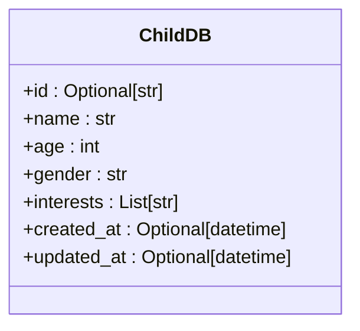

**Diagram sources**
- [models.py](file://src/infrastructure/persistence/models.py#L8-L17)

**Section sources**
- [models.py](file://src/infrastructure/persistence/models.py#L8-L17)
- [005_create_children_table.sql](file://supabase/migrations/005_create_children_table.sql#L2-L10)

### HeroDB Model
The HeroDB model represents hero profiles used in story generation, capturing physical appearance, personality traits, and other characteristics.

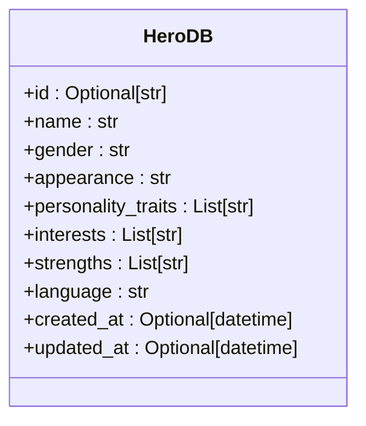

**Diagram sources**
- [models.py](file://src/infrastructure/persistence/models.py#L19-L31)

**Section sources**
- [models.py](file://src/infrastructure/persistence/models.py#L19-L31)

### StoryDB Model
The StoryDB model represents generated stories, including content, metadata, and relationships to children and heroes.

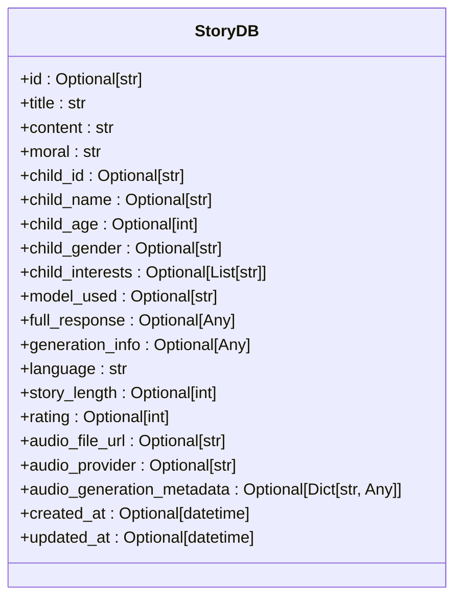

**Diagram sources**
- [models.py](file://src/infrastructure/persistence/models.py#L33-L55)

**Section sources**
- [models.py](file://src/infrastructure/persistence/models.py#L33-L55)
- [001_create_stories_table.sql](file://supabase/migrations/001_create_stories_table.sql#L3-L14)

## Schema Evolution
The database schema has evolved through a series of migrations that incrementally add functionality and improve data modeling. Each migration is versioned and stored in the supabase/migrations directory.

### Initial Schema
The initial schema established the core stories table with basic story information and child demographics.

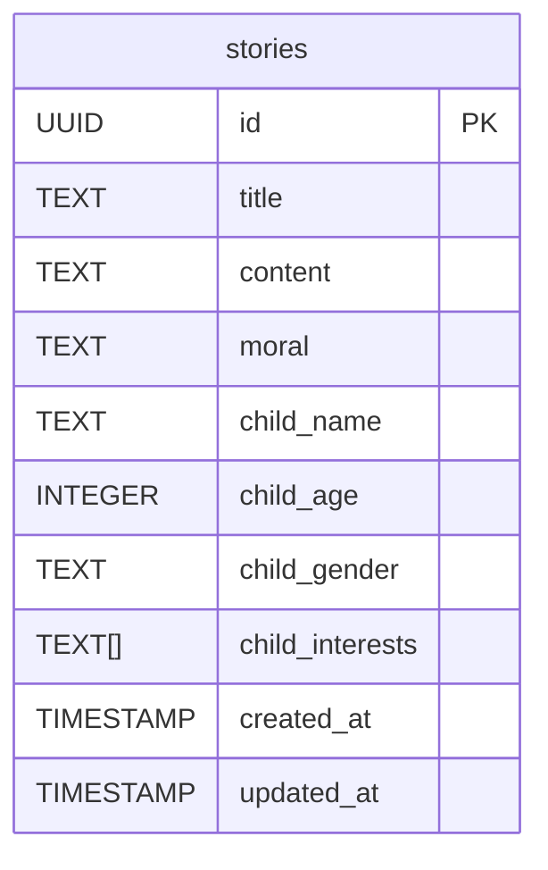

**Diagram sources**
- [001_create_stories_table.sql](file://supabase/migrations/001_create_stories_table.sql#L3-L14)

**Section sources**
- [001_create_stories_table.sql](file://supabase/migrations/001_create_stories_table.sql#L1-L44)

### Migration Sequence
The schema has evolved through the following migration sequence:

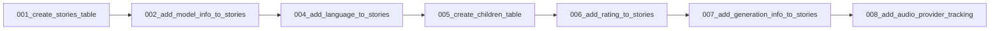

**Diagram sources**
- [supabase/migrations](file://supabase/migrations)

**Section sources**
- [001_create_stories_table.sql](file://supabase/migrations/001_create_stories_table.sql)
- [002_add_model_info_to_stories.sql](file://supabase/migrations/002_add_model_info_to_stories.sql)
- [004_add_language_to_stories.sql](file://supabase/migrations/004_add_language_to_stories.sql)
- [005_create_children_table.sql](file://supabase/migrations/005_create_children_table.sql)
- [006_add_rating_to_stories.sql](file://supabase/migrations/006_add_rating_to_stories.sql)
- [007_add_generation_info_to_stories.sql](file://supabase/migrations/007_add_generation_info_to_stories.sql)
- [008_add_audio_provider_tracking.sql](file://supabase/migrations/008_add_audio_provider_tracking.sql)

### Model Information Addition
Migration 002 added model information to track which AI model was used for story generation.

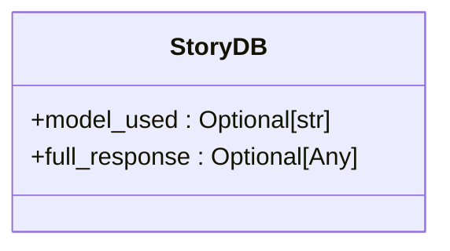

**Diagram sources**
- [002_add_model_info_to_stories.sql](file://supabase/migrations/002_add_model_info_to_stories.sql#L2-L7)

**Section sources**
- [002_add_model_info_to_stories.sql](file://supabase/migrations/002_add_model_info_to_stories.sql#L1-L7)

### Language Support
Migration 004 added language support to enable multilingual story generation.

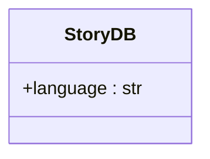

**Diagram sources**
- [004_add_language_to_stories.sql](file://supabase/migrations/004_add_language_to_stories.sql#L2-L11)

**Section sources**
- [004_add_language_to_stories.sql](file://supabase/migrations/004_add_language_to_stories.sql#L1-L11)

### Rating System
Migration 006 introduced a rating system to capture user feedback on generated stories.

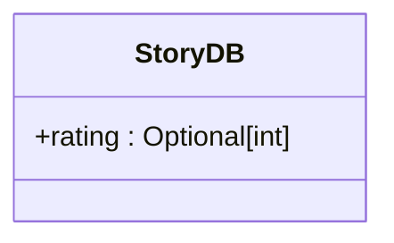

**Diagram sources**
- [006_add_rating_to_stories.sql](file://supabase/migrations/006_add_rating_to_stories.sql#L2-L11)

**Section sources**
- [006_add_rating_to_stories.sql](file://supabase/migrations/006_add_rating_to_stories.sql#L1-L11)

### Audio Provider Tracking
Migration 008 added audio provider tracking to support multiple voice generation services.

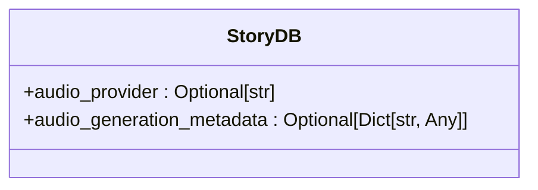

**Diagram sources**
- [008_add_audio_provider_tracking.sql](file://supabase/migrations/008_add_audio_provider_tracking.sql#L5-L24)

**Section sources**
- [008_add_audio_provider_tracking.sql](file://supabase/migrations/008_add_audio_provider_tracking.sql#L1-L24)

## Supabase Client Implementation
The SupabaseClient class provides a clean interface for CRUD operations on the database models, handling the translation between Python objects and database records.

### Key Mapping Strategy
The client implements a consistent strategy for mapping between camelCase (Python) and snake_case (PostgreSQL) naming conventions.

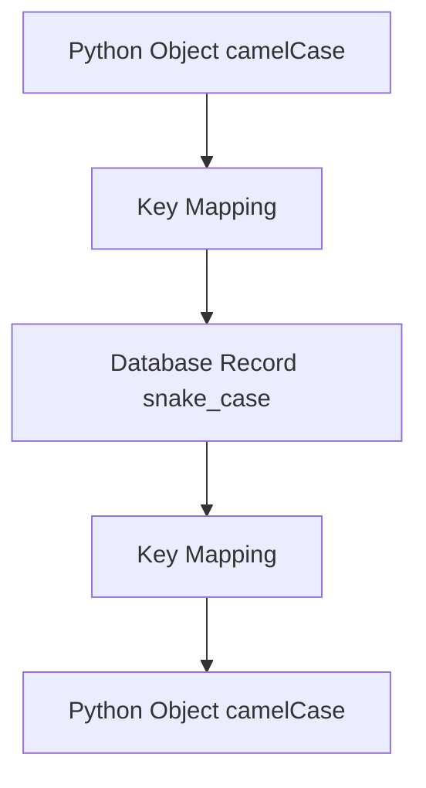

**Diagram sources**
- [supabase_client.py](file://src/supabase_client.py#L116-L125)
- [supabase_client.py](file://src/supabase_client.py#L280-L292)

**Section sources**
- [supabase_client.py](file://src/supabase_client.py#L102-L481)

### CRUD Operations
The client implements comprehensive CRUD operations for all three models.

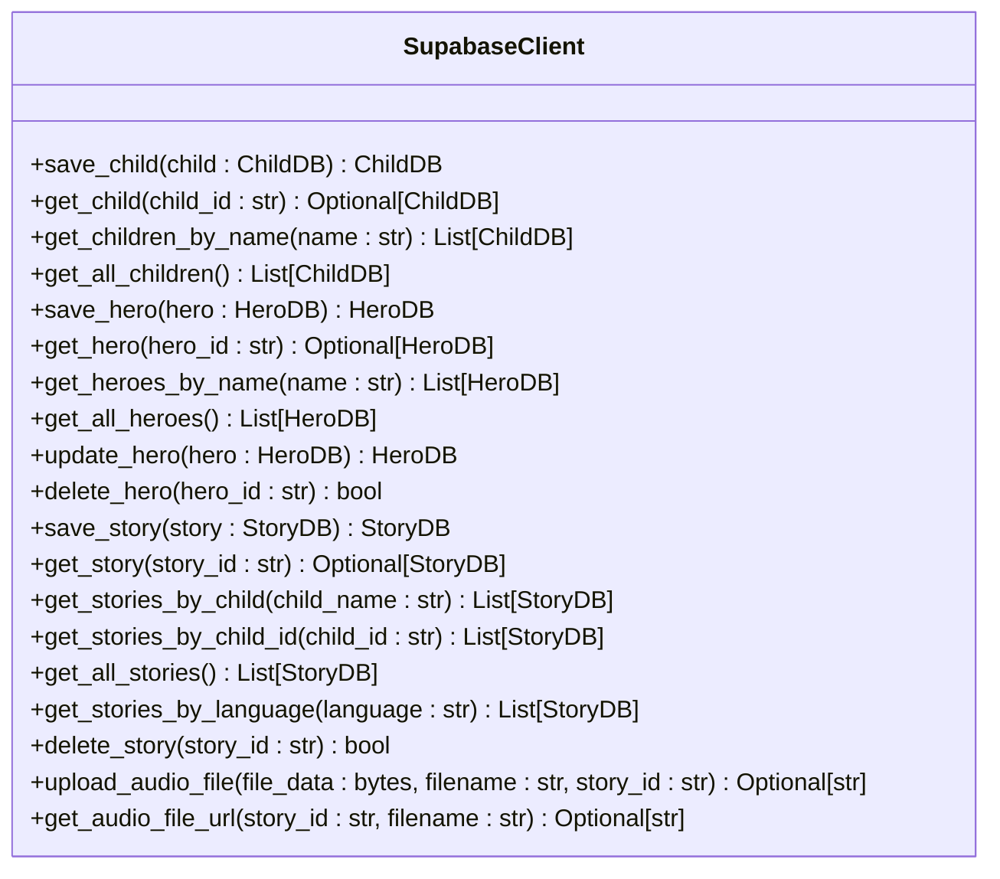

**Diagram sources**
- [supabase_client.py](file://src/supabase_client.py#L19-L82)

**Section sources**
- [supabase_client.py](file://src/supabase_client.py#L19-L820)

## Data Access Patterns
The persistence layer supports several key data access patterns optimized for the application's use cases.

### Child-Centric Queries
The system supports queries by child name, enabling retrieval of all stories for a specific child.

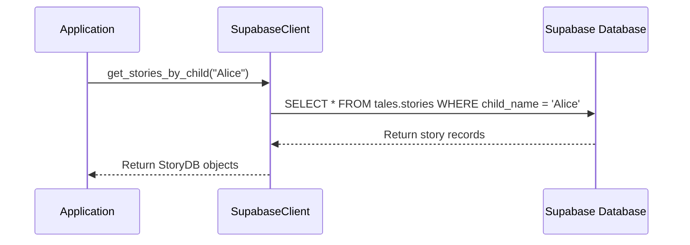

**Diagram sources**
- [supabase_client.py](file://src/supabase_client.py#L642-L687)

**Section sources**
- [supabase_client.py](file://src/supabase_client.py#L642-L687)

### Language-Based Filtering
Stories can be retrieved by language, supporting multilingual applications.

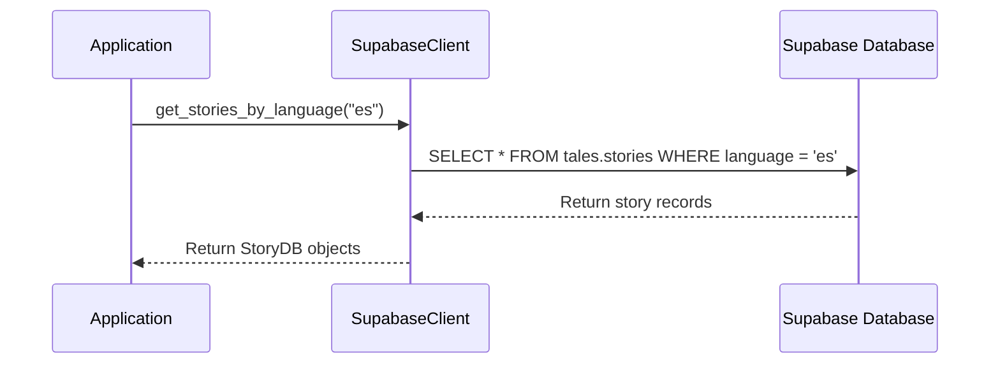

**Diagram sources**
- [supabase_client.py](file://src/supabase_client.py#L777-L800)

**Section sources**
- [supabase_client.py](file://src/supabase_client.py#L777-L800)

### Rating-Based Queries
The system supports filtering stories by rating, enabling quality-based retrieval.

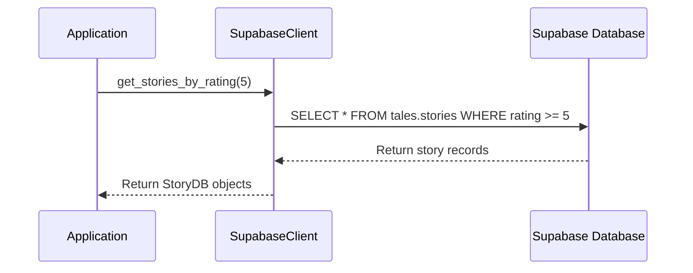

**Section sources**
- [supabase_client.py](file://src/supabase_client.py#L595-L641)

## Error Handling and Transaction Management
The persistence layer implements robust error handling to ensure data integrity and provide meaningful feedback.

### Error Handling Strategy
The client wraps database exceptions in application-specific exceptions with contextual information.

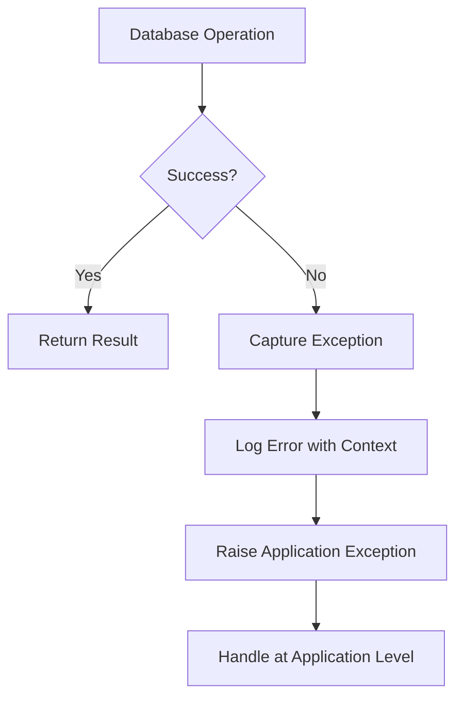

**Diagram sources**
- [supabase_client.py](file://src/supabase_client.py#L157-L158)
- [supabase_client.py](file://src/supabase_client.py#L192-L193)

**Section sources**
- [supabase_client.py](file://src/supabase_client.py#L111-L158)

### Transaction Management
While the current implementation uses individual operations, the Supabase client supports transactional operations for complex workflows.

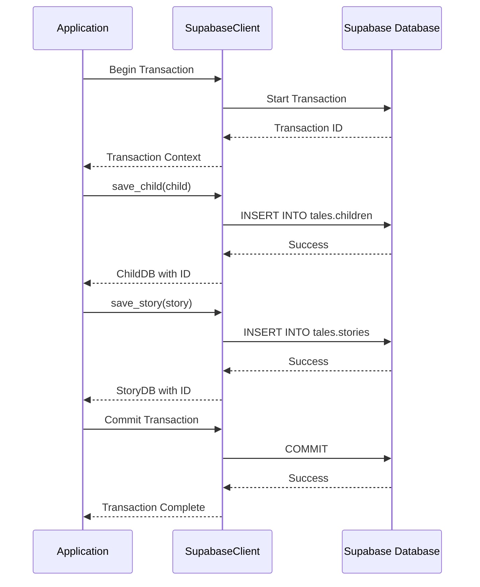

**Section sources**
- [supabase_client.py](file://src/supabase_client.py#L143-L144)
- [supabase_client.py](file://src/supabase_client.py#L578-L579)

## Performance Considerations
The database schema includes several performance optimizations to ensure efficient queries.

### Indexing Strategy
The schema includes targeted indexes on frequently queried fields.

```mermaid
erDiagram
stories {
UUID id PK
TEXT title
TEXT content
TEXT moral
TEXT child_name
INTEGER child_age
TEXT child_gender
TEXT[] child_interests
TIMESTAMP created_at
TIMESTAMP updated_at
TEXT model_used
TEXT language
INTEGER rating
}
INDEX idx_stories_child_name ON stories(child_name)
INDEX idx_stories_language ON stories(language)
INDEX idx_stories_rating ON stories(rating)
INDEX idx_stories_created_at ON stories(created_at)
INDEX idx_stories_model_used ON stories(model_used)
```

**Diagram sources**
- [001_create_stories_table.sql](file://supabase/migrations/001_create_stories_table.sql#L17-L19)
- [004_add_language_to_stories.sql](file://supabase/migrations/004_add_language_to_stories.sql#L6)
- [006_add_rating_to_stories.sql](file://supabase/migrations/006_add_rating_to_stories.sql#L6)

**Section sources**
- [001_create_stories_table.sql](file://supabase/migrations/001_create_stories_table.sql#L17-L19)
- [004_add_language_to_stories.sql](file://supabase/migrations/004_add_language_to_stories.sql#L6)
- [006_add_rating_to_stories.sql](file://supabase/migrations/006_add_rating_to_stories.sql#L6)

### Query Optimization
The client implements optimized queries for common access patterns.

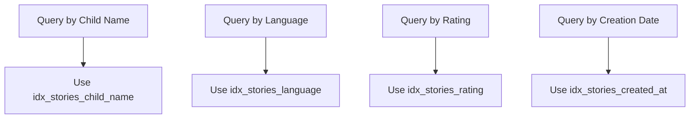

**Section sources**
- [supabase_client.py](file://src/supabase_client.py#L652-L653)
- [supabase_client.py](file://src/supabase_client.py#L787-L788)

## Schema Extension and Backward Compatibility
The migration-based approach enables safe schema evolution while maintaining backward compatibility.

### Migration Best Practices
The system follows several best practices for schema evolution:

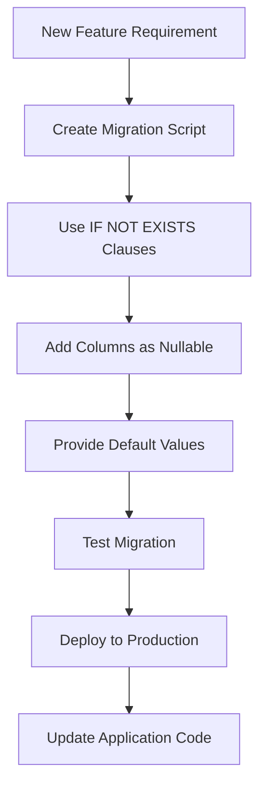

**Section sources**
- [008_add_audio_provider_tracking.sql](file://supabase/migrations/008_add_audio_provider_tracking.sql#L6-L11)

### Backward Compatibility
The schema design ensures backward compatibility through careful column management.

```mermaid
classDiagram
class StoryDB {
+audio_provider : Optional[str]
+audio_generation_metadata : Optional[Dict[str, Any]]
}
note right of StoryDB
New fields are optional to maintain
compatibility with existing records
end note
```

**Diagram sources**
- [models.py](file://src/infrastructure/persistence/models.py#L50-L52)
- [008_add_audio_provider_tracking.sql](file://supabase/migrations/008_add_audio_provider_tracking.sql#L6-L11)

**Section sources**
- [models.py](file://src/infrastructure/persistence/models.py#L50-L52)
- [008_add_audio_provider_tracking.sql](file://supabase/migrations/008_add_audio_provider_tracking.sql#L6-L11)

## Storage Integration
The persistence layer integrates with Supabase Storage for managing audio files associated with stories.

### Audio File Management
The system provides methods for uploading and retrieving audio files.

```mermaid
sequenceDiagram
participant App as Application
participant Client as SupabaseClient
participant Storage as Supabase Storage
App->>Client : upload_audio_file(data, "story.mp3", "story-123")
Client->>Storage : Upload to tales/stories/story-123/story.mp3
Storage-->>Client : Success
Client->>Storage : Get public URL
Storage-->>Client : https : //...
Client-->>App : Return URL
App->>Client : get_audio_file_url("story-123", "story.mp3")
Client->>Storage : Get public URL
Storage-->>Client : https : //...
Client-->>App : Return URL
```

**Diagram sources**
- [supabase_client.py](file://src/supabase_client.py#L44-L101)

**Section sources**
- [supabase_client.py](file://src/supabase_client.py#L44-L101)

### Storage Structure
Audio files are organized in a hierarchical structure within the 'tales' bucket.

```mermaid
erDiagram
tales {
stories {
story-123 {
story.mp3
thumbnail.jpg
}
story-456 {
story.mp3
thumbnail.jpg
}
}
heroes {
hero-789 {
portrait.jpg
}
}
}
```

**Section sources**
- [supabase_client.py](file://src/supabase_client.py#L61-L62)