# Concrete Voice Provider Implementations

<cite>
**Referenced Files in This Document**
- [base_provider.py](file://src/voice_providers/base_provider.py)
- [elevenlabs_provider.py](file://src/voice_providers/elevenlabs_provider.py)
- [mock_provider.py](file://src/voice_providers/mock_provider.py)
- [provider_registry.py](file://src/voice_providers/provider_registry.py)
- [voice_service.py](file://src/voice_providers/voice_service.py)
- [test_voice_providers.py](file://test_voice_providers.py)
- [test_integration_voice.py](file://test_integration_voice.py)
- [models.py](file://src/models.py)
</cite>

## Table of Contents
1. [Introduction](#introduction)
2. [Architecture Overview](#architecture-overview)
3. [ElevenLabs Provider Implementation](#elevenlabs-provider-implementation)
4. [Mock Provider Implementation](#mock-provider-implementation)
5. [Provider Registry System](#provider-registry-system)
6. [Voice Service Facade](#voice-service-facade)
7. [Configuration Management](#configuration-management)
8. [Error Handling and Fallback Mechanisms](#error-handling-and-fallback-mechanisms)
9. [Testing and Development Patterns](#testing-and-development-patterns)
10. [Common Issues and Solutions](#common-issues-and-solutions)
11. [Best Practices](#best-practices)

## Introduction

The Tale Generator application implements a sophisticated voice provider system that enables flexible audio generation for children's stories. This system supports multiple voice synthesis providers through a unified interface, allowing seamless switching between production and development environments while maintaining consistent functionality.

The voice provider architecture consists of two primary implementations: the **ElevenLabsProvider** for production-grade AI-generated speech and the **MockProvider** for testing and development scenarios. Both providers implement a common interface and integrate with a centralized registry system for dynamic provider management.

## Architecture Overview

The voice provider system follows a modular architecture with clear separation of concerns:

**Diagram sources**
- [base_provider.py](file://src/voice_providers/base_provider.py#L28-L97)
- [elevenlabs_provider.py](file://src/voice_providers/elevenlabs_provider.py#L18-L220)
- [mock_provider.py](file://src/voice_providers/mock_provider.py#L13-L98)
- [provider_registry.py](file://src/voice_providers/provider_registry.py#L12-L212)
- [voice_service.py](file://src/voice_providers/voice_service.py#L25-L236)

## ElevenLabs Provider Implementation

The ElevenLabsProvider serves as the primary production voice synthesis solution, integrating with the ElevenLabs API to deliver high-quality AI-generated speech for children's stories.

### API Integration and Authentication

The provider implements robust API key management and client initialization with lazy loading:

**Diagram sources**
- [elevenlabs_provider.py](file://src/voice_providers/elevenlabs_provider.py#L22-L59)
- [elevenlabs_provider.py](file://src/voice_providers/elevenlabs_provider.py#L181-L219)

### Lazy Loading and Client Initialization

The provider implements intelligent lazy loading to optimize resource usage:

- **API Key Storage**: Stores API key from environment variables for secure access
- **Lazy Client Creation**: Initializes the ElevenLabs client only when needed
- **Error Handling**: Gracefully handles client initialization failures with detailed logging
- **Validation**: Provides comprehensive configuration validation

### Multilingual Model Support

The ElevenLabsProvider supports extensive language coverage through its multilingual models:

| Language Code | Language Name | Model Support |
|---------------|---------------|---------------|
| en | English | Native |
| ru | Russian | Native |
| es | Spanish | Native |
| fr | French | Native |
| de | German | Native |
| it | Italian | Native |
| pt | Portuguese | Native |
| pl | Polish | Native |
| hi | Hindi | Native |
| ja | Japanese | Native |
| ko | Korean | Native |
| zh | Chinese | Native |
| ar | Arabic | Native |

### Voice Selection Logic

The provider implements sophisticated voice selection based on language preferences:

**Diagram sources**
- [elevenlabs_provider.py](file://src/voice_providers/elevenlabs_provider.py#L128-L155)
- [elevenlabs_provider.py](file://src/voice_providers/elevenlabs_provider.py#L157-L163)

### Voice Settings Configuration

The provider applies carefully tuned voice settings optimized for children's stories:

- **Stability**: 0.5 balance between consistency and natural variation
- **Similarity Boost**: 0.75 enhances voice resemblance to the selected model
- **Style**: 0.0 neutral speaking style suitable for storytelling
- **Speaker Boost**: Enabled for clearer pronunciation in educational content

### Error Handling During Audio Generation

The provider implements comprehensive error handling:

- **API Communication**: Handles network errors, rate limiting, and service unavailability
- **Voice Selection**: Falls back gracefully when specific voices aren't available
- **Audio Processing**: Manages streaming conversion errors and data corruption
- **Logging**: Provides detailed error information for debugging and monitoring

**Section sources**
- [elevenlabs_provider.py](file://src/voice_providers/elevenlabs_provider.py#L18-L220)

## Mock Provider Implementation

The MockProvider serves as a testing and development companion, providing deterministic audio generation without external API dependencies.

### Purpose in Testing and Development

The MockProvider enables comprehensive testing of the voice generation pipeline:

- **Deterministic Output**: Generates predictable audio data based on input text
- **Development Independence**: Eliminates reliance on external APIs during development
- **Performance Testing**: Enables fast testing of audio generation workflows
- **Edge Case Simulation**: Supports testing of error conditions and boundary cases

### Deterministic Audio Generation

The provider creates consistent, predictable audio output:

```mermaid
flowchart TD
Input["Text Input"] --> Hash["Generate MD5 Hash"]
Hash --> Header["Add MP3 Header"]
Header --> Metadata["Encode Text Length & Language"]
Metadata --> Padding["Add Padding"]
Padding --> Audio["Generate Mock Audio"]
Audio --> Output["Consistent Byte Stream"]
Note1["Same input → Same output"]
Note2["Contains text info for validation"]
Note3["Looks realistic but is fake"]
Input -.-> Note1
Audio -.-> Note2
Audio -.-> Note3
```

**Diagram sources**
- [mock_provider.py](file://src/voice_providers/mock_provider.py#L66-L82)

### Configurable Success/Failure States

The provider supports testing various failure scenarios:

- **Configuration Control**: Allows setting provider as configured or not
- **Failure Simulation**: Enables testing of error handling paths
- **Validation Testing**: Supports testing of provider validation logic
- **Fallback Testing**: Validates fallback mechanisms under various conditions

### Language Support Detection

The MockProvider maintains comprehensive language support:

- **Complete Coverage**: Supports all major languages tested by the system
- **Dynamic Voice Lists**: Generates language-specific voice identifiers
- **Consistent Behavior**: Maintains predictable response patterns across languages
- **Metadata Preservation**: Includes language information in generated audio

**Section sources**
- [mock_provider.py](file://src/voice_providers/mock_provider.py#L13-L98)

## Provider Registry System

The VoiceProviderRegistry manages the lifecycle and availability of voice providers, enabling dynamic provider selection and fallback mechanisms.

### Global Registry Management

The registry implements singleton pattern with global state management:

**Diagram sources**
- [provider_registry.py](file://src/voice_providers/provider_registry.py#L12-L212)

### Environment-Based Configuration

The registry loads provider configuration from environment variables:

- **DEFAULT_VOICE_PROVIDER**: Sets the primary provider (defaults to "elevenlabs")
- **VOICE_PROVIDER_FALLBACK**: Defines fallback provider priorities
- **Automatic Loading**: Configuration loaded during registry initialization
- **Runtime Updates**: Supports dynamic configuration changes

### Provider Lifecycle Management

The registry handles provider registration and lifecycle:

- **Registration Validation**: Validates provider configuration before registration
- **Duplicate Prevention**: Prevents multiple registrations of the same provider
- **Cleanup Operations**: Provides methods for clearing and resetting providers
- **State Persistence**: Maintains provider state across application lifecycle

**Section sources**
- [provider_registry.py](file://src/voice_providers/provider_registry.py#L12-L212)

## Voice Service Facade

The VoiceService provides a unified interface for audio generation, abstracting provider complexity and implementing intelligent fallback mechanisms.

### Audio Generation Workflow

The service orchestrates the complete audio generation process:

**Diagram sources**
- [voice_service.py](file://src/voice_providers/voice_service.py#L32-L134)
- [voice_service.py](file://src/voice_providers/voice_service.py#L136-L191)

### Provider Selection Logic

The service implements intelligent provider selection with fallback:

- **Explicit Selection**: Uses specified provider when available
- **Default Fallback**: Falls back to configured default provider
- **Priority Fallback**: Tries configured fallback providers in order
- **Any Available**: Uses any available provider if specific ones fail
- **Error Reporting**: Provides detailed error information for debugging

### Result Aggregation

The service returns comprehensive results through AudioGenerationResult:

- **Audio Data**: Generated audio as bytes
- **Provider Information**: Name and metadata of the used provider
- **Success Status**: Boolean indicating operation success
- **Error Details**: Human-readable error messages when applicable
- **Metadata**: Additional information about the generation process

**Section sources**
- [voice_service.py](file://src/voice_providers/voice_service.py#L25-L236)

## Configuration Management

The voice provider system supports flexible configuration through environment variables and programmatic interfaces.

### Environment Variable Configuration

Key configuration parameters:

| Variable | Purpose | Default Value | Example |
|----------|---------|---------------|---------|
| ELEVENLABS_API_KEY | ElevenLabs API authentication | None | `your-api-key-here` |
| DEFAULT_VOICE_PROVIDER | Primary provider selection | `elevenlabs` | `mock` |
| VOICE_PROVIDER_FALLBACK | Fallback provider priorities | Empty | `mock,elevenlabs` |

### Programmatic Configuration

Providers support runtime configuration:

- **Provider Registration**: Dynamic addition of providers to the registry
- **Default Provider Setting**: Runtime selection of primary provider
- **Fallback Configuration**: Dynamic fallback chain modification
- **Validation Control**: Runtime provider configuration validation

### Configuration Validation

The system implements comprehensive configuration validation:

- **API Key Verification**: Validates ElevenLabs API key format and accessibility
- **Provider Availability**: Checks provider connectivity and service status
- **Capability Matching**: Ensures provider capabilities meet requirements
- **Resource Availability**: Validates required resources (e.g., voice models)

## Error Handling and Fallback Mechanisms

The voice provider system implements robust error handling and automatic fallback mechanisms.

### Automatic Fallback Chain

The fallback system operates in multiple stages:

**Diagram sources**
- [provider_registry.py](file://src/voice_providers/provider_registry.py#L100-L140)
- [voice_service.py](file://src/voice_providers/voice_service.py#L136-L191)

### Error Classification and Handling

The system categorizes and handles different types of errors:

- **Configuration Errors**: Invalid API keys, missing credentials
- **Network Errors**: Connection timeouts, service unavailability
- **Rate Limiting**: API quota exceeded, throttling responses
- **Content Errors**: Unsupported languages, invalid text
- **Provider Errors**: Internal provider failures, voice unavailability

### Logging and Monitoring

Comprehensive logging supports debugging and monitoring:

- **Operation Logging**: Tracks provider selection and audio generation
- **Error Logging**: Captures detailed error information with stack traces
- **Performance Logging**: Monitors provider response times and success rates
- **Debug Logging**: Provides detailed diagnostic information for troubleshooting

**Section sources**
- [provider_registry.py](file://src/voice_providers/provider_registry.py#L100-L140)
- [voice_service.py](file://src/voice_providers/voice_service.py#L136-L191)

## Testing and Development Patterns

The voice provider system supports comprehensive testing through dedicated patterns and utilities.

### Test Provider Usage

The MockProvider enables various testing scenarios:

- **Unit Testing**: Individual provider functionality verification
- **Integration Testing**: End-to-end workflow testing
- **Performance Testing**: Audio generation throughput measurement
- **Error Testing**: Failure scenario validation

### Testing Patterns

Common testing patterns include:

**Diagram sources**
- [test_voice_providers.py](file://test_voice_providers.py#L19-L45)
- [test_integration_voice.py](file://test_integration_voice.py#L14-L50)

### Development Workflow

The system supports efficient development workflows:

- **Local Development**: Mock provider enables offline development
- **CI/CD Integration**: Automated testing without external dependencies
- **Feature Branch Testing**: Isolated testing of new provider implementations
- **Regression Testing**: Consistent validation of existing functionality

**Section sources**
- [test_voice_providers.py](file://test_voice_providers.py#L19-L213)
- [test_integration_voice.py](file://test_integration_voice.py#L14-L178)

## Common Issues and Solutions

### API Rate Limiting

**Issue**: ElevenLabs API rate limits causing generation failures

**Solutions**:
- Implement request throttling in the application
- Use caching for frequently requested audio segments
- Monitor API usage and adjust quotas proactively
- Implement exponential backoff for retry logic

### Authentication Failures

**Issue**: Invalid or expired API keys

**Solutions**:
- Validate API keys during application startup
- Implement key rotation mechanisms
- Monitor authentication status regularly
- Provide clear error messages for key issues

### Voice Unavailability

**Issue**: Selected voices not available in the target language

**Solutions**:
- Implement fallback voice selection logic
- Pre-cache voice availability information
- Use multilingual models when specific voices are unavailable
- Provide user feedback for voice selection issues

### Network Connectivity Issues

**Issue**: Intermittent network problems affecting audio generation

**Solutions**:
- Implement robust retry mechanisms with exponential backoff
- Cache audio generation results when possible
- Provide offline fallback options
- Monitor network health and alert on persistent issues

### Memory and Performance Issues

**Issue**: Large audio generation consuming excessive resources

**Solutions**:
- Implement streaming audio generation where supported
- Set reasonable limits on text length and audio duration
- Optimize memory usage in audio processing
- Monitor resource consumption and implement throttling

## Best Practices

### Production Deployment

- **API Key Security**: Store API keys securely using environment variables or secret management systems
- **Monitoring**: Implement comprehensive monitoring for provider health and performance
- **Caching**: Use appropriate caching strategies to reduce API calls and improve response times
- **Fallback Configuration**: Configure multiple fallback providers for high availability

### Development and Testing

- **Mock Provider Usage**: Use MockProvider for local development and testing
- **Environment Separation**: Maintain separate configurations for development and production
- **Comprehensive Testing**: Test all provider fallback scenarios and error conditions
- **Documentation**: Keep provider documentation updated with current capabilities

### Performance Optimization

- **Lazy Loading**: Leverage lazy loading for expensive operations like client initialization
- **Connection Pooling**: Reuse connections where possible to reduce overhead
- **Async Processing**: Consider asynchronous processing for non-blocking operations
- **Resource Management**: Properly manage resources and implement cleanup procedures

### Error Handling

- **Graceful Degradation**: Implement graceful degradation when providers fail
- **User Feedback**: Provide meaningful error messages to users
- **Logging**: Implement comprehensive logging for debugging and monitoring
- **Retry Logic**: Implement intelligent retry mechanisms with backoff