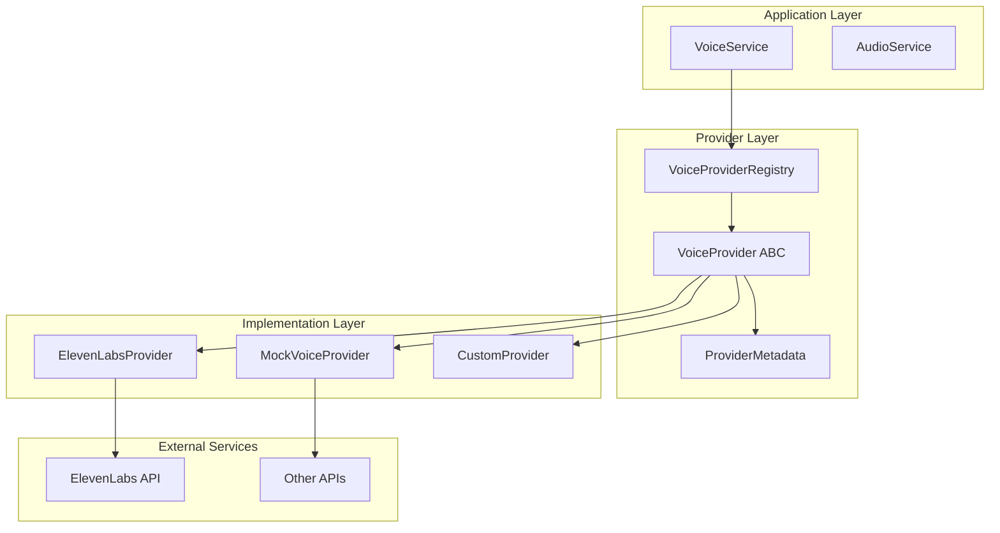
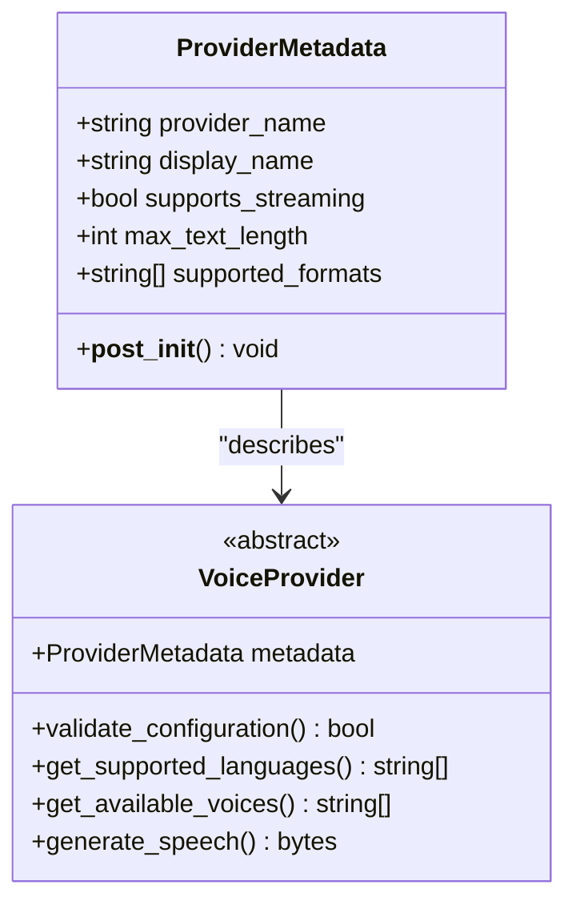
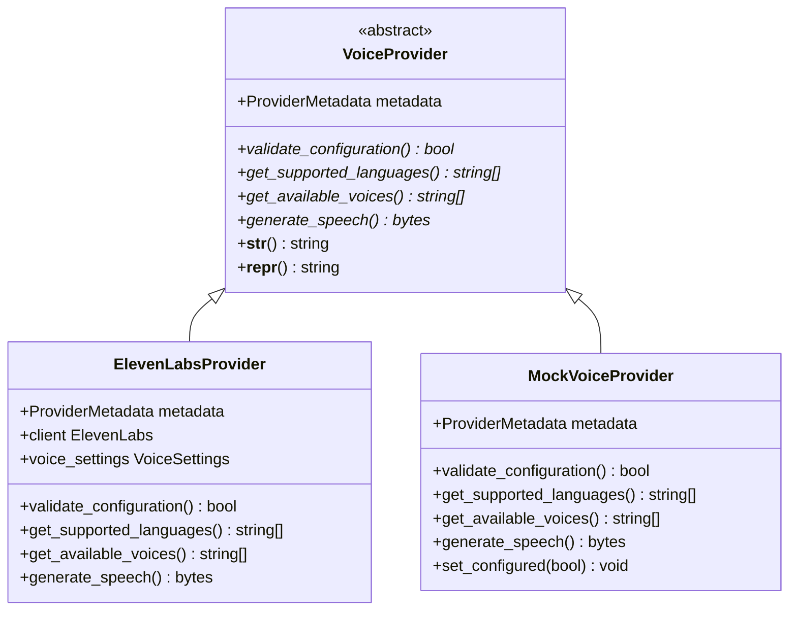
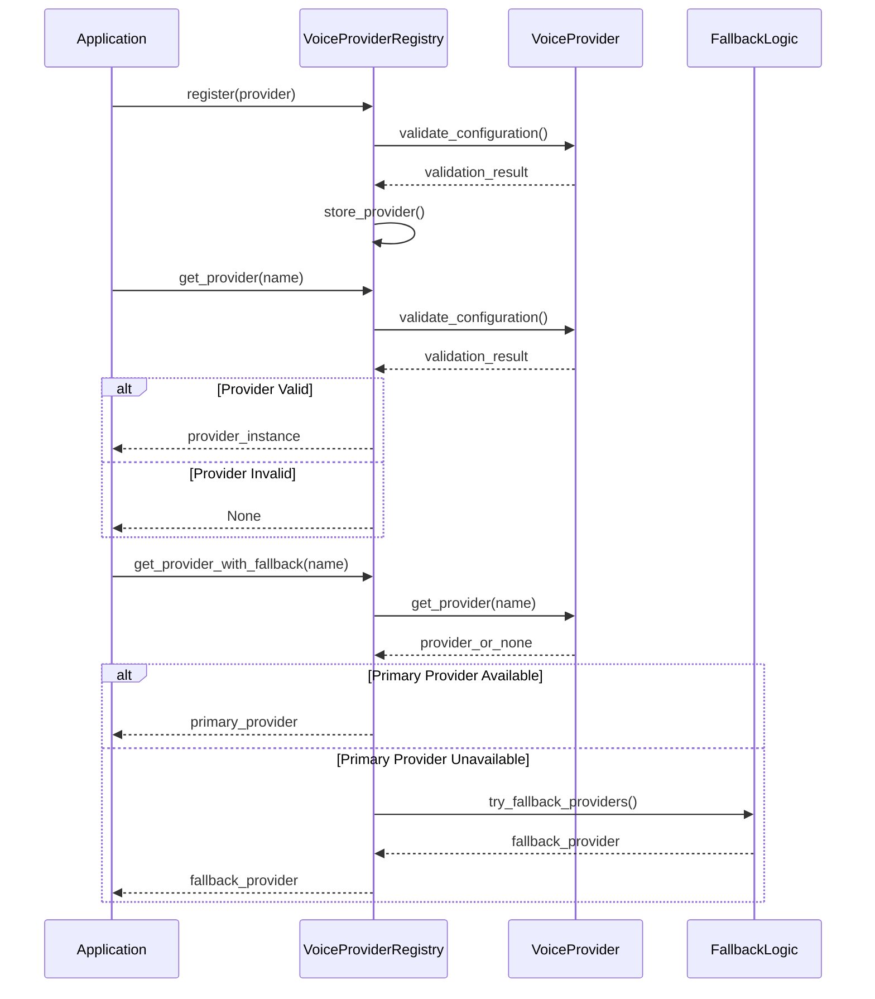
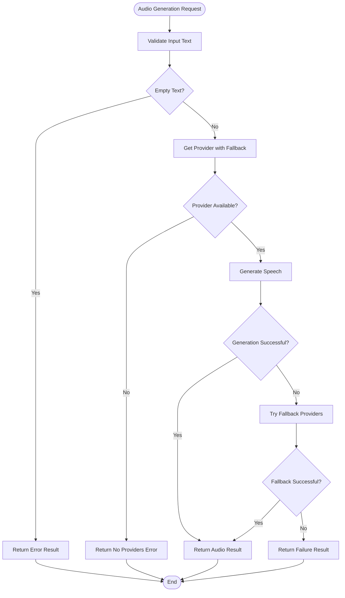

# Provider Interface

<cite>
**Referenced Files in This Document**
- [base_provider.py](file://src/voice_providers/base_provider.py)
- [provider_registry.py](file://src/voice_providers/provider_registry.py)
- [voice_service.py](file://src/voice_providers/voice_service.py)
- [elevenlabs_provider.py](file://src/voice_providers/elevenlabs_provider.py)
- [mock_provider.py](file://src/voice_providers/mock_provider.py)
- [__init__.py](file://src/voice_providers/__init__.py)
- [test_voice_providers.py](file://test_voice_providers.py)
</cite>

## Table of Contents
1. [Introduction](#introduction)
2. [Architecture Overview](#architecture-overview)
3. [ProviderMetadata Class](#providermetadata-class)
4. [VoiceProvider Abstract Base Class](#voiceprovider-abstract-base-class)
5. [Provider Registry System](#provider-registry-system)
6. [Voice Service Facade](#voice-service-facade)
7. [Concrete Provider Implementations](#concrete-provider-implementations)
8. [Interface Implementation Patterns](#interface-implementation-patterns)
9. [Common Issues and Best Practices](#common-issues-and-best-practices)
10. [Testing Strategies](#testing-strategies)
11. [Conclusion](#conclusion)

## Introduction

The VoiceProvider interface serves as the cornerstone of Tale Generator's extensible voice synthesis architecture. This plugin-based system enables seamless integration of multiple text-to-speech providers while maintaining a consistent API contract. The interface design promotes polymorphism, allowing the application to work with different voice providers interchangeably while abstracting provider-specific implementation details.

The system's architecture follows established design patterns for extensibility and maintainability, featuring a well-defined contract through the abstract base class, standardized metadata through the ProviderMetadata class, and robust provider management through the registry system.

## Architecture Overview

The voice provider system implements a layered architecture that separates concerns and enables flexible provider management:



**Diagram sources**
- [voice_service.py](file://src/voice_providers/voice_service.py#L25-L236)
- [provider_registry.py](file://src/voice_providers/provider_registry.py#L12-L212)
- [base_provider.py](file://src/voice_providers/base_provider.py#L28-L97)

**Section sources**
- [voice_service.py](file://src/voice_providers/voice_service.py#L1-L236)
- [provider_registry.py](file://src/voice_providers/provider_registry.py#L1-L212)

## ProviderMetadata Class

The ProviderMetadata class standardizes provider characteristics and capabilities, serving as the foundation for provider discovery and selection logic.

### Class Structure and Properties



**Diagram sources**
- [base_provider.py](file://src/voice_providers/base_provider.py#L12-L39)

### Metadata Properties

| Property | Type | Description | Default Value |
|----------|------|-------------|---------------|
| `provider_name` | string | Unique identifier for the provider | Required |
| `display_name` | string | Human-readable name for UI display | Required |
| `supports_streaming` | bool | Whether the provider supports streaming audio | `false` |
| `max_text_length` | int | Maximum text length in characters | `5000` |
| `supported_formats` | List[string] | Audio formats supported by the provider | `["mp3"]` |

### Initialization and Validation

The metadata class implements post-initialization validation to ensure consistent defaults and prevent configuration errors. The `__post_init__()` method automatically sets default values for optional fields, particularly initializing the `supported_formats` list if not provided.

**Section sources**
- [base_provider.py](file://src/voice_providers/base_provider.py#L12-L39)

## VoiceProvider Abstract Base Class

The VoiceProvider abstract base class defines the complete contract that all voice providers must implement, establishing a standardized interface for text-to-speech functionality.

### Interface Contract



**Diagram sources**
- [base_provider.py](file://src/voice_providers/base_provider.py#L28-L97)
- [elevenlabs_provider.py](file://src/voice_providers/elevenlabs_provider.py#L18-L220)
- [mock_provider.py](file://src/voice_providers/mock_provider.py#L13-L98)

### Required Methods

#### validate_configuration()

The `validate_configuration()` method ensures that a provider is properly set up and ready for use. This method performs essential checks such as API key validation, network connectivity verification, and resource availability assessment.

**Method Signature:** `validate_configuration(self) -> bool`

**Return Value:** `True` if the provider is properly configured and ready to use, `False` otherwise.

**Implementation Pattern:** Providers typically implement this method by attempting to establish connections or validate credentials without performing expensive operations.

#### get_supported_languages()

The `get_supported_languages()` method returns a comprehensive list of ISO 639-1 language codes that the provider supports. This information is crucial for language detection and provider selection logic.

**Method Signature:** `get_supported_languages(self) -> List[str]`

**Return Value:** List of supported language codes (e.g., `['en', 'ru', 'es']`).

**Implementation Pattern:** Providers return hardcoded lists of supported languages or dynamically query the provider API for current language support.

#### get_available_voices()

The `get_available_voices()` method retrieves identifiers for available voices, optionally filtered by language. This method enables voice selection and discovery functionality.

**Method Signature:** `get_available_voices(self, language: Optional[str] = None) -> List[str]`

**Parameters:**
- `language`: Optional language code to filter voices (e.g., `'en'`, `'ru'`)

**Return Value:** List of voice identifiers available for the specified language or all voices if no language filter is provided.

#### generate_speech()

The `generate_speech()` method converts text to audio according to the provider's specifications. This is the core functionality that transforms written content into spoken word.

**Method Signature:** `generate_speech(self, text: str, language: str = "en", voice_options: Optional[Dict[str, Any]] = None) -> Optional[bytes]`

**Parameters:**
- `text`: The text to convert to speech
- `language`: The language code for the text (default: `"en"`)
- `voice_options`: Provider-specific voice configuration options

**Return Value:** Audio data as bytes (typically MP3 format), or `None` if generation failed.

### Metadata Property

The `metadata` property provides access to standardized provider information including capabilities, limitations, and identification details. This property enables provider discovery, selection, and routing decisions throughout the system.

**Property Signature:** `@property @abstractmethod def metadata(self) -> ProviderMetadata`

**Usage Scenarios:**
- Provider selection based on capabilities
- Feature compatibility checking
- Configuration validation
- UI display and user selection

**Section sources**
- [base_provider.py](file://src/voice_providers/base_provider.py#L28-L97)

## Provider Registry System

The VoiceProviderRegistry manages the lifecycle of voice providers, handling registration, discovery, and fallback mechanisms. This centralized system ensures proper provider coordination and enables robust error handling.

### Registry Architecture



**Diagram sources**
- [provider_registry.py](file://src/voice_providers/provider_registry.py#L36-L140)

### Registry Operations

#### Registration and Validation

The registry enforces strict validation during provider registration, ensuring that only properly configured providers are stored. This prevents runtime errors and maintains system reliability.

**Registration Process:**
1. Extract provider name from metadata
2. Validate configuration using `validate_configuration()`
3. Store provider instance in internal dictionary
4. Log registration status and warnings for invalid configurations

#### Provider Discovery

The registry provides multiple discovery mechanisms for different use cases:

- **Direct Lookup**: Retrieve specific providers by name
- **Available Providers**: List providers that pass configuration validation
- **Default Provider**: Access the configured default provider
- **Fallback Resolution**: Automatic provider selection with failover

#### Environment-Based Configuration

The registry loads configuration from environment variables, enabling flexible deployment scenarios:

- `DEFAULT_VOICE_PROVIDER`: Primary provider selection
- `VOICE_PROVIDER_FALLBACK`: Comma-separated fallback providers

### Fallback Mechanisms

The registry implements sophisticated fallback logic to ensure continuous operation even when preferred providers fail:

1. **Primary Provider**: Attempt the requested or default provider first
2. **Default Provider**: Fall back to the configured default if primary fails
3. **Fallback Chain**: Try configured fallback providers in order
4. **Any Available**: Use any provider that passes validation
5. **Failure Handling**: Graceful degradation with error reporting

**Section sources**
- [provider_registry.py](file://src/voice_providers/provider_registry.py#L12-L212)

## Voice Service Facade

The VoiceService class provides a simplified interface for audio generation, abstracting provider management complexities and implementing intelligent fallback logic.

### Service Architecture



**Diagram sources**
- [voice_service.py](file://src/voice_providers/voice_service.py#L32-L134)

### Audio Generation Workflow

The VoiceService implements a comprehensive workflow that handles various failure scenarios gracefully:

#### Input Validation
- Empty text detection with appropriate error reporting
- Parameter validation for language and provider specifications
- Resource availability checks

#### Provider Selection
- Explicit provider specification
- Default provider fallback
- Automatic provider discovery
- Configuration validation

#### Audio Generation
- Text preprocessing and formatting
- Provider-specific parameter mapping
- Streaming vs. batch processing
- Error handling and logging

#### Result Processing
- Audio data validation and formatting
- Metadata collection and enrichment
- Success/failure determination
- Provider attribution

### Result Structure

The `AudioGenerationResult` dataclass encapsulates all aspects of audio generation outcomes:

| Field | Type | Description |
|-------|------|-------------|
| `audio_data` | Optional[bytes] | Generated audio data or None |
| `provider_name` | Optional[str] | Name of the provider used |
| `success` | bool | Whether generation succeeded |
| `error_message` | Optional[str] | Error description if failed |
| `metadata` | Optional[Dict[str, Any]] | Additional generation metadata |

**Section sources**
- [voice_service.py](file://src/voice_providers/voice_service.py#L14-L236)

## Concrete Provider Implementations

The system includes multiple provider implementations that demonstrate different approaches to interface compliance and feature utilization.

### ElevenLabs Provider

The ElevenLabs provider showcases production-ready implementation with comprehensive feature support:

#### Advanced Capabilities
- Streaming audio support for improved latency
- Multiple audio format support (MP3, PCM)
- Dynamic voice discovery and selection
- Language-specific voice matching
- Configurable voice settings

#### Implementation Features
- Lazy client initialization with error handling
- Comprehensive language support (13+ languages)
- Voice caching for performance optimization
- Fallback voice selection logic
- Detailed logging and monitoring

#### Configuration Management
- Environment-based API key management
- Runtime client validation
- Graceful degradation when API is unavailable
- Rate limiting awareness

### Mock Provider

The MockVoiceProvider demonstrates testing and development patterns:

#### Testing Features
- Deterministic audio generation
- Hash-based content identification
- Configurable availability
- Performance simulation

#### Development Benefits
- Cost-free testing without API calls
- Consistent response patterns
- Quick iteration cycles
- Integration test support

**Section sources**
- [elevenlabs_provider.py](file://src/voice_providers/elevenlabs_provider.py#L18-L220)
- [mock_provider.py](file://src/voice_providers/mock_provider.py#L13-L98)

## Interface Implementation Patterns

Successful VoiceProvider implementations follow established patterns that ensure consistency and reliability across the system.

### Configuration Validation Patterns

#### Early Validation
Providers implement configuration validation early in the lifecycle to prevent runtime failures. This pattern involves:

```python
def validate_configuration(self) -> bool:
    if not self.api_key:
        logger.warning("API key not configured")
        return False
    # Additional validation logic
    return True
```

#### Graceful Degradation
When configuration validation fails, providers should log warnings but still register to enable fallback mechanisms.

### Metadata Standardization

#### Consistent Metadata
All providers must provide complete metadata with accurate capabilities:

```python
self._metadata = ProviderMetadata(
    provider_name="provider_identifier",
    display_name="Human Readable Name",
    supports_streaming=True,
    max_text_length=5000,
    supported_formats=["mp3", "wav"]
)
```

#### Capability Discovery
Providers should implement capability discovery methods that return accurate, up-to-date information about supported features.

### Error Handling Patterns

#### Defensive Programming
Providers implement defensive error handling to prevent system-wide failures:

```python
def generate_speech(self, text: str, language: str = "en") -> Optional[bytes]:
    try:
        # Implementation logic
        return audio_data
    except Exception as e:
        logger.error(f"Speech generation failed: {str(e)}")
        return None
```

#### Logging and Monitoring
Comprehensive logging enables debugging and performance monitoring while maintaining security through sensitive data sanitization.

## Common Issues and Best Practices

Understanding common implementation challenges and established best practices helps ensure reliable provider integration.

### Interface Implementation Issues

#### Incomplete Interface Implementation
**Problem**: Providers missing required abstract methods
**Solution**: Ensure all abstract methods from VoiceProvider are implemented
**Prevention**: Use IDE type checking and abstract base class enforcement

#### Metadata Inaccuracies
**Problem**: Incorrect or outdated metadata causing provider selection errors
**Solution**: Implement dynamic metadata updates and validation
**Prevention**: Regular metadata validation and testing

#### Configuration Validation Failures
**Problem**: Providers failing validation despite being functional
**Solution**: Implement comprehensive validation logic with appropriate error handling
**Prevention**: Test validation logic independently of main functionality

### Performance Considerations

#### Lazy Loading
Implement lazy initialization for expensive resources like API clients:

```python
@property
def client(self) -> Optional[SomeClient]:
    if self._client is None:
        self._client = SomeClient(api_key=self.api_key)
    return self._client
```

#### Caching Strategies
Cache frequently accessed data like voice lists and language mappings to improve performance.

#### Resource Management
Properly manage connections and resources to prevent memory leaks and connection exhaustion.

### Security Best Practices

#### API Key Management
- Store API keys in environment variables
- Never log API keys or sensitive data
- Implement key rotation and backup strategies

#### Input Sanitization
- Validate and sanitize input text
- Implement rate limiting and throttling
- Monitor for abusive usage patterns

#### Error Information Disclosure
- Avoid exposing sensitive information in error messages
- Use generic error messages for external clients
- Log detailed errors internally for debugging

### Testing Strategies

#### Unit Testing
- Test each method independently
- Mock external dependencies
- Verify metadata accuracy
- Test error conditions

#### Integration Testing
- Test provider registration and discovery
- Verify fallback mechanisms
- Test audio generation workflows
- Validate result formats

#### Performance Testing
- Measure response times under load
- Test resource usage patterns
- Validate scalability limits
- Monitor memory consumption

**Section sources**
- [test_voice_providers.py](file://test_voice_providers.py#L1-L213)

## Testing Strategies

The voice provider system includes comprehensive testing strategies that ensure reliability and maintainability.

### Test Coverage Areas

#### Provider Interface Compliance
Tests verify that all providers implement the required interface correctly:

- Metadata property accessibility
- Configuration validation methods
- Language support discovery
- Audio generation functionality

#### Registry Operations
Registry functionality tests cover:

- Provider registration and unregistration
- Provider discovery and retrieval
- Fallback mechanism validation
- Configuration management

#### Service Integration
Voice service tests validate:

- Audio generation workflows
- Provider selection logic
- Error handling and recovery
- Result processing and formatting

### Testing Patterns

#### Mock Provider Usage
The mock provider enables comprehensive testing without external dependencies:

```python
def test_provider_interface_compliance():
    provider = MockVoiceProvider()
    assert provider.metadata.provider_name == "mock"
    assert provider.validate_configuration() is True
    assert "en" in provider.get_supported_languages()
```

#### Provider Registry Testing
Registry tests verify complex provider management scenarios:

```python
def test_fallback_mechanism():
    registry = VoiceProviderRegistry()
    registry.register(MockVoiceProvider())
    provider = registry.get_provider_with_fallback("nonexistent")
    assert provider is not None
```

#### Service Workflow Testing
Voice service tests validate end-to-end functionality:

```python
def test_audio_generation_workflow():
    service = VoiceService()
    result = service.generate_audio(text="Test", language="en")
    assert result.success is True
    assert result.audio_data is not None
```

**Section sources**
- [test_voice_providers.py](file://test_voice_providers.py#L19-L213)

## Conclusion

The VoiceProvider interface and associated systems represent a well-designed, extensible architecture for text-to-speech functionality in the Tale Generator application. The abstract base class establishes a clear contract that enables polymorphic behavior while maintaining type safety and consistency.

The ProviderMetadata class provides standardized capability discovery and provider characterization, enabling intelligent routing and selection logic. The VoiceProviderRegistry system offers robust provider management with sophisticated fallback mechanisms, ensuring system reliability even when individual providers fail.

The VoiceService facade simplifies complex provider interactions while maintaining flexibility and extensibility. The included concrete implementations demonstrate different approaches to interface compliance and feature utilization, providing valuable examples for future provider development.

Key strengths of this design include:

- **Extensibility**: New providers can be easily integrated through the standardized interface
- **Reliability**: Comprehensive fallback mechanisms ensure continuous operation
- **Maintainability**: Clear separation of concerns and well-defined contracts
- **Testability**: Comprehensive testing strategies and mock implementations
- **Performance**: Efficient resource management and caching strategies

The system successfully balances flexibility with reliability, providing a solid foundation for voice synthesis functionality while accommodating diverse provider requirements and deployment scenarios. This architecture serves as an excellent example of how to implement extensible, maintainable systems through well-designed interfaces and supporting infrastructure.