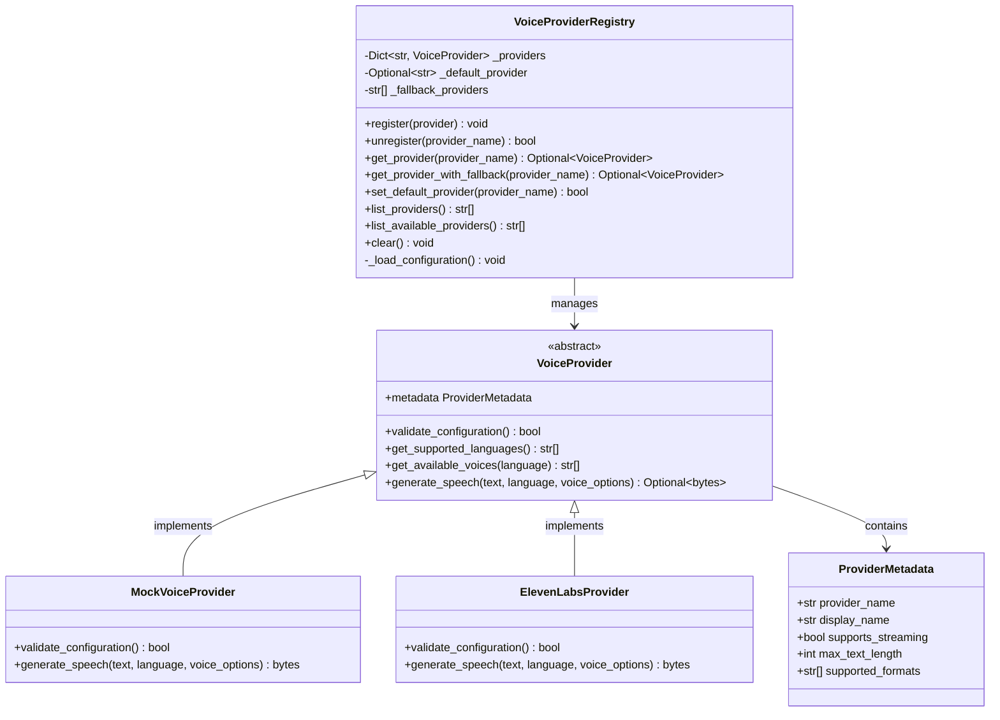
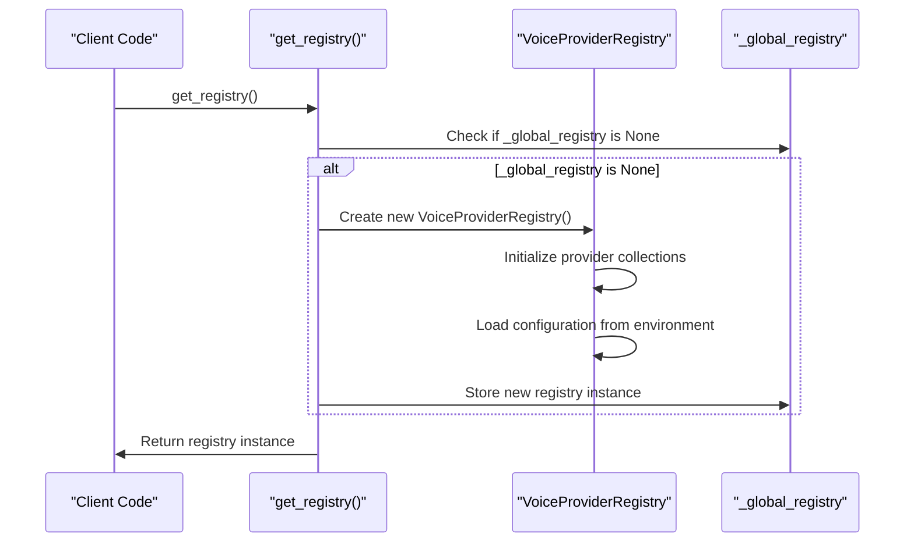
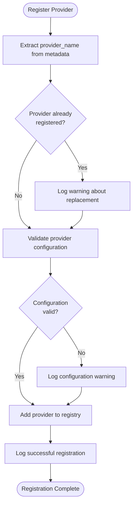
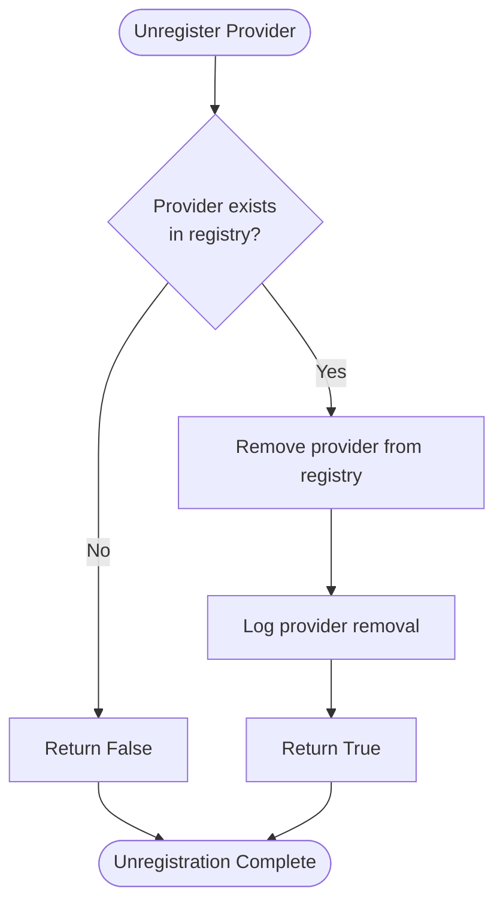
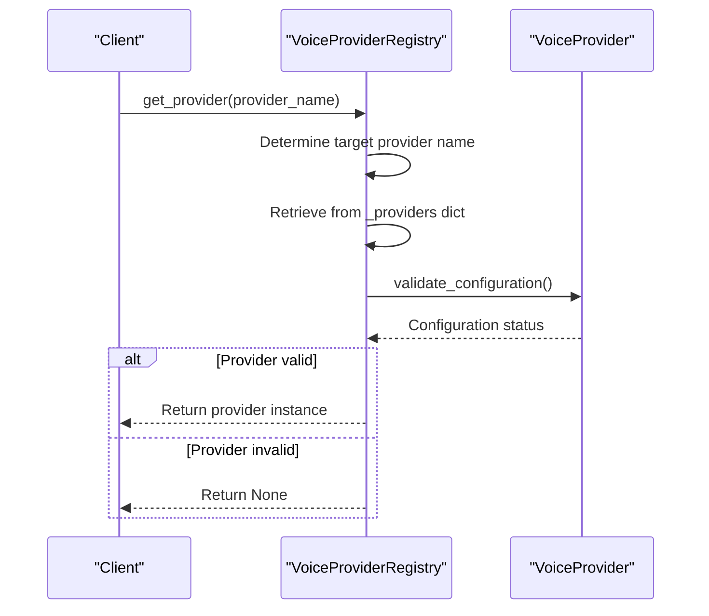
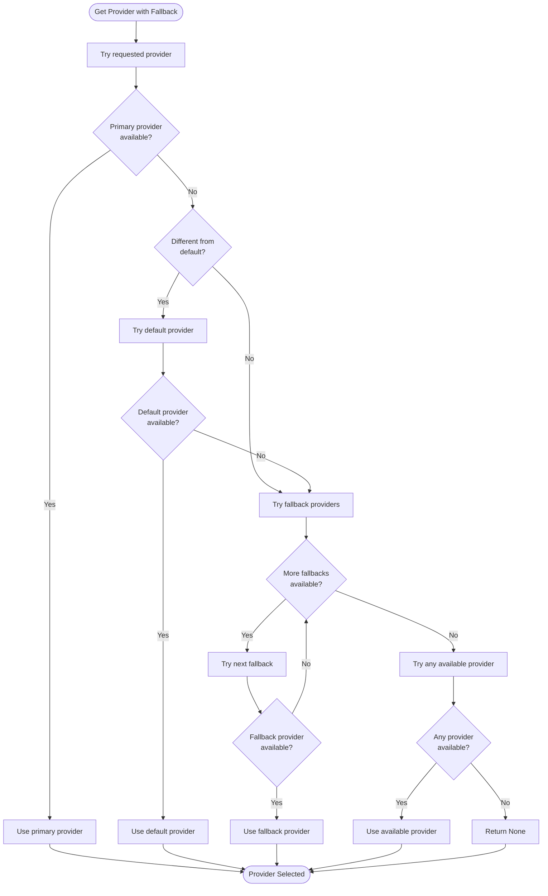
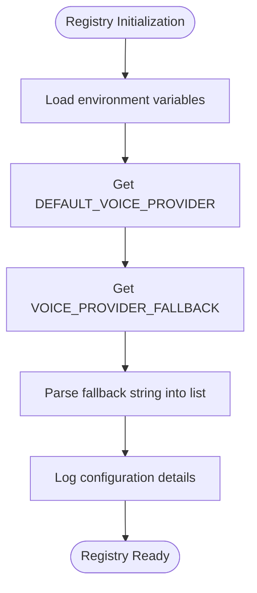
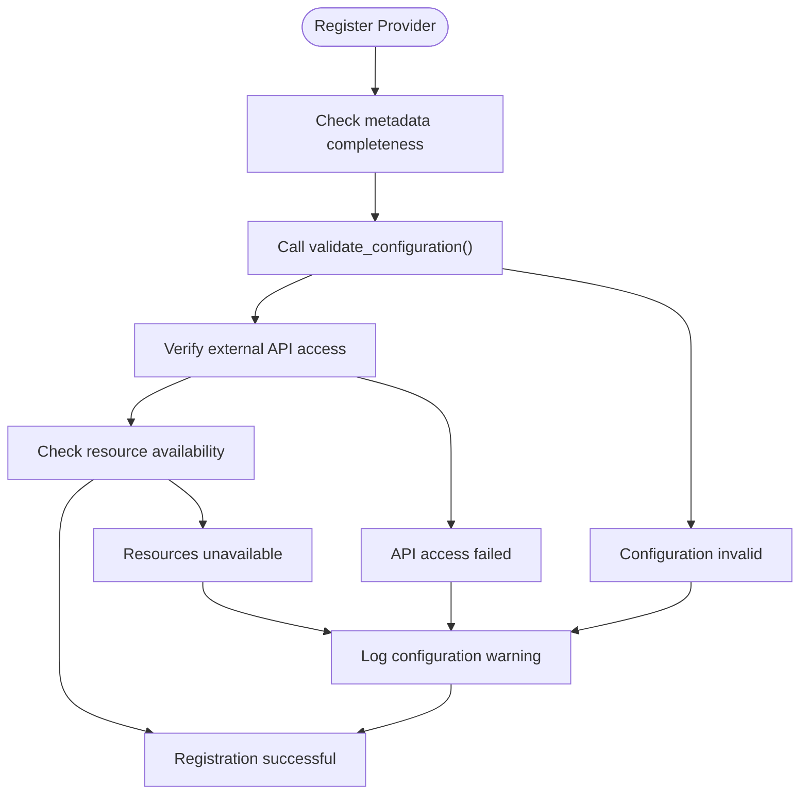
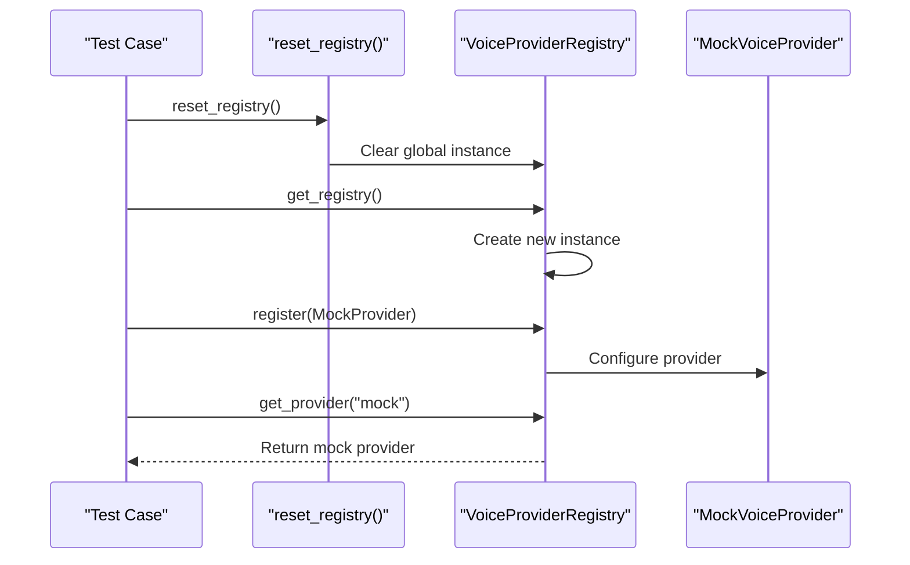

# VoiceProviderRegistry Documentation

<cite>
**Referenced Files in This Document**
- [provider_registry.py](file://src/voice_providers/provider_registry.py)
- [base_provider.py](file://src/voice_providers/base_provider.py)
- [mock_provider.py](file://src/voice_providers/mock_provider.py)
- [elevenlabs_provider.py](file://src/voice_providers/elevenlabs_provider.py)
- [voice_service.py](file://src/voice_providers/voice_service.py)
- [__init__.py](file://src/voice_providers/__init__.py)
- [test_voice_providers.py](file://test_voice_providers.py)
</cite>

## Table of Contents
1. [Introduction](#introduction)
2. [Architecture Overview](#architecture-overview)
3. [Singleton Pattern Implementation](#singleton-pattern-implementation)
4. [Provider Registration System](#provider-registration-system)
5. [Provider Retrieval Mechanisms](#provider-retrieval-mechanisms)
6. [Fallback Resolution Logic](#fallback-resolution-logic)
7. [Configuration Management](#configuration-management)
8. [Error Handling and Validation](#error-handling-and-validation)
9. [Testing and Development](#testing-and-development)
10. [Common Issues and Solutions](#common-issues-and-solutions)
11. [Best Practices](#best-practices)

## Introduction

The VoiceProviderRegistry class serves as the central hub for managing voice provider lifecycle in the Tale Generator application. It implements a sophisticated provider management system that handles registration, unregistration, retrieval, and fallback mechanisms for multiple voice-over providers. The registry ensures reliable audio generation by maintaining provider availability, validating configurations, and implementing intelligent fallback strategies when primary providers fail.

The registry operates as a singleton pattern implementation, providing a globally accessible instance through the `get_registry()` factory function while maintaining thread-safe access to provider collections. It integrates seamlessly with the voice service layer to enable robust audio generation capabilities across different voice providers.

## Architecture Overview

The VoiceProviderRegistry follows a layered architecture that separates concerns between provider management, configuration handling, and fallback logic:

**Diagram sources**
- [provider_registry.py](file://src/voice_providers/provider_registry.py#L12-L212)
- [base_provider.py](file://src/voice_providers/base_provider.py#L28-L97)
- [mock_provider.py](file://src/voice_providers/mock_provider.py#L13-L98)
- [elevenlabs_provider.py](file://src/voice_providers/elevenlabs_provider.py#L18-L220)

**Section sources**
- [provider_registry.py](file://src/voice_providers/provider_registry.py#L12-L212)
- [base_provider.py](file://src/voice_providers/base_provider.py#L28-L97)

## Singleton Pattern Implementation

The VoiceProviderRegistry implements a singleton pattern through a global registry instance managed by the `_global_registry` variable and accessed via the `get_registry()` factory function. This design ensures that all parts of the application share a single, consistent provider registry instance.

### Global Registry Instance

The registry maintains a global state through the `_global_registry` variable, which is lazily instantiated when first accessed:

**Diagram sources**
- [provider_registry.py](file://src/voice_providers/provider_registry.py#L196-L205)

### Factory Function Design

The `get_registry()` function provides controlled access to the singleton instance, ensuring proper initialization and configuration loading. The function implements lazy initialization, creating the registry only when first requested and loading environment-based configuration automatically.

### Testing Support

The registry provides a `reset_registry()` function for testing scenarios, allowing developers to clear the global instance and simulate fresh initialization. This is crucial for isolated unit testing and integration tests that require clean state between test runs.

**Section sources**
- [provider_registry.py](file://src/voice_providers/provider_registry.py#L192-L212)

## Provider Registration System

The provider registration system handles the lifecycle management of voice providers, including validation, deduplication, and configuration verification. The registration process ensures that providers are properly validated before being added to the registry.

### Registration Process

The `register()` method implements a comprehensive registration workflow:

**Diagram sources**
- [provider_registry.py](file://src/voice_providers/provider_registry.py#L36-L55)

### Configuration Validation

During registration, the registry performs configuration validation to ensure providers are ready for use. The validation process includes:

- **Metadata Verification**: Ensures the provider has proper metadata with unique identifiers
- **Configuration Validation**: Calls the provider's `validate_configuration()` method
- **Environment Checks**: Verifies required environment variables and external dependencies
- **Resource Availability**: Confirms access to APIs, databases, or other resources

### Duplicate Handling

The registry handles duplicate registrations gracefully by replacing existing providers with newer instances. This behavior allows for dynamic provider updates and configuration changes without requiring explicit unregistration.

### Unregistration Process

The `unregister()` method removes providers from the registry while maintaining system integrity:

**Diagram sources**
- [provider_registry.py](file://src/voice_providers/provider_registry.py#L57-L70)

**Section sources**
- [provider_registry.py](file://src/voice_providers/provider_registry.py#L36-L70)

## Provider Retrieval Mechanisms

The registry provides multiple methods for retrieving providers, each serving different use cases and requirements for provider selection.

### Basic Provider Retrieval

The `get_provider()` method implements the core provider retrieval logic with optional provider specification:

**Diagram sources**
- [provider_registry.py](file://src/voice_providers/provider_registry.py#L72-L98)

### Default Provider Selection

When no provider name is specified, the method automatically uses the configured default provider. This simplifies common use cases where applications prefer a consistent default provider.

### Available Provider Filtering

The `list_available_providers()` method returns only providers that pass configuration validation, ensuring that only functional providers are considered for audio generation tasks.

### Provider Discovery

The `list_providers()` method provides a complete inventory of registered providers, useful for administrative purposes and debugging.

**Section sources**
- [provider_registry.py](file://src/voice_providers/provider_registry.py#L72-L174)

## Fallback Resolution Logic

The `get_provider_with_fallback()` method implements a sophisticated fallback mechanism that attempts multiple provider selection strategies when primary providers fail or become unavailable.

### Fallback Strategy Hierarchy

The fallback mechanism follows a hierarchical approach:

**Diagram sources**
- [provider_registry.py](file://src/voice_providers/provider_registry.py#L100-L140)

### Fallback Chain Configuration

The fallback chain is configured through environment variables:

- **DEFAULT_VOICE_PROVIDER**: Sets the primary default provider
- **VOICE_PROVIDER_FALLBACK**: Defines comma-separated fallback providers

### Intelligent Provider Selection

The fallback mechanism intelligently selects providers by considering:

- **Availability**: Only considers providers that pass configuration validation
- **Priority**: Respects the configured fallback order
- **Redundancy**: Tries all available providers as a last resort
- **Logging**: Provides detailed logging for debugging and monitoring

**Section sources**
- [provider_registry.py](file://src/voice_providers/provider_registry.py#L100-L140)

## Configuration Management

The registry implements comprehensive configuration management through environment variables and runtime configuration loading.

### Environment-Based Configuration

The registry loads configuration from environment variables during initialization:

**Diagram sources**
- [provider_registry.py](file://src/voice_providers/provider_registry.py#L24-L34)

### Default Provider Management

The `set_default_provider()` method allows dynamic modification of the default provider:

- **Validation**: Ensures the target provider exists in the registry
- **Persistence**: Updates the internal default provider reference
- **Logging**: Records the change for audit and debugging purposes

### Runtime Configuration Updates

The registry supports runtime configuration updates through:

- **Provider Registration**: New providers become immediately available
- **Default Provider Changes**: Dynamic default switching without restart
- **Fallback Reconfiguration**: Runtime modification of fallback priorities

**Section sources**
- [provider_registry.py](file://src/voice_providers/provider_registry.py#L24-L34)
- [provider_registry.py](file://src/voice_providers/provider_registry.py#L169-L184)

## Error Handling and Validation

The registry implements comprehensive error handling and validation to ensure system reliability and provide meaningful feedback for debugging.

### Provider Validation

Each provider undergoes validation through multiple layers:

**Diagram sources**
- [provider_registry.py](file://src/voice_providers/provider_registry.py#L50-L55)

### Error Recovery Strategies

The registry implements several error recovery strategies:

- **Graceful Degradation**: Continues operation with reduced functionality when providers fail
- **Fallback Chains**: Automatic switching to alternative providers
- **Logging and Monitoring**: Comprehensive logging for debugging and alerting
- **Safe Defaults**: Maintains system functionality even when providers are unavailable

### Common Error Scenarios

The registry handles various error scenarios:

- **Missing Providers**: Gracefully handles requests for non-existent providers
- **Invalid Configurations**: Warns about but allows registration of misconfigured providers
- **Network Failures**: Implements retry logic and fallback mechanisms
- **API Rate Limiting**: Manages rate limits through provider prioritization

**Section sources**
- [provider_registry.py](file://src/voice_providers/provider_registry.py#L50-L55)
- [provider_registry.py](file://src/voice_providers/provider_registry.py#L89-L98)

## Testing and Development

The registry provides extensive testing support through dedicated testing utilities and patterns.

### Testing Utilities

The registry includes specialized testing functions:

- **reset_registry()**: Clears the global registry instance for clean testing
- **Mock Providers**: Specialized providers for testing without external dependencies
- **Configuration Isolation**: Independent configuration for each test run

### Test Patterns

The registry supports various testing patterns:

**Diagram sources**
- [test_voice_providers.py](file://test_voice_providers.py#L47-L83)

### Development Best Practices

The registry encourages development best practices:

- **Provider Abstraction**: Consistent interface across all providers
- **Configuration Validation**: Early detection of configuration issues
- **Fallback Mechanisms**: Reliable operation under failure conditions
- **Comprehensive Logging**: Detailed tracing for debugging and monitoring

**Section sources**
- [test_voice_providers.py](file://test_voice_providers.py#L47-L83)
- [provider_registry.py](file://src/voice_providers/provider_registry.py#L208-L212)

## Common Issues and Solutions

Understanding common issues helps developers implement robust solutions and handle edge cases effectively.

### Provider Configuration Validation Failures

**Issue**: Providers fail validation due to missing credentials or network issues.

**Solution**: 
- Implement proper credential management and validation
- Use fallback providers for critical functionality
- Provide clear error messages for configuration issues

### Fallback Chain Misconfiguration

**Issue**: Incorrect fallback ordering leads to poor provider selection.

**Solution**:
- Validate fallback chain configuration during startup
- Monitor fallback usage patterns for optimization
- Provide clear documentation for fallback configuration

### Memory Management

**Issue**: Accumulation of unused providers in the registry.

**Solution**:
- Implement provider lifecycle management
- Use weak references for long-lived provider instances
- Regular cleanup of obsolete providers

### Thread Safety

**Issue**: Concurrent access to the registry causes race conditions.

**Solution**:
- The singleton pattern ensures thread-safe access
- Use appropriate locking mechanisms for mutable state
- Implement atomic operations for critical registry updates

## Best Practices

Following established best practices ensures optimal performance and maintainability of the provider registry system.

### Provider Registration

- **Validate Early**: Perform configuration validation during registration
- **Handle Duplicates**: Understand and handle provider replacement scenarios
- **Log Thoroughly**: Maintain comprehensive logs for debugging and monitoring

### Provider Selection

- **Use Fallbacks**: Always use `get_provider_with_fallback()` for production code
- **Monitor Performance**: Track provider response times and success rates
- **Implement Circuit Breakers**: Prevent cascading failures across providers

### Configuration Management

- **Environment Variables**: Use environment variables for provider configuration
- **Default Values**: Provide sensible defaults for configuration parameters
- **Validation**: Validate configuration at startup and runtime

### Error Handling

- **Graceful Degradation**: Maintain functionality even when providers fail
- **Comprehensive Logging**: Log all provider operations and errors
- **Monitoring**: Implement monitoring for provider health and performance

### Testing Strategies

- **Isolated Testing**: Use `reset_registry()` for clean test environments
- **Mock Providers**: Utilize mock providers for unit testing
- **Integration Tests**: Test provider fallback mechanisms thoroughly