# Voice Provider System

<cite>
**Referenced Files in This Document**
- [src/voice_providers/__init__.py](file://src/voice_providers/__init__.py)
- [src/voice_providers/base_provider.py](file://src/voice_providers/base_provider.py)
- [src/voice_providers/provider_registry.py](file://src/voice_providers/provider_registry.py)
- [src/voice_providers/voice_service.py](file://src/voice_providers/voice_service.py)
- [src/voice_providers/elevenlabs_provider.py](file://src/voice_providers/elevenlabs_provider.py)
- [src/voice_providers/mock_provider.py](file://src/voice_providers/mock_provider.py)
- [test_voice_providers.py](file://test_voice_providers.py)
- [test_integration_voice.py](file://test_integration_voice.py)
- [src/application/dto.py](file://src/application/dto.py)
- [src/domain/entities.py](file://src/domain/entities.py)
- [src/api/routes.py](file://src/api/routes.py)
- [src/application/use_cases/generate_story.py](file://src/application/use_cases/generate_story.py)
</cite>

## Table of Contents
1. [Introduction](#introduction)
2. [System Architecture Overview](#system-architecture-overview)
3. [Core Components](#core-components)
4. [Plugin Architecture](#plugin-architecture)
5. [Provider Registry Management](#provider-registry-management)
6. [Voice Service Facade](#voice-service-facade)
7. [Concrete Provider Implementations](#concrete-provider-implementations)
8. [Configuration and Environment Variables](#configuration-and-environment-variables)
9. [Fallback Resolution Strategy](#fallback-resolution-strategy)
10. [Language Support and Voice Selection](#language-support-and-voice-selection)
11. [Integration Patterns](#integration-patterns)
12. [Testing Strategies](#testing-strategies)
13. [Common Issues and Solutions](#common-issues-and-solutions)
14. [Extending the System](#extending-the-system)

## Introduction

The Voice Provider System in the Tale Generator application is a sophisticated plugin architecture designed to enable flexible text-to-speech functionality with multiple voice providers. The system abstracts voice generation behind a unified interface while providing robust fallback mechanisms, configuration management, and comprehensive error handling.

The architecture centers around the VoiceProvider abstract base class, which defines a standardized interface for all voice providers. A centralized VoiceProviderRegistry manages provider lifecycle, configuration, and selection, while the VoiceService facade provides a simplified interface for audio generation with automatic provider selection and fallback capabilities.

## System Architecture Overview

The Voice Provider System follows a layered architecture with clear separation of concerns:

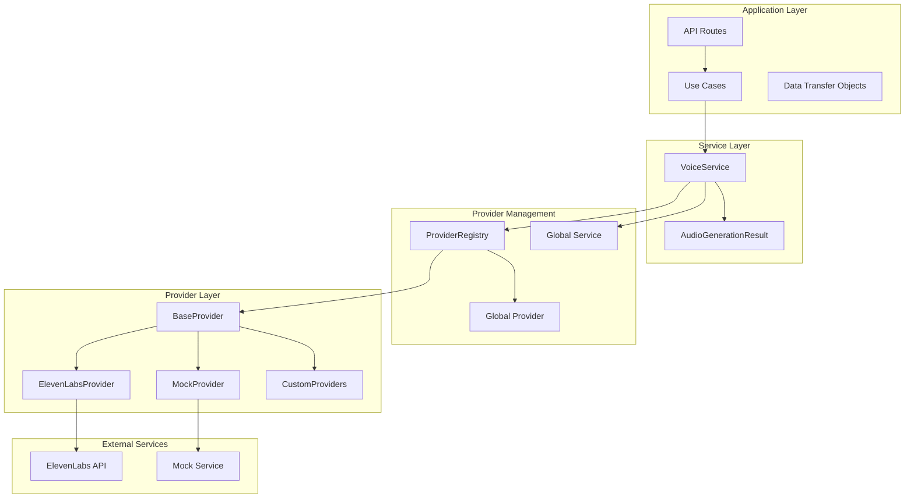

**Diagram sources**
- [src/api/routes.py](file://src/api/routes.py#L145-L171)
- [src/application/use_cases/generate_story.py](file://src/application/use_cases/generate_story.py#L162-L207)
- [src/voice_providers/voice_service.py](file://src/voice_providers/voice_service.py#L25-L236)
- [src/voice_providers/provider_registry.py](file://src/voice_providers/provider_registry.py#L12-L212)

## Core Components

The Voice Provider System consists of several interconnected components that work together to provide seamless voice generation capabilities:

### VoiceProvider Abstract Base Class

The foundation of the system is the VoiceProvider abstract base class, which defines the standardized interface that all providers must implement:

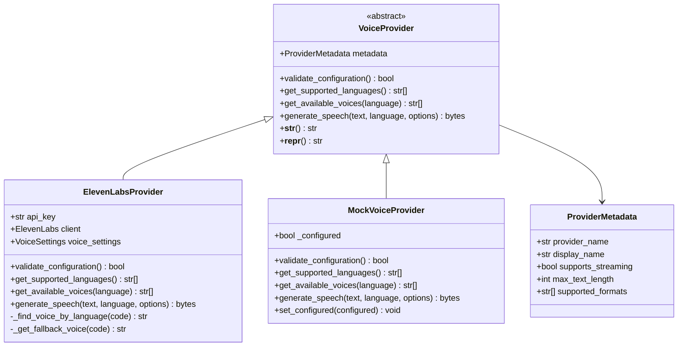

**Diagram sources**
- [src/voice_providers/base_provider.py](file://src/voice_providers/base_provider.py#L28-L97)
- [src/voice_providers/elevenlabs_provider.py](file://src/voice_providers/elevenlabs_provider.py#L18-L220)
- [src/voice_providers/mock_provider.py](file://src/voice_providers/mock_provider.py#L13-L98)

**Section sources**
- [src/voice_providers/base_provider.py](file://src/voice_providers/base_provider.py#L1-L97)

### VoiceProviderRegistry

The VoiceProviderRegistry serves as the central management hub for all voice providers, handling registration, configuration, and provider selection with sophisticated fallback mechanisms:

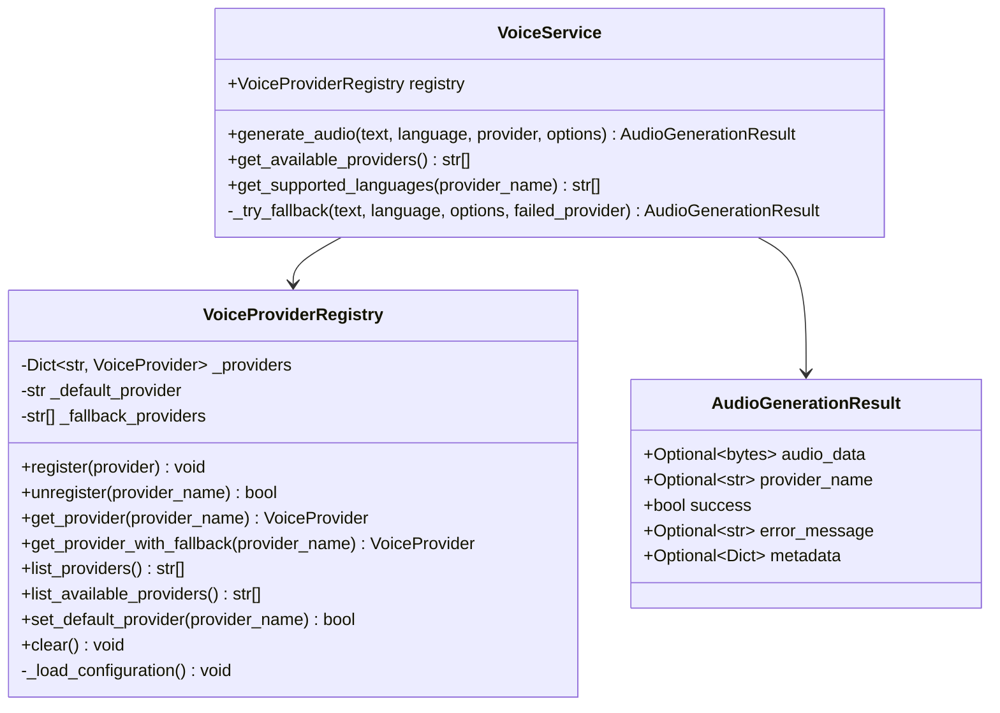

**Diagram sources**
- [src/voice_providers/provider_registry.py](file://src/voice_providers/provider_registry.py#L12-L212)
- [src/voice_providers/voice_service.py](file://src/voice_providers/voice_service.py#L25-L236)

**Section sources**
- [src/voice_providers/provider_registry.py](file://src/voice_providers/provider_registry.py#L1-L212)

## Plugin Architecture

The Voice Provider System implements a robust plugin architecture that enables dynamic provider registration and management:

### Provider Registration Lifecycle

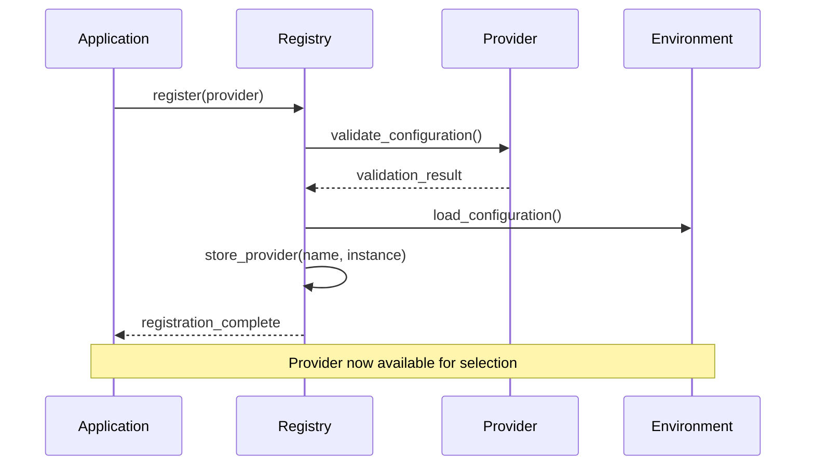

**Diagram sources**
- [src/voice_providers/provider_registry.py](file://src/voice_providers/provider_registry.py#L36-L55)

### Provider Interface Standardization

All providers must implement the VoiceProvider interface, ensuring consistent behavior across different voice services:

| Method | Purpose | Return Type | Validation |
|--------|---------|-------------|------------|
| `validate_configuration()` | Verify provider setup | `bool` | Must return `True` for active providers |
| `get_supported_languages()` | List supported languages | `List[str]` | ISO 639-1 language codes |
| `get_available_voices()` | Get voice identifiers | `List[str]` | Filterable by language |
| `generate_speech()` | Convert text to audio | `Optional[bytes]` | Returns audio data or None |

**Section sources**
- [src/voice_providers/base_provider.py](file://src/voice_providers/base_provider.py#L41-L88)

## Provider Registry Management

The VoiceProviderRegistry manages provider lifecycle through a sophisticated configuration system that supports environment-based setup and dynamic provider management:

### Configuration Loading

The registry automatically loads configuration from environment variables during initialization:

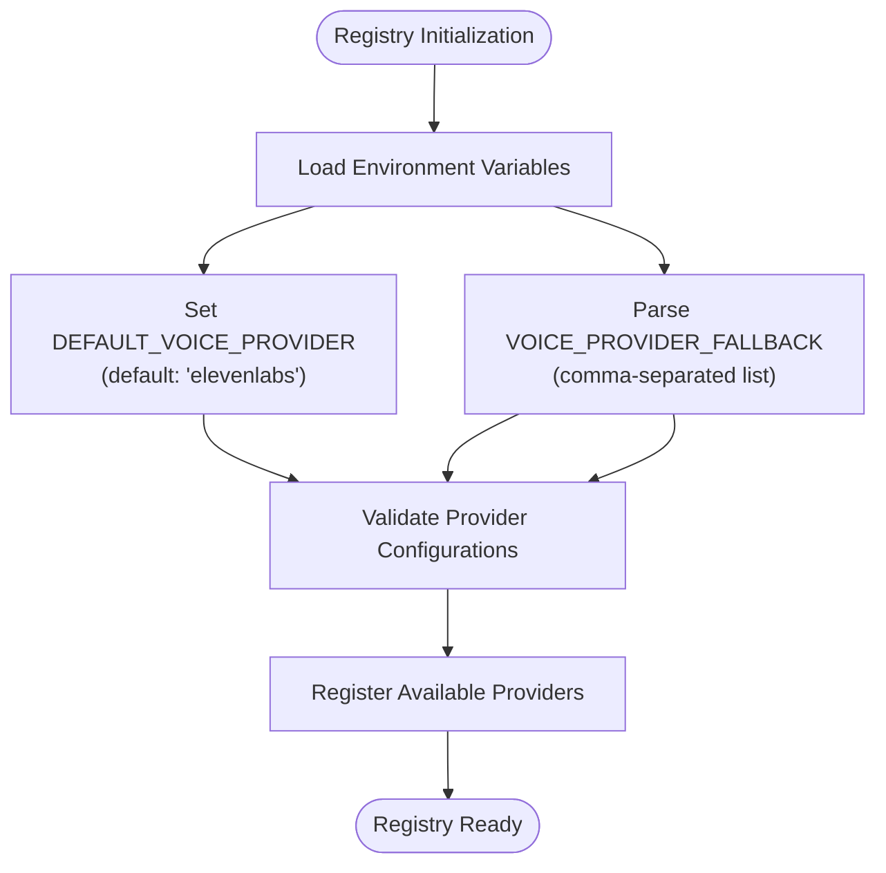

**Diagram sources**
- [src/voice_providers/provider_registry.py](file://src/voice_providers/provider_registry.py#L24-L34)

### Provider Selection Strategy

The registry implements a hierarchical provider selection strategy:

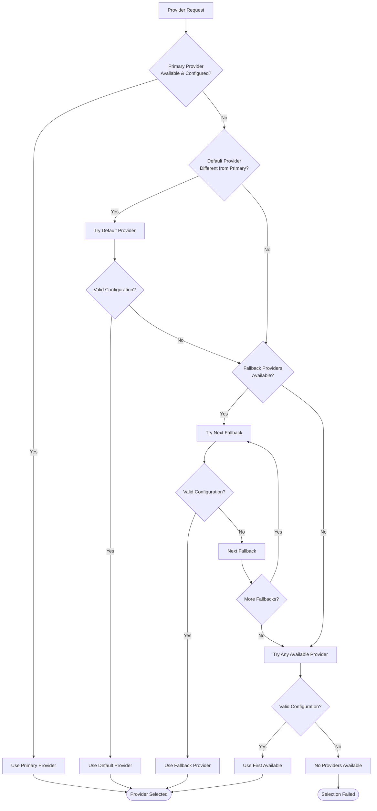

**Diagram sources**
- [src/voice_providers/provider_registry.py](file://src/voice_providers/provider_registry.py#L100-L140)

**Section sources**
- [src/voice_providers/provider_registry.py](file://src/voice_providers/provider_registry.py#L100-L140)

## Voice Service Facade

The VoiceService acts as a facade that simplifies voice generation for consumers while handling complex provider selection, fallback logic, and error management:

### Audio Generation Workflow

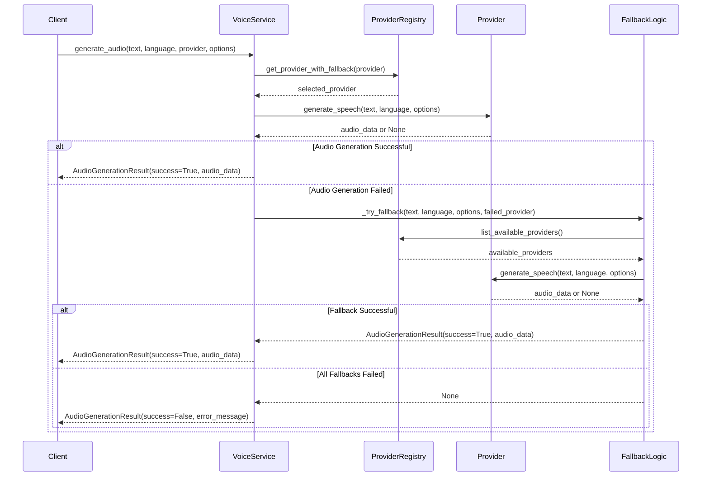

**Diagram sources**
- [src/voice_providers/voice_service.py](file://src/voice_providers/voice_service.py#L32-L134)

### AudioGenerationResult Data Structure

The AudioGenerationResult encapsulates the outcome of audio generation with comprehensive metadata:

| Field | Type | Purpose |
|-------|------|---------|
| `audio_data` | `Optional[bytes]` | Generated audio data (MP3 format) |
| `provider_name` | `Optional[str]` | Name of the provider used |
| `success` | `bool` | Indicates generation success |
| `error_message` | `Optional[str]` | Human-readable error description |
| `metadata` | `Optional[Dict[str, Any]]` | Additional generation metadata |

**Section sources**
- [src/voice_providers/voice_service.py](file://src/voice_providers/voice_service.py#L14-L23)

## Concrete Provider Implementations

The system includes two concrete provider implementations that demonstrate different approaches to voice generation:

### ElevenLabsProvider Implementation

The ElevenLabsProvider integrates with the ElevenLabs API to provide high-quality voice synthesis:

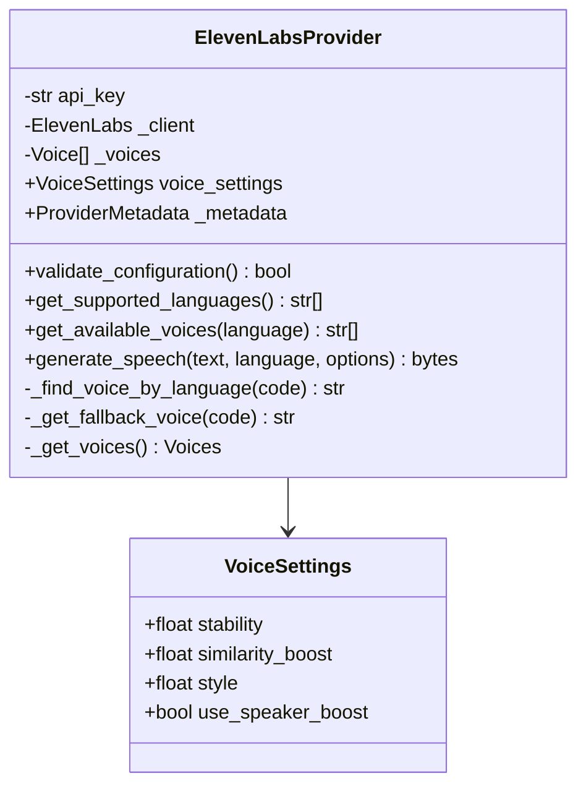

**Diagram sources**
- [src/voice_providers/elevenlabs_provider.py](file://src/voice_providers/elevenlabs_provider.py#L18-L220)

### MockProvider for Testing

The MockProvider provides deterministic audio generation for testing without external API dependencies:

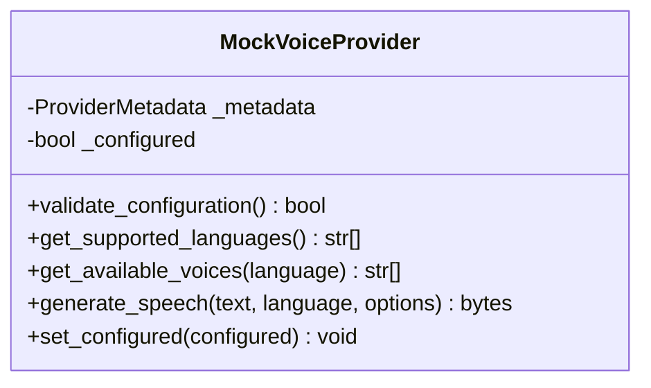

**Diagram sources**
- [src/voice_providers/mock_provider.py](file://src/voice_providers/mock_provider.py#L13-L98)

**Section sources**
- [src/voice_providers/elevenlabs_provider.py](file://src/voice_providers/elevenlabs_provider.py#L1-L220)
- [src/voice_providers/mock_provider.py](file://src/voice_providers/mock_provider.py#L1-L98)

## Configuration and Environment Variables

The Voice Provider System uses environment variables for flexible configuration management:

### Environment Variable Configuration

| Variable | Purpose | Default Value | Format |
|----------|---------|---------------|--------|
| `DEFAULT_VOICE_PROVIDER` | Primary provider selection | `"elevenlabs"` | Provider name string |
| `VOICE_PROVIDER_FALLBACK` | Comma-separated fallback providers | `""` | `provider1,provider2,provider3` |

### Configuration Loading Process

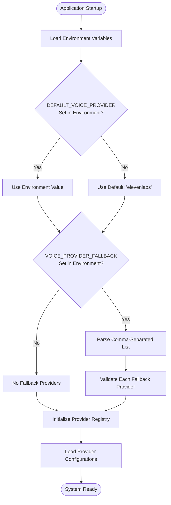

**Diagram sources**
- [src/voice_providers/provider_registry.py](file://src/voice_providers/provider_registry.py#L24-L34)

**Section sources**
- [src/voice_providers/provider_registry.py](file://src/voice_providers/provider_registry.py#L24-L34)

## Fallback Resolution Strategy

The Voice Provider System implements a sophisticated fallback mechanism that ensures reliable audio generation even when individual providers fail:

### Fallback Chain Execution

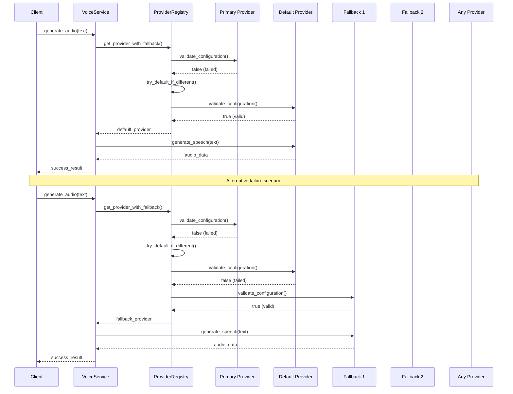

**Diagram sources**
- [src/voice_providers/provider_registry.py](file://src/voice_providers/provider_registry.py#L100-L140)
- [src/voice_providers/voice_service.py](file://src/voice_providers/voice_service.py#L136-L191)

### Fallback Priority Order

The system follows a strict priority order for fallback resolution:

1. **Primary Provider**: The explicitly requested provider
2. **Default Provider**: The configured default provider (if different from primary)
3. **Fallback Providers**: Pre-configured fallback providers in order
4. **Any Available Provider**: First valid provider in the registry

**Section sources**
- [src/voice_providers/provider_registry.py](file://src/voice_providers/provider_registry.py#L100-L140)
- [src/voice_providers/voice_service.py](file://src/voice_providers/voice_service.py#L136-L191)

## Language Support and Voice Selection

The Voice Provider System provides comprehensive language support detection and intelligent voice selection:

### Language Support Matrix

| Provider | Languages | Voice Selection Strategy |
|----------|-----------|-------------------------|
| ElevenLabsProvider | 13+ languages | Automatic language detection with fallback |
| MockProvider | 11 languages | Fixed language support with mock voices |

### Voice Selection Algorithm

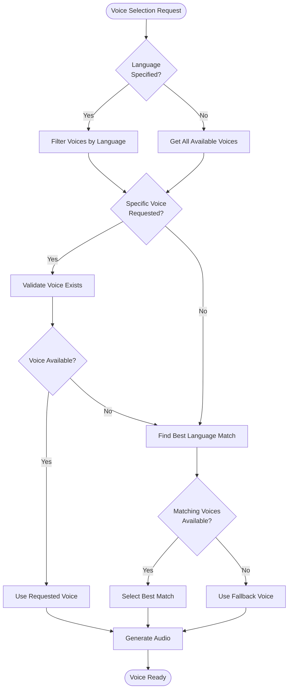

**Diagram sources**
- [src/voice_providers/elevenlabs_provider.py](file://src/voice_providers/elevenlabs_provider.py#L128-L163)

**Section sources**
- [src/voice_providers/elevenlabs_provider.py](file://src/voice_providers/elevenlabs_provider.py#L73-L163)

## Integration Patterns

The Voice Provider System integrates seamlessly with the broader Tale Generator application through well-defined patterns:

### API Integration Pattern

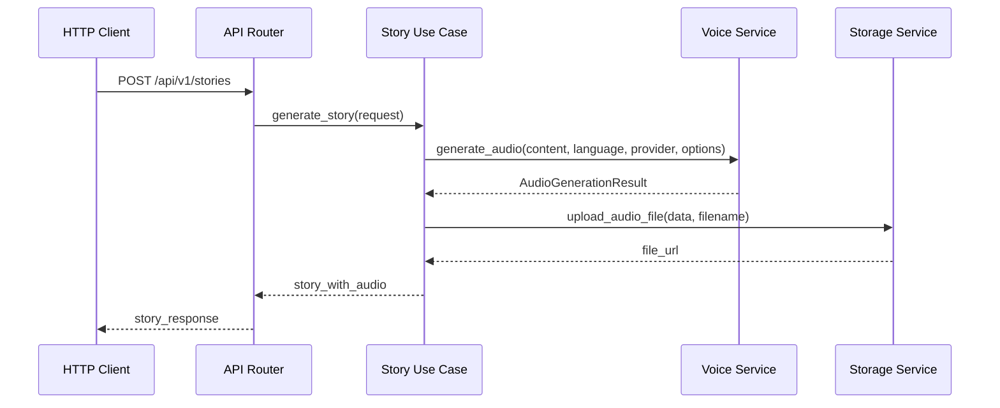

**Diagram sources**
- [src/api/routes.py](file://src/api/routes.py#L145-L171)
- [src/application/use_cases/generate_story.py](file://src/application/use_cases/generate_story.py#L162-L207)

### Data Transfer Object Integration

The system uses structured DTOs to maintain compatibility across different API versions:

| Field | Type | Purpose |
|-------|------|---------|
| `voice_provider` | `Optional[str]` | Explicit provider selection |
| `voice_options` | `Optional[Dict[str, Any]]` | Provider-specific configuration |
| `generate_audio` | `Optional[bool]` | Audio generation toggle |

**Section sources**
- [src/application/dto.py](file://src/application/dto.py#L25-L27)
- [src/api/routes.py](file://src/api/routes.py#L145-L171)

## Testing Strategies

The Voice Provider System employs comprehensive testing strategies to ensure reliability and maintainability:

### Unit Testing Approach

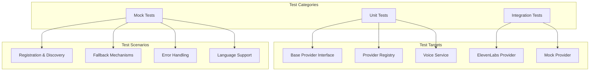

### Testing Patterns

The system includes comprehensive test coverage for all major components:

- **Provider Registration**: Tests provider lifecycle management
- **Fallback Behavior**: Validates fallback chain execution
- **Error Handling**: Ensures graceful degradation
- **Language Support**: Verifies language detection and voice selection
- **Mock Provider**: Provides deterministic testing without external dependencies

**Section sources**
- [test_voice_providers.py](file://test_voice_providers.py#L1-L213)
- [test_integration_voice.py](file://test_integration_voice.py#L1-L178)

## Common Issues and Solutions

### Provider Configuration Validation

**Issue**: Providers failing silently due to misconfiguration
**Solution**: Implement comprehensive validation in `validate_configuration()` method

```python
def validate_configuration(self) -> bool:
    """Validate that the provider is properly configured."""
    if not self.api_key:
        logger.warning("API key is not configured")
        return False
    
    # Additional validation logic
    return True
```

### Fallback Chain Management

**Issue**: Infinite fallback loops or incorrect provider selection
**Solution**: Implement proper fallback chain termination and logging

```python
def get_provider_with_fallback(self, provider_name: Optional[str] = None) -> Optional[VoiceProvider]:
    # Track visited providers to prevent cycles
    visited = set()
    
    # Primary provider
    provider = self.get_provider(provider_name)
    if provider and provider.metadata.provider_name not in visited:
        return provider
```

### Memory Management

**Issue**: Registry growing indefinitely with unregistered providers
**Solution**: Implement provider cleanup and garbage collection

```python
def clear(self) -> None:
    """Clear all registered providers."""
    self._providers.clear()
    logger.info("All providers cleared from registry")
```

**Section sources**
- [src/voice_providers/provider_registry.py](file://src/voice_providers/provider_registry.py#L186-L190)

## Extending the System

Adding new voice providers to the system requires implementing the VoiceProvider interface and registering the provider with the global registry:

### Creating a New Provider

1. **Implement VoiceProvider Interface**:
   ```python
   class CustomProvider(VoiceProvider):
       def __init__(self):
           self._metadata = ProviderMetadata(
               provider_name="custom",
               display_name="Custom Provider",
               supports_streaming=False,
               max_text_length=5000,
               supported_formats=["mp3"]
           )
       
       def validate_configuration(self) -> bool:
           # Implementation
           pass
       
       def get_supported_languages(self) -> List[str]:
           # Implementation
           pass
       
       def get_available_voices(self, language: Optional[str] = None) -> List[str]:
           # Implementation
           pass
       
       def generate_speech(self, text: str, language: str = "en", voice_options: Optional[Dict[str, Any]] = None) -> Optional[bytes]:
           # Implementation
           pass
   ```

2. **Register the Provider**:
   ```python
   from src.voice_providers import get_registry
   
   registry = get_registry()
   custom_provider = CustomProvider()
   registry.register(custom_provider)
   ```

3. **Configure Environment Variables**:
   ```
   DEFAULT_VOICE_PROVIDER=custom
   VOICE_PROVIDER_FALLBACK=elevenlabs,mock
   ```

### Best Practices for Provider Implementation

- **Validation**: Always implement comprehensive configuration validation
- **Error Handling**: Provide meaningful error messages and graceful degradation
- **Logging**: Include detailed logging for debugging and monitoring
- **Documentation**: Document provider capabilities and limitations
- **Testing**: Include comprehensive unit and integration tests

**Section sources**
- [src/voice_providers/base_provider.py](file://src/voice_providers/base_provider.py#L28-L97)
- [src/voice_providers/provider_registry.py](file://src/voice_providers/provider_registry.py#L36-L55)