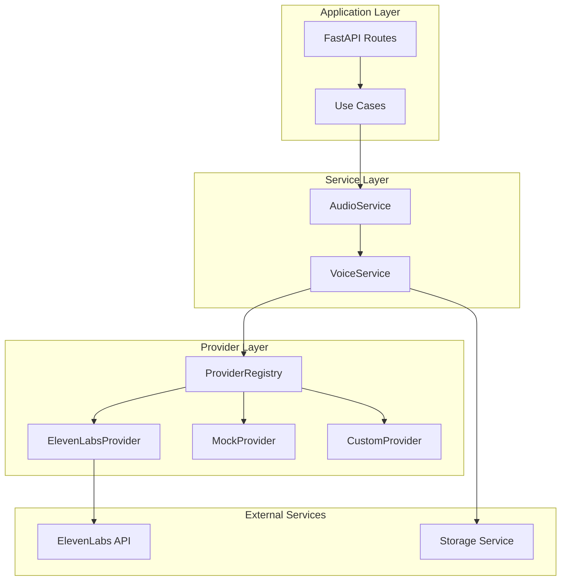
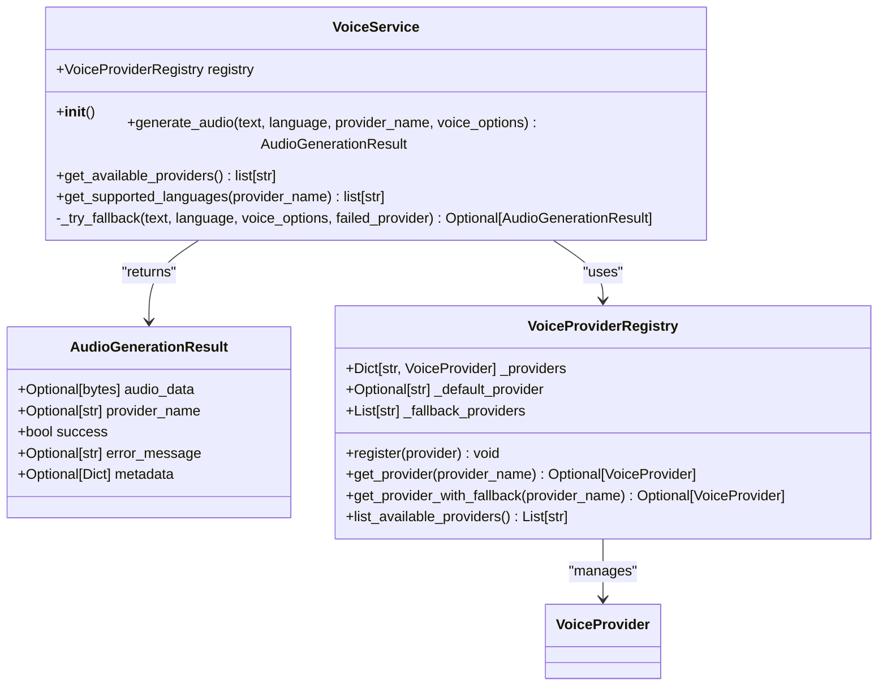
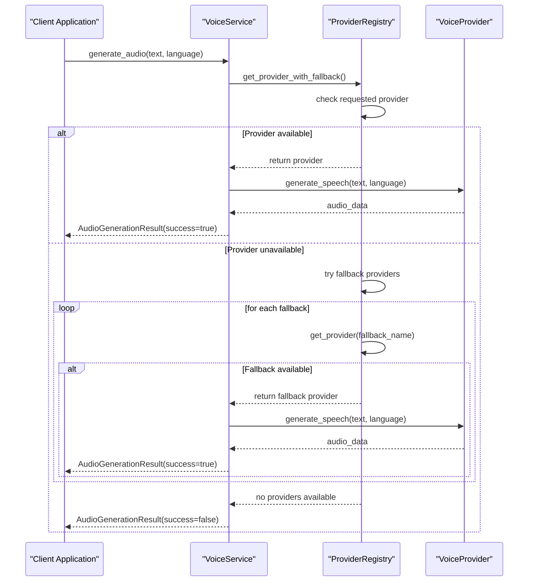
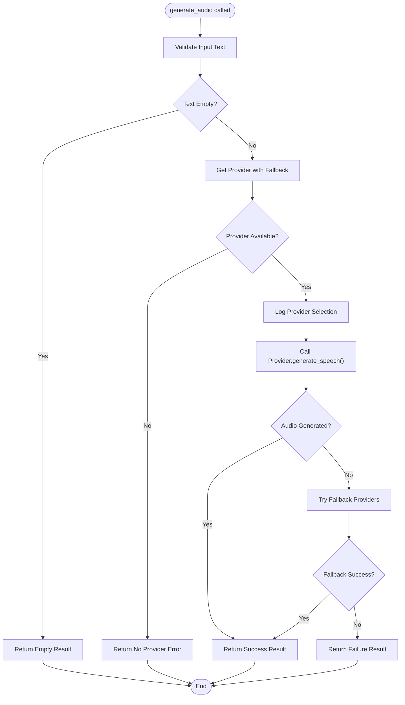
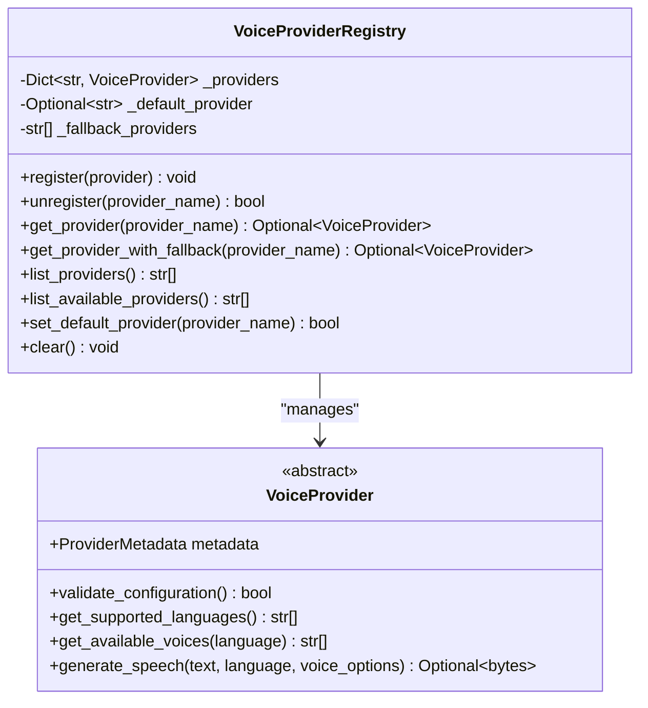
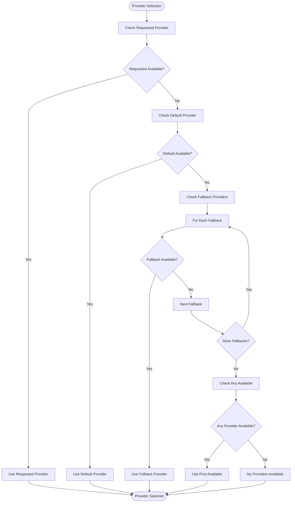
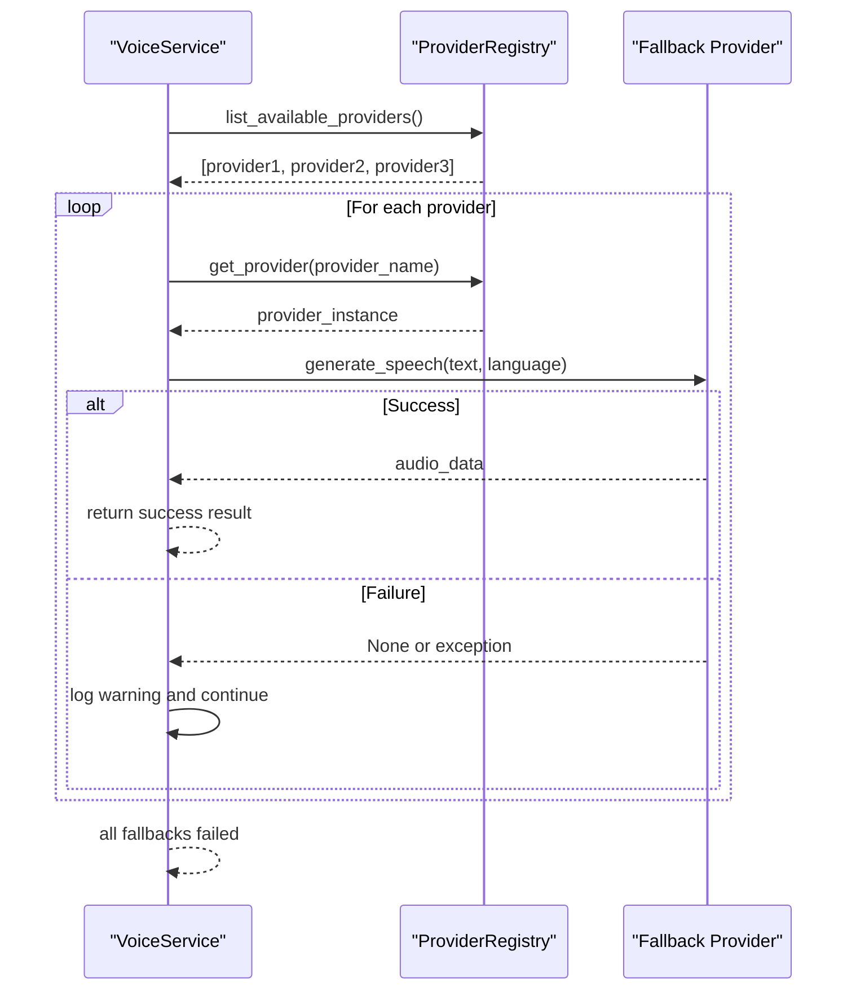
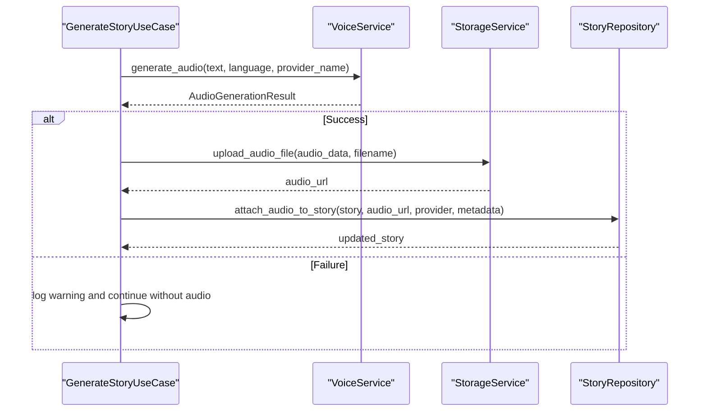

# Voice Service Facade

<cite>
**Referenced Files in This Document**
- [voice_service.py](file://src/voice_providers/voice_service.py)
- [provider_registry.py](file://src/voice_providers/provider_registry.py)
- [base_provider.py](file://src/voice_providers/base_provider.py)
- [audio_service.py](file://src/domain/services/audio_service.py)
- [elevenlabs_provider.py](file://src/voice_providers/elevenlabs_provider.py)
- [mock_provider.py](file://src/voice_providers/mock_provider.py)
- [generate_story.py](file://src/application/use_cases/generate_story.py)
- [routes.py](file://src/api/routes.py)
- [test_voice_providers.py](file://test_voice_providers.py)
- [test_integration_voice.py](file://test_integration_voice.py)
</cite>

## Table of Contents
1. [Introduction](#introduction)
2. [Architecture Overview](#architecture-overview)
3. [Core Components](#core-components)
4. [VoiceService Class Analysis](#voiceservice-class-analysis)
5. [Provider Management System](#provider-management-system)
6. [Audio Generation Workflow](#audio-generation-workflow)
7. [Error Handling and Fallback Mechanisms](#error-handling-and-fallback-mechanisms)
8. [Integration Patterns](#integration-patterns)
9. [Testing Strategies](#testing-strategies)
10. [Common Issues and Solutions](#common-issues-and-solutions)
11. [Best Practices](#best-practices)
12. [Conclusion](#conclusion)

## Introduction

The VoiceService class serves as the primary facade for audio generation in the Tale Generator application, providing a unified interface for text-to-speech conversion while abstracting the complexity of provider selection, configuration management, and error handling. As part of the voice provider ecosystem, it acts as the central coordinator for audio generation workflows, supporting multiple voice providers through a flexible registry system.

The service implements sophisticated fallback mechanisms, comprehensive error handling, and maintains backward compatibility while enabling modern provider selection features. It seamlessly integrates with the broader application architecture, supporting both legacy API patterns and new provider-aware workflows.

## Architecture Overview

The VoiceService operates within a layered architecture that separates concerns between presentation, business logic, and external service integration:



**Diagram sources**
- [routes.py](file://src/api/routes.py#L56-L210)
- [generate_story.py](file://src/application/use_cases/generate_story.py#L156-L207)
- [voice_service.py](file://src/voice_providers/voice_service.py#L25-L236)

## Core Components

### VoiceService Class

The VoiceService class serves as the primary interface for audio generation, implementing the facade pattern to simplify complex provider interactions:



**Diagram sources**
- [voice_service.py](file://src/voice_providers/voice_service.py#L14-L236)
- [provider_registry.py](file://src/voice_providers/provider_registry.py#L12-L212)
- [base_provider.py](file://src/voice_providers/base_provider.py#L28-L97)

### Provider Registry System

The provider registry manages multiple voice providers with sophisticated configuration and fallback mechanisms:



**Diagram sources**
- [voice_service.py](file://src/voice_providers/voice_service.py#L59-L134)
- [provider_registry.py](file://src/voice_providers/provider_registry.py#L100-L140)

**Section sources**
- [voice_service.py](file://src/voice_providers/voice_service.py#L25-L236)
- [provider_registry.py](file://src/voice_providers/provider_registry.py#L12-L212)

## VoiceService Class Analysis

### Initialization and Global Instance

The VoiceService implements a singleton pattern through the `get_voice_service()` factory function, ensuring consistent service instances across the application:

The service initializes with a provider registry that manages multiple voice providers, supporting dynamic registration and configuration validation.

### Core Method: generate_audio()

The `generate_audio()` method represents the primary interface for audio generation, implementing a comprehensive workflow:



**Diagram sources**
- [voice_service.py](file://src/voice_providers/voice_service.py#L32-L134)

### Discovery Methods

The VoiceService provides two key discovery methods for provider and language information:

- **get_available_providers()**: Returns list of properly configured providers
- **get_supported_languages()**: Returns supported languages for a specific provider

**Section sources**
- [voice_service.py](file://src/voice_providers/voice_service.py#L32-L236)

## Provider Management System

### VoiceProviderRegistry

The VoiceProviderRegistry manages provider lifecycle, configuration validation, and fallback mechanisms:



**Diagram sources**
- [provider_registry.py](file://src/voice_providers/provider_registry.py#L12-L212)
- [base_provider.py](file://src/voice_providers/base_provider.py#L28-L97)

### Provider Configuration and Validation

Providers implement the `validate_configuration()` method to ensure proper setup before use. The registry automatically filters out misconfigured providers during discovery operations.

**Section sources**
- [provider_registry.py](file://src/voice_providers/provider_registry.py#L12-L212)
- [base_provider.py](file://src/voice_providers/base_provider.py#L28-L97)

## Audio Generation Workflow

### Text Validation and Processing

The VoiceService performs comprehensive input validation before attempting audio generation:

1. **Empty Text Detection**: Automatically handles empty or null input by returning appropriate error results
2. **Language Validation**: Supports multiple languages through provider-specific language mapping
3. **Text Length Constraints**: Respects provider-specific text length limits

### Provider Selection Algorithm

The provider selection follows a sophisticated fallback chain:



**Diagram sources**
- [provider_registry.py](file://src/voice_providers/provider_registry.py#L100-L140)

### Audio Generation Result Structure

The `AudioGenerationResult` data structure encapsulates all aspects of audio generation outcomes:

| Field | Type | Description |
|-------|------|-------------|
| `audio_data` | `Optional[bytes]` | Generated audio data in binary format |
| `provider_name` | `Optional[str]` | Name of the provider used |
| `success` | `bool` | Indicates whether generation succeeded |
| `error_message` | `Optional[str]` | Human-readable error description |
| `metadata` | `Optional[Dict[str, Any]]` | Additional generation metadata |

**Section sources**
- [voice_service.py](file://src/voice_providers/voice_service.py#L14-L236)

## Error Handling and Fallback Mechanisms

### Comprehensive Error Handling

The VoiceService implements multi-layered error handling:

1. **Input Validation**: Immediate rejection of invalid inputs
2. **Provider Validation**: Pre-flight checks for provider availability
3. **Runtime Error Handling**: Graceful degradation during generation failures
4. **Fallback Chain**: Automatic switching to alternative providers

### Fallback Implementation

The `_try_fallback()` method implements intelligent fallback logic:



**Diagram sources**
- [voice_service.py](file://src/voice_providers/voice_service.py#L136-L191)

### Graceful Degradation

When all providers fail, the system gracefully degrades by:
- Logging detailed error information
- Returning meaningful error messages
- Maintaining application stability
- Preserving partial functionality

**Section sources**
- [voice_service.py](file://src/voice_providers/voice_service.py#L136-L191)

## Integration Patterns

### API Integration

The VoiceService integrates seamlessly with FastAPI routes, supporting both legacy and modern API patterns:

```python
# Legacy API pattern (backward compatible)
@router.post("/generate-story")
async def generate_story(request: StoryRequest):
    # Uses default provider configuration
    audio_result = voice_service.generate_audio(
        text=story_content,
        language=request.language.value
    )

# Modern API pattern (with provider selection)
@router.post("/generate-story")
async def generate_story(request: StoryRequest):
    # Explicit provider selection
    audio_result = voice_service.generate_audio(
        text=story_content,
        language=request.language.value,
        provider_name=request.voice_provider,
        voice_options=request.voice_options
    )
```

### Use Case Integration

The VoiceService integrates with the GenerateStoryUseCase for complete story generation workflows:



**Diagram sources**
- [generate_story.py](file://src/application/use_cases/generate_story.py#L156-L207)
- [routes.py](file://src/api/routes.py#L138-L172)

**Section sources**
- [routes.py](file://src/api/routes.py#L56-L210)
- [generate_story.py](file://src/application/use_cases/generate_story.py#L156-L207)

## Testing Strategies

### Unit Testing Approach

The VoiceService supports comprehensive testing through the global service instance and provider mocking:

```python
def test_voice_service_basic():
    """Test voice service basic functionality."""
    reset_registry()
    reset_voice_service()
    
    # Setup: Register mock provider
    registry = get_registry()
    mock_provider = MockVoiceProvider()
    registry.register(mock_provider)
    registry.set_default_provider("mock")
    
    # Execute: Generate audio
    service = get_voice_service()
    result = service.generate_audio(
        text="This is a test story.",
        language="en"
    )
    
    # Verify: Success and correct provider
    assert result.success is True
    assert result.provider_name == "mock"
```

### Integration Testing

The integration tests demonstrate end-to-end functionality:

```python
def test_complete_workflow():
    """Test the complete workflow from API request to audio generation."""
    # Setup providers
    registry = get_registry()
    mock = MockVoiceProvider()
    registry.register(mock)
    registry.set_default_provider("mock")
    
    # Generate audio with voice service
    service = get_voice_service()
    result = service.generate_audio(
        text="Once upon a time...",
        language="en"
    )
    
    # Verify: Successful generation
    assert result.success is True
    assert result.audio_data is not None
    assert len(result.audio_data) > 0
```

### Provider-Specific Testing

Each provider implements its own validation and testing patterns:

- **MockProvider**: Provides deterministic test results
- **ElevenLabsProvider**: Validates API connectivity and configuration
- **Custom Providers**: Follow established patterns for consistency

**Section sources**
- [test_voice_providers.py](file://test_voice_providers.py#L86-L213)
- [test_integration_voice.py](file://test_integration_voice.py#L14-L178)

## Common Issues and Solutions

### Invalid Input Handling

**Issue**: Empty text input causing generation failures
**Solution**: The VoiceService automatically detects empty text and returns appropriate error results without attempting provider calls.

**Example**: 
```python
result = voice_service.generate_audio(text="", language="en")
# Returns: success=False, error_message="Empty text provided"
```

### Provider Failure Cascades

**Issue**: Single provider failure affecting overall service availability
**Solution**: The fallback mechanism ensures continued operation even when individual providers fail.

**Implementation**: The `_try_fallback()` method systematically attempts alternative providers until success or exhaustion.

### Configuration Management

**Issue**: Misconfigured providers causing runtime errors
**Solution**: The registry validates provider configurations during registration and filtering.

**Prevention**: Use `list_available_providers()` to check provider readiness before attempting generation.

### Memory and Resource Management

**Issue**: Large audio generation consuming excessive resources
**Solution**: The service respects provider-imposed limits and implements efficient memory usage patterns.

**Monitoring**: Audio size and generation metadata are tracked for resource optimization.

**Section sources**
- [voice_service.py](file://src/voice_providers/voice_service.py#L50-L134)
- [provider_registry.py](file://src/voice_providers/provider_registry.py#L45-L55)

## Best Practices

### Service Initialization

Always use the global service instance for consistent behavior:

```python
from src.voice_providers import get_voice_service

# Get the singleton instance
voice_service = get_voice_service()
```

### Provider Selection Strategy

Choose providers based on specific requirements:

```python
# For production with quality focus
result = voice_service.generate_audio(
    text=content,
    language="en",
    provider_name="elevenlabs"
)

# For development and testing
result = voice_service.generate_audio(
    text=content,
    language="en",
    provider_name="mock"
)
```

### Error Handling Pattern

Implement robust error handling for production deployments:

```python
result = voice_service.generate_audio(text, language)
if not result.success:
    logger.error(f"Audio generation failed: {result.error_message}")
    # Implement fallback or alternative logic
```

### Testing and Development

Use the mock provider for testing scenarios:

```python
# During development and testing
mock_provider = MockVoiceProvider()
registry.register(mock_provider)
registry.set_default_provider("mock")

# Tests will use deterministic mock audio
```

### Production Deployment

Configure multiple providers for reliability:

```python
# Register multiple providers for redundancy
registry.register(ElevenLabsProvider())
registry.register(MockVoiceProvider())

# Configure fallback chain
os.environ["VOICE_PROVIDER_FALLBACK"] = "mock"
```

## Conclusion

The VoiceService class represents a sophisticated audio generation facade that successfully abstracts provider complexity while maintaining flexibility and reliability. Through its comprehensive fallback mechanisms, robust error handling, and seamless integration patterns, it enables the Tale Generator application to deliver high-quality audio experiences across multiple voice providers.

Key strengths include:
- **Unified Interface**: Simplifies complex provider interactions
- **Intelligent Fallbacks**: Ensures service continuity during failures
- **Backward Compatibility**: Maintains legacy API support
- **Extensible Architecture**: Supports easy addition of new providers
- **Comprehensive Testing**: Enables reliable development and deployment

The service demonstrates excellent software engineering practices, including proper abstraction, error handling, and integration patterns that make it suitable for production environments while remaining developer-friendly for testing and extension.