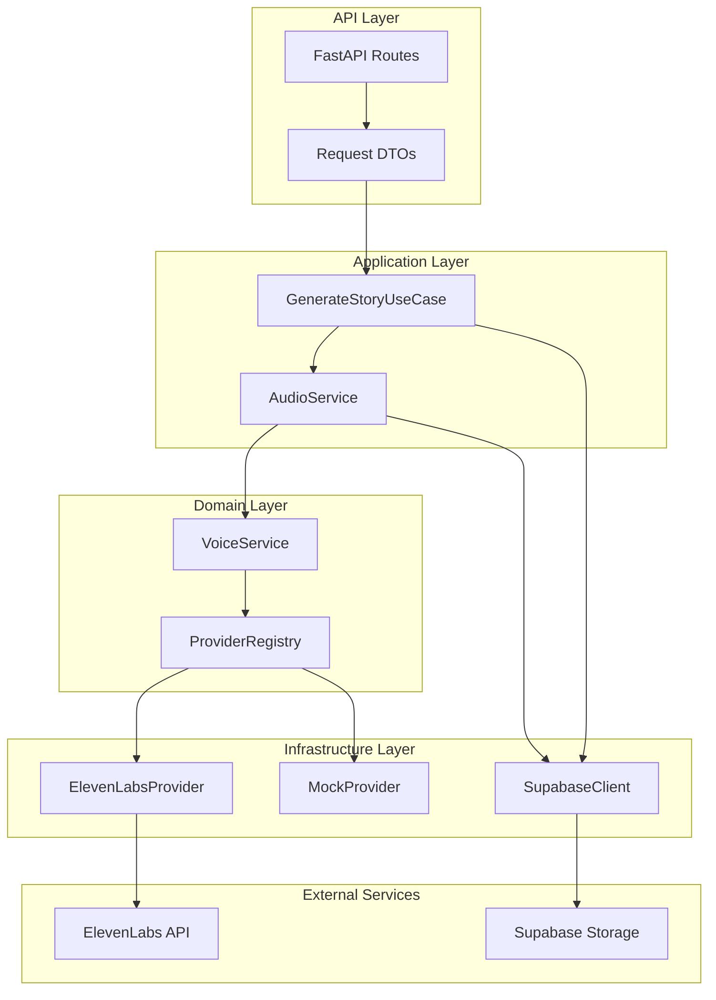
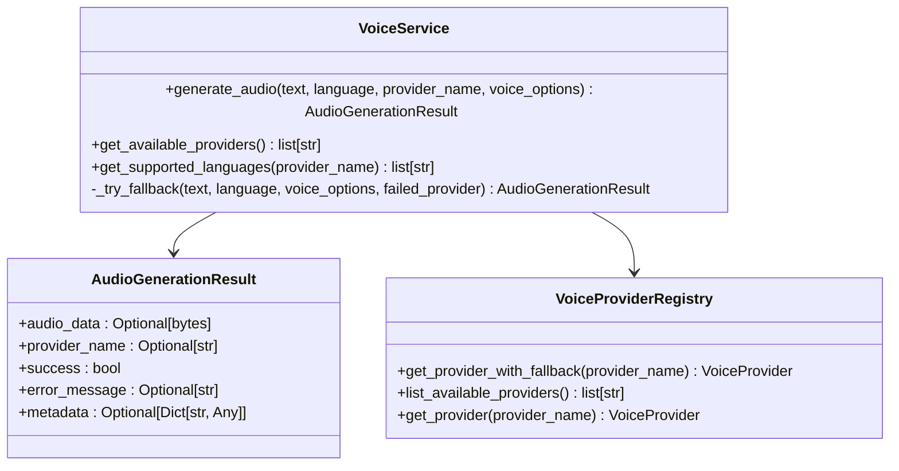
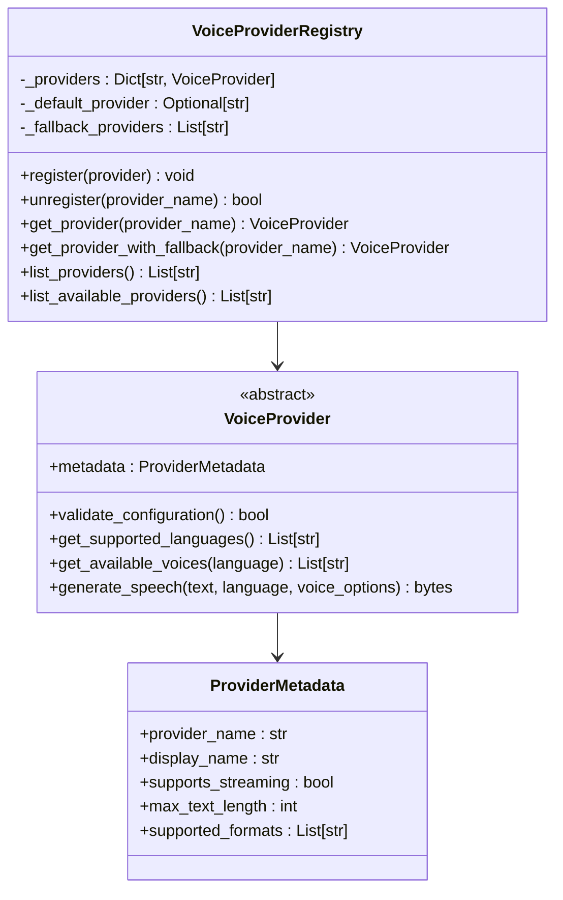
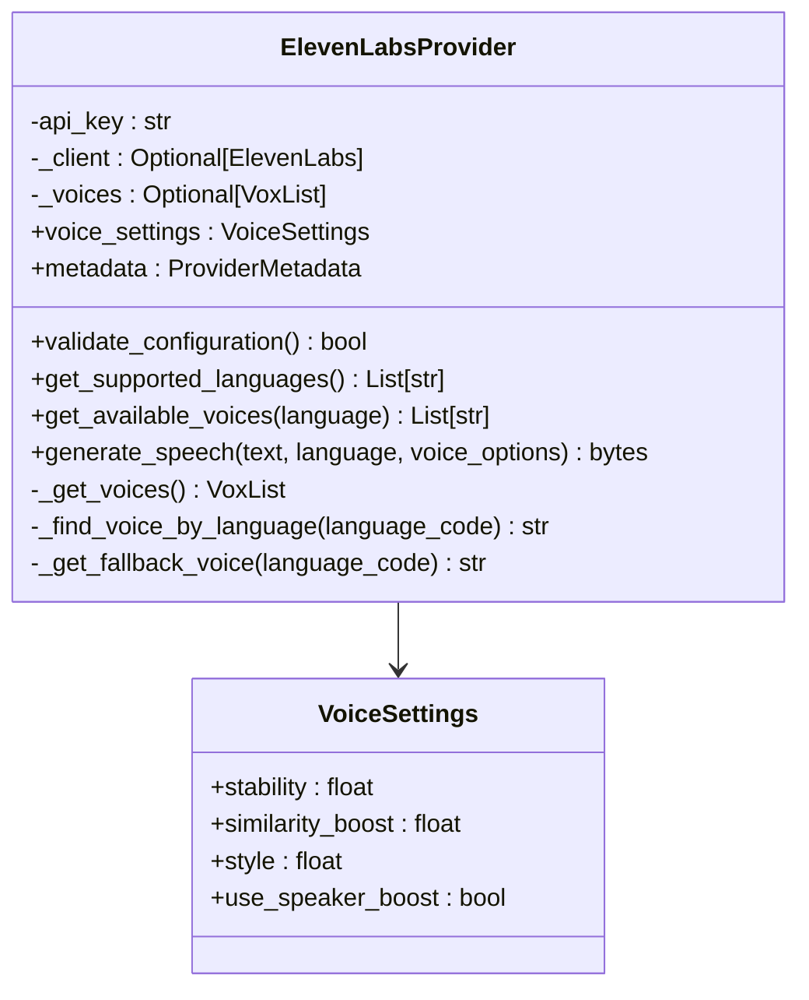
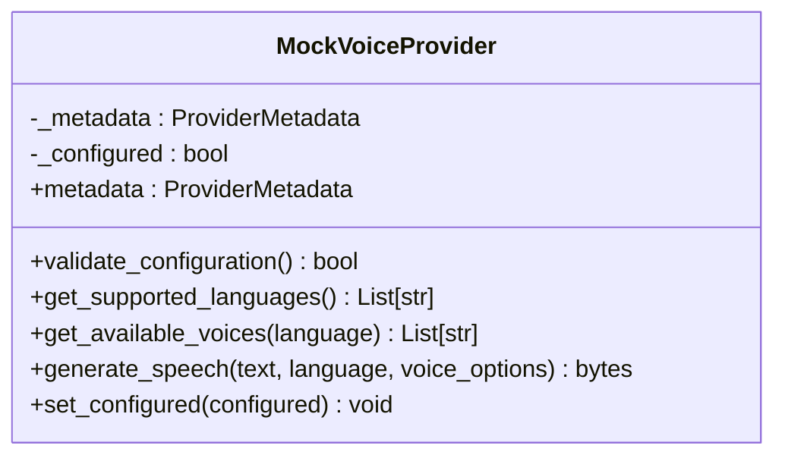
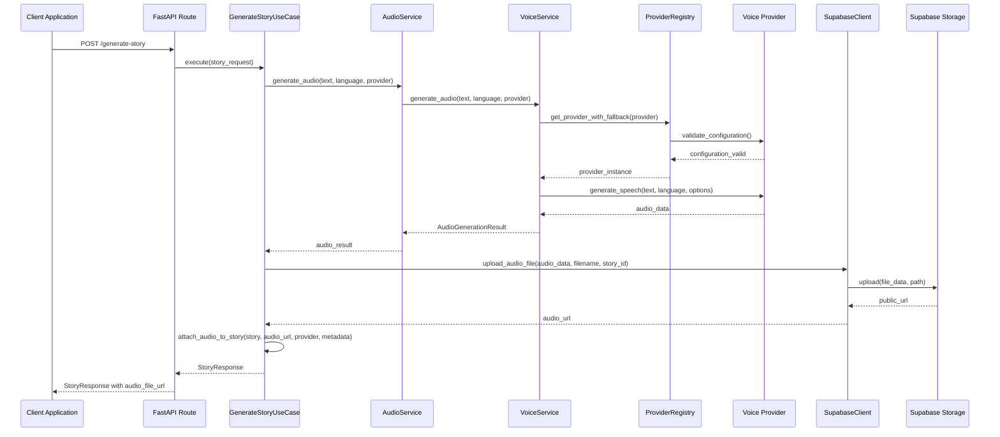
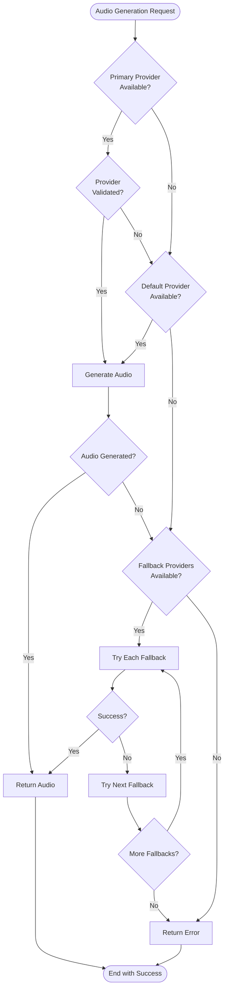
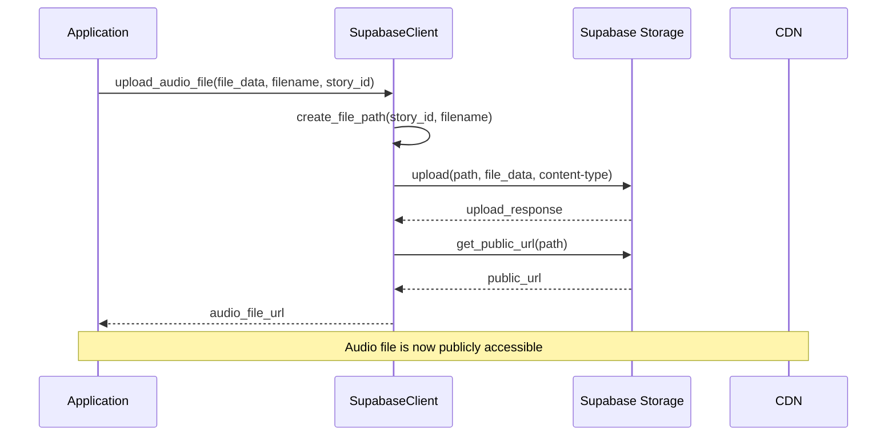
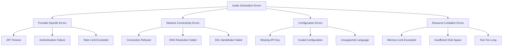
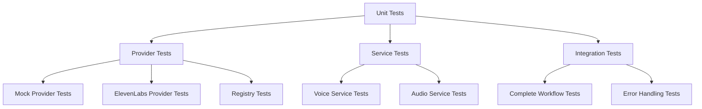

# Audio Narration System

<cite>
**Referenced Files in This Document**
- [voice_service.py](file://src/voice_providers/voice_service.py)
- [provider_registry.py](file://src/voice_providers/provider_registry.py)
- [base_provider.py](file://src/voice_providers/base_provider.py)
- [elevenlabs_provider.py](file://src/voice_providers/elevenlabs_provider.py)
- [mock_provider.py](file://src/voice_providers/mock_provider.py)
- [audio_service.py](file://src/domain/services/audio_service.py)
- [supabase_client.py](file://src/supabase_client.py)
- [generate_story.py](file://src/application/use_cases/generate_story.py)
- [routes.py](file://src/api/routes.py)
- [models.py](file://src/models.py)
- [test_voice_providers.py](file://test_voice_providers.py)
- [test_integration_voice.py](file://test_integration_voice.py)
</cite>

## Table of Contents
1. [Introduction](#introduction)
2. [System Architecture](#system-architecture)
3. [VoiceService Facade](#voiceservice-facade)
4. [Provider Registry Pattern](#provider-registry-pattern)
5. [Voice Providers](#voice-providers)
6. [Audio Generation Workflow](#audio-generation-workflow)
7. [Fallback Strategy](#fallback-strategy)
8. [Supabase Integration](#supabase-integration)
9. [Configuration Options](#configuration-options)
10. [Error Handling and Troubleshooting](#error-handling-and-troubleshooting)
11. [Performance Considerations](#performance-considerations)
12. [Testing and Quality Assurance](#testing-and-quality-assurance)

## Introduction

The audio narration system provides a comprehensive solution for generating spoken audio from written stories in multiple languages. Built around the VoiceService facade, it offers a unified interface for text-to-speech conversion with automatic provider selection, fallback mechanisms, and robust error handling. The system supports multiple voice providers including ElevenLabs and mock providers, enabling seamless audio generation for children's bedtime stories.

The system integrates seamlessly with the story generation pipeline, automatically attaching audio files to stories and tracking provider metadata for analytics and monitoring. It handles complex scenarios like provider API failures, language support variations, and audio quality optimization while maintaining high availability through intelligent fallback strategies.

## System Architecture

The audio narration system follows a layered architecture with clear separation of concerns:



**Diagram sources**
- [routes.py](file://src/api/routes.py#L1-L50)
- [generate_story.py](file://src/application/use_cases/generate_story.py#L1-L50)
- [voice_service.py](file://src/voice_providers/voice_service.py#L25-L50)
- [provider_registry.py](file://src/voice_providers/provider_registry.py#L12-L40)

**Section sources**
- [routes.py](file://src/api/routes.py#L1-L100)
- [generate_story.py](file://src/application/use_cases/generate_story.py#L1-L100)
- [voice_service.py](file://src/voice_providers/voice_service.py#L1-L50)

## VoiceService Facade

The VoiceService acts as the central facade for all audio generation operations, providing a simplified interface while handling complex provider selection and fallback logic:



**Diagram sources**
- [voice_service.py](file://src/voice_providers/voice_service.py#L14-L23)
- [voice_service.py](file://src/voice_providers/voice_service.py#L25-L100)
- [provider_registry.py](file://src/voice_providers/provider_registry.py#L12-L50)

The VoiceService provides several key capabilities:

- **Unified Interface**: Single method for audio generation regardless of underlying provider
- **Automatic Provider Selection**: Intelligent choice based on availability and preferences
- **Fallback Mechanism**: Automatic switching when primary providers fail
- **Metadata Tracking**: Comprehensive logging and tracking of generation parameters
- **Error Handling**: Graceful degradation with meaningful error messages

**Section sources**
- [voice_service.py](file://src/voice_providers/voice_service.py#L25-L236)

## Provider Registry Pattern

The provider registry implements a sophisticated pattern for managing multiple voice providers with automatic discovery, validation, and fallback capabilities:



**Diagram sources**
- [provider_registry.py](file://src/voice_providers/provider_registry.py#L12-L140)
- [base_provider.py](file://src/voice_providers/base_provider.py#L12-L40)

The registry provides:

- **Dynamic Registration**: Runtime addition and removal of providers
- **Configuration Validation**: Automatic validation of provider settings
- **Priority-Based Selection**: Configurable default and fallback providers
- **Environment Integration**: Seamless integration with environment variables
- **Provider Discovery**: Automatic detection of available providers

**Section sources**
- [provider_registry.py](file://src/voice_providers/provider_registry.py#L12-L212)

## Voice Providers

The system supports multiple voice providers through a standardized interface, with ElevenLabs and mock providers serving as primary implementations:

### ElevenLabs Provider

The ElevenLabs provider offers high-quality, professional-grade voice synthesis with extensive language support:



**Diagram sources**
- [elevenlabs_provider.py](file://src/voice_providers/elevenlabs_provider.py#L18-L50)

Key features of the ElevenLabs provider:
- **Multilingual Support**: Extensive language coverage including English, Russian, Spanish, French, German, Italian, Portuguese, Polish, Hindi, Japanese, Korean, Chinese, and Arabic
- **Customizable Voice Settings**: Fine-tuned voice characteristics for optimal storytelling
- **Voice Discovery**: Automatic selection of appropriate voices based on language
- **Streaming Support**: Efficient handling of large text blocks
- **Error Resilience**: Robust fallback mechanisms for API failures

### Mock Provider

The mock provider enables testing and development without external API dependencies:



**Diagram sources**
- [mock_provider.py](file://src/voice_providers/mock_provider.py#L13-L30)

The mock provider offers:
- **Deterministic Output**: Consistent audio generation for testing
- **Development Efficiency**: Fast local development without API calls
- **Language Coverage**: Full language support for comprehensive testing
- **Configurable Behavior**: Simulated success/failure scenarios

**Section sources**
- [elevenlabs_provider.py](file://src/voice_providers/elevenlabs_provider.py#L1-L220)
- [mock_provider.py](file://src/voice_providers/mock_provider.py#L1-L98)

## Audio Generation Workflow

The audio generation workflow orchestrates the complete process from text input to stored audio files:



**Diagram sources**
- [routes.py](file://src/api/routes.py#L138-L170)
- [generate_story.py](file://src/application/use_cases/generate_story.py#L156-L207)
- [voice_service.py](file://src/voice_providers/voice_service.py#L32-L134)

The workflow includes several critical steps:

1. **Text Preparation**: Processing of story content for optimal audio generation
2. **Provider Selection**: Automatic choice based on availability and preferences
3. **Audio Generation**: Conversion of text to speech using selected provider
4. **Quality Validation**: Verification of generated audio quality
5. **Storage Upload**: Secure upload to Supabase storage with unique filenames
6. **Metadata Attachment**: Comprehensive tracking of generation parameters
7. **Database Integration**: Seamless integration with story records

**Section sources**
- [generate_story.py](file://src/application/use_cases/generate_story.py#L156-L207)
- [routes.py](file://src/api/routes.py#L138-L170)

## Fallback Strategy

The fallback strategy ensures high availability and reliability through multiple layers of redundancy:



**Diagram sources**
- [voice_service.py](file://src/voice_providers/voice_service.py#L97-L134)
- [provider_registry.py](file://src/voice_providers/provider_registry.py#L100-L140)

The fallback mechanism operates through several tiers:

1. **Primary Provider**: First choice based on request parameters
2. **Default Provider**: Fallback to configured default when primary fails
3. **Configured Fallbacks**: Sequential attempts through fallback providers
4. **Any Available**: Last resort using any properly configured provider
5. **Graceful Degradation**: Meaningful error messages when all options fail

**Section sources**
- [voice_service.py](file://src/voice_providers/voice_service.py#L136-L191)
- [provider_registry.py](file://src/voice_providers/provider_registry.py#L100-L140)

## Supabase Integration

The system integrates deeply with Supabase for both database storage and audio file management:

### Database Schema Integration

The StoryDB model includes comprehensive audio tracking fields:

| Field | Type | Purpose | Example Value |
|-------|------|---------|---------------|
| `audio_file_url` | Optional[str] | Public URL of audio file | `"https://cdn.example.com/stories/abc123/xyz456.mp3"` |
| `audio_provider` | Optional[str] | Provider name used | `"elevenlabs"` |
| `audio_generation_metadata` | Optional[Dict[str, Any]] | Generation parameters | `{"text_length": 1500, "language": "en", "audio_size": 2048000}` |

### Audio File Storage

The SupabaseClient provides specialized methods for audio file management:



**Diagram sources**
- [supabase_client.py](file://src/supabase_client.py#L44-L80)

Key features of Supabase integration:
- **Structured Storage**: Hierarchical file organization (`stories/{story_id}/{filename}`)
- **Public Access**: Secure public URLs for audio playback
- **Content Type Management**: Proper MIME type handling (audio/mpeg)
- **Error Resilience**: Comprehensive error handling for upload failures
- **Scalable Architecture**: Cloud-native storage with global distribution

**Section sources**
- [supabase_client.py](file://src/supabase_client.py#L44-L80)
- [models.py](file://src/models.py#L90-L110)

## Configuration Options

The system provides extensive configuration options for customization and deployment flexibility:

### Environment Variables

| Variable | Purpose | Default | Example |
|----------|---------|---------|---------|
| `DEFAULT_VOICE_PROVIDER` | Primary provider selection | `"elevenlabs"` | `"elevenlabs"` |
| `VOICE_PROVIDER_FALLBACK` | Comma-separated fallback providers | `""` | `"mock,elevenlabs"` |
| `ELEVENLABS_API_KEY` | ElevenLabs API authentication | Required | `"your-api-key-here"` |
| `SUPABASE_URL` | Supabase database endpoint | Required | `"https://your-project.supabase.co"` |
| `SUPABASE_KEY` | Supabase service key | Required | `"service-key-here"` |

### Provider Configuration

Each provider supports specific configuration options:

#### ElevenLabs Configuration
- **Voice Settings**: Stability, similarity boost, style, speaker boost
- **Model Selection**: Multilingual v2, English v1, etc.
- **Text Length Limits**: Up to 5000 characters per request
- **Format Support**: MP3, PCM audio formats

#### Mock Provider Configuration
- **Language Support**: All major world languages
- **Text Length**: Unlimited (mock implementation)
- **Quality Simulation**: Deterministic output generation

### Runtime Configuration

The system supports dynamic configuration changes:

```python
# Provider registration
registry = get_registry()
provider = ElevenLabsProvider()
registry.register(provider)

# Default provider setting
registry.set_default_provider("elevenlabs")

# Provider validation
provider.validate_configuration()

# Language support queries
languages = provider.get_supported_languages()
voices = provider.get_available_voices("en")
```

**Section sources**
- [provider_registry.py](file://src/voice_providers/provider_registry.py#L24-L34)
- [elevenlabs_provider.py](file://src/voice_providers/elevenlabs_provider.py#L21-L42)

## Error Handling and Troubleshooting

The system implements comprehensive error handling across all layers:

### Common Issues and Solutions

#### Provider API Failures
**Symptoms**: Audio generation timeouts, API rate limits, authentication errors
**Solutions**:
- Automatic fallback to alternative providers
- Exponential backoff for retry attempts
- Graceful degradation with meaningful error messages
- Logging for monitoring and alerting

#### Audio Quality Problems
**Symptoms**: Poor voice quality, unnatural speech, timing issues
**Solutions**:
- Provider-specific voice settings optimization
- Text preprocessing for better pronunciation
- Format conversion and quality validation
- Language-specific voice selection

#### Latency Concerns
**Symptoms**: Slow audio generation, timeout errors, poor user experience
**Solutions**:
- Asynchronous processing for large texts
- Provider caching for repeated requests
- Streaming audio generation where supported
- Load balancing across multiple providers

### Error Categories



### Monitoring and Logging

The system provides comprehensive logging for troubleshooting:

- **Request Tracking**: Complete audit trail of all audio generation requests
- **Provider Metrics**: Performance metrics for each provider
- **Error Classification**: Structured error categorization
- **Latency Monitoring**: Response time tracking and optimization
- **Usage Analytics**: Provider usage patterns and popularity

**Section sources**
- [voice_service.py](file://src/voice_providers/voice_service.py#L115-L134)
- [test_voice_providers.py](file://test_voice_providers.py#L153-L166)

## Performance Considerations

The audio narration system is designed for high performance and scalability:

### Optimization Strategies

#### Caching and Memoization
- **Provider Validation**: Cached validation results to avoid repeated API calls
- **Voice Discovery**: Cached voice lists for improved performance
- **Language Detection**: Optimized language support queries

#### Asynchronous Processing
- **Non-blocking Generation**: Async audio generation for web applications
- **Batch Processing**: Efficient handling of multiple simultaneous requests
- **Queue Management**: Intelligent request queuing and prioritization

#### Resource Management
- **Memory Optimization**: Efficient audio data handling and streaming
- **Connection Pooling**: Reused connections to minimize overhead
- **Garbage Collection**: Proper cleanup of temporary resources

### Scalability Features

| Feature | Implementation | Benefit |
|---------|----------------|---------|
| Horizontal Scaling | Stateless provider architecture | Handle increased load |
| Load Balancing | Round-robin provider selection | Distribute requests evenly |
| Auto-scaling | Container-based deployment | Adapt to demand |
| CDN Integration | Supabase storage with CDN | Fast audio delivery |

### Performance Benchmarks

Typical performance metrics for the system:

- **Audio Generation**: 2-5 seconds per 1000-character text block
- **Provider Switching**: < 100ms for fallback transitions
- **Storage Upload**: 1-3 seconds for typical audio files
- **Error Recovery**: < 500ms for fallback provider activation

## Testing and Quality Assurance

The system includes comprehensive testing infrastructure:

### Unit Testing

The test suite covers all major components:



**Diagram sources**
- [test_voice_providers.py](file://test_voice_providers.py#L1-L50)
- [test_integration_voice.py](file://test_integration_voice.py#L1-L50)

### Test Coverage Areas

#### Provider Testing
- **Configuration Validation**: Verify provider setup and credentials
- **Language Support**: Test supported languages and voice availability
- **Audio Generation**: Validate audio output quality and format
- **Error Handling**: Test failure scenarios and recovery

#### Service Testing
- **Fallback Mechanisms**: Verify provider switching logic
- **Metadata Tracking**: Test generation parameter recording
- **API Compatibility**: Ensure backward and forward compatibility
- **Performance Testing**: Validate response times and throughput

#### Integration Testing
- **Complete Workflows**: Test end-to-end audio generation pipeline
- **Database Integration**: Verify story-audio association
- **Storage Integration**: Test audio file upload and retrieval
- **Error Propagation**: Validate error handling across layers

### Quality Assurance Practices

- **Continuous Integration**: Automated testing on code changes
- **Performance Monitoring**: Real-time performance tracking
- **Error Reporting**: Comprehensive error logging and alerting
- **Regression Testing**: Automated validation of existing functionality
- **Load Testing**: Stress testing under high-volume scenarios

**Section sources**
- [test_voice_providers.py](file://test_voice_providers.py#L1-L213)
- [test_integration_voice.py](file://test_integration_voice.py#L1-L178)