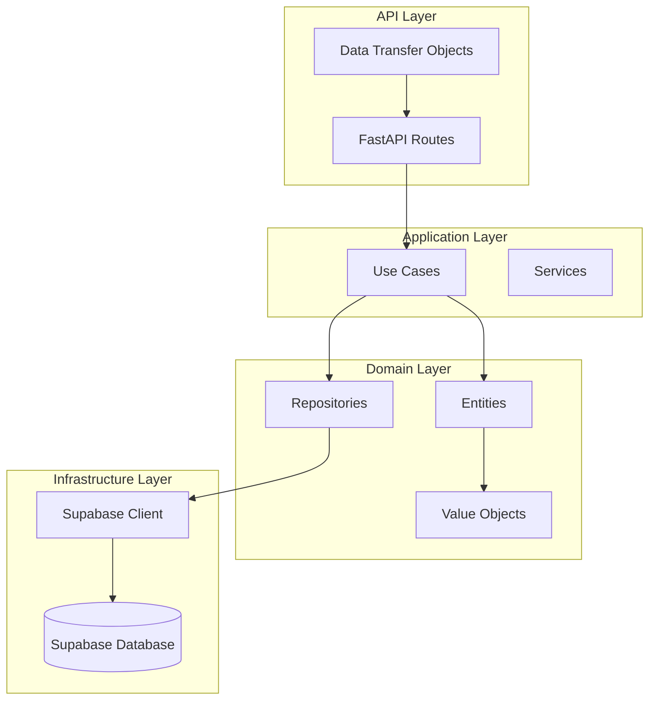
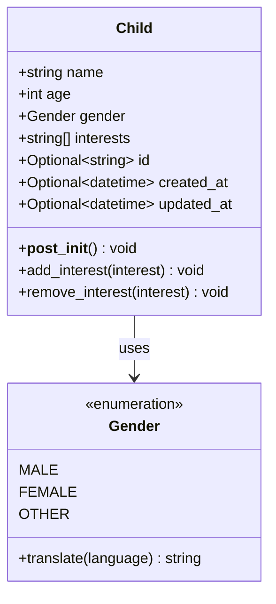
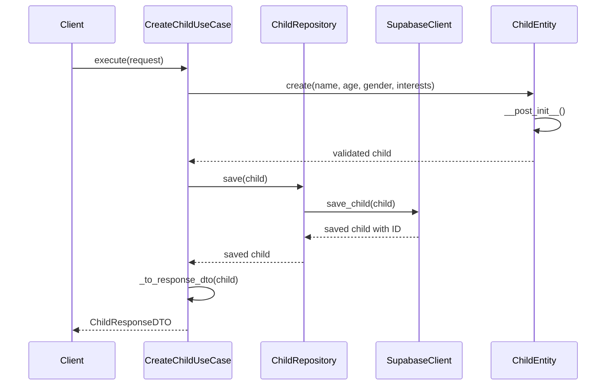
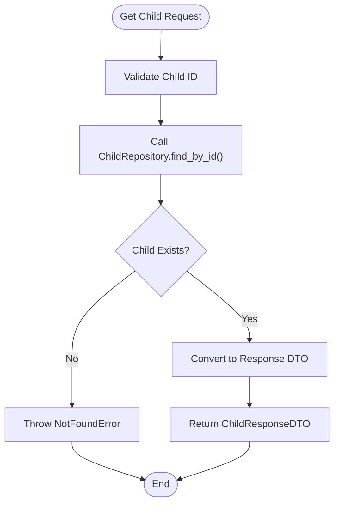
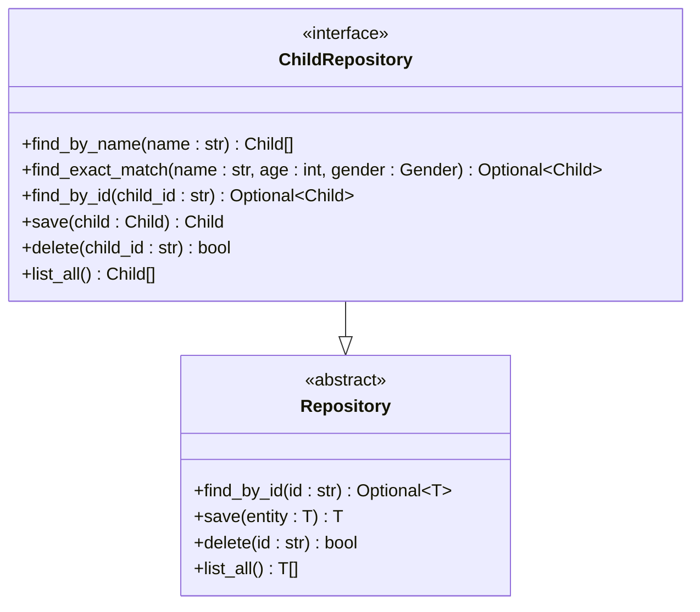
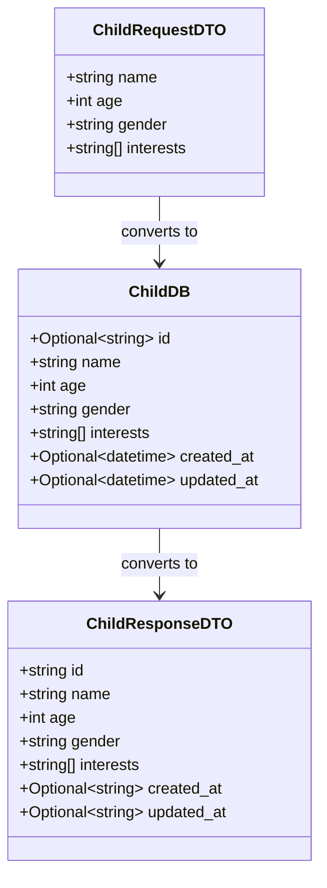
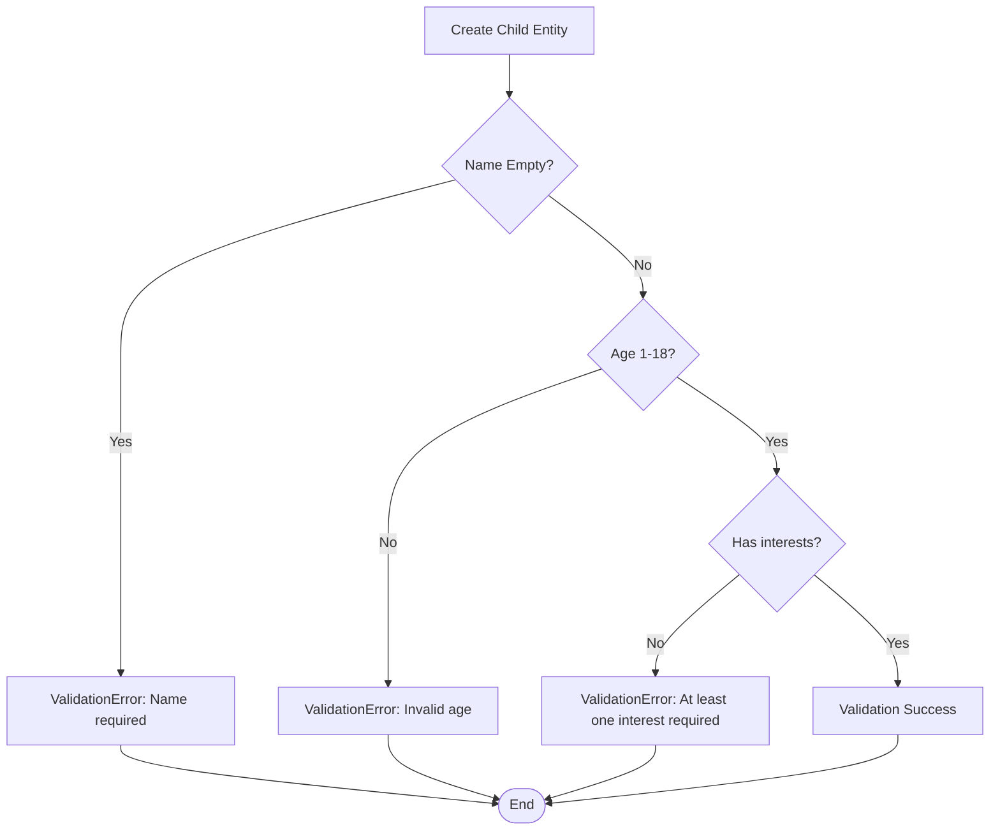
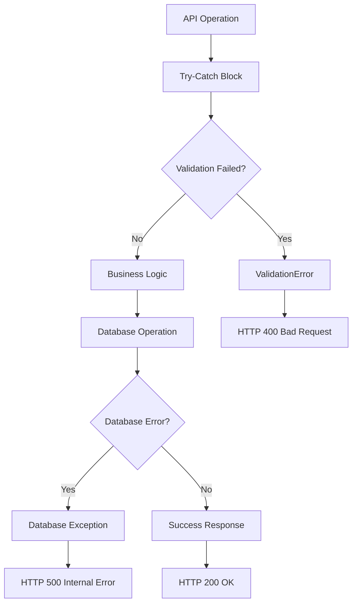

# Child Profile Management

<cite>
**Referenced Files in This Document**
- [manage_children.py](file://src/application/use_cases/manage_children.py)
- [entities.py](file://src/domain/entities.py)
- [child_repository.py](file://src/domain/repositories/child_repository.py)
- [routes.py](file://src/api/routes.py)
- [dto.py](file://src/application/dto.py)
- [supabase_client.py](file://src/supabase_client.py)
- [value_objects.py](file://src/domain/value_objects.py)
- [models.py](file://src/models.py)
- [test_populate_children.py](file://test_populate_children.py)
- [test_children.py](file://test_children.py)
- [test_children_models.py](file://test_children_models.py)
- [005_create_children_table.sql](file://supabase/migrations/005_create_children_table.sql)
</cite>

## Table of Contents
1. [Introduction](#introduction)
2. [System Architecture](#system-architecture)
3. [Data Model](#data-model)
4. [Use Cases](#use-cases)
5. [API Endpoints](#api-endpoints)
6. [Repository Pattern](#repository-pattern)
7. [DTO Patterns](#dto-patterns)
8. [Validation and Configuration](#validation-and-configuration)
9. [CRUD Operations](#crud-operations)
10. [Common Issues and Solutions](#common-issues-and-solutions)
11. [Privacy Considerations](#privacy-considerations)
12. [Testing and Quality Assurance](#testing-and-quality-assurance)

## Introduction

The child profile management system in the Tale Generator application provides comprehensive functionality for creating, retrieving, updating, and deleting child profiles. This system enables personalized story generation by maintaining detailed child information including name, age, gender, and interests. The architecture follows Domain-Driven Design principles with clear separation between use cases, repositories, and data persistence layers.

## System Architecture

The child profile management system follows a layered architecture pattern with distinct responsibilities:



**Diagram sources**
- [routes.py](file://src/api/routes.py#L1-L570)
- [manage_children.py](file://src/application/use_cases/manage_children.py#L1-L220)
- [entities.py](file://src/domain/entities.py#L1-L210)
- [supabase_client.py](file://src/supabase_client.py#L1-L914)

## Data Model

### Child Entity

The core data model for child profiles is represented by the `Child` entity, which encapsulates all essential information about a child:



**Diagram sources**
- [entities.py](file://src/domain/entities.py#L10-L58)
- [value_objects.py](file://src/domain/value_objects.py#L46-L74)

### Database Model

The database representation uses the `ChildDB` model for persistence:

| Field | Type | Description | Constraints |
|-------|------|-------------|-------------|
| id | UUID | Unique identifier | Primary Key, Auto-generated |
| name | TEXT | Child's full name | Not Null |
| age | INTEGER | Child's age (1-18) | Not Null, Range validation |
| gender | TEXT | Child's gender | Not Null, Must be male/female/other |
| interests | TEXT[] | Array of child interests | Not Null, Non-empty |
| created_at | TIMESTAMP | Record creation timestamp | Default: NOW() |
| updated_at | TIMESTAMP | Last update timestamp | Default: NOW() |

**Section sources**
- [entities.py](file://src/domain/entities.py#L10-L21)
- [models.py](file://src/models.py#L65-L73)
- [005_create_children_table.sql](file://supabase/migrations/005_create_children_table.sql#L1-L47)

## Use Cases

### CreateChildUseCase

The `CreateChildUseCase` handles the creation of new child profiles with comprehensive validation:



**Diagram sources**
- [manage_children.py](file://src/application/use_cases/manage_children.py#L16-L54)

### GetChildUseCase

The `GetChildUseCase` retrieves child profiles by ID with error handling:



**Diagram sources**
- [manage_children.py](file://src/application/use_cases/manage_children.py#L68-L98)

**Section sources**
- [manage_children.py](file://src/application/use_cases/manage_children.py#L16-L220)

## API Endpoints

### Child Management Endpoints

The system exposes RESTful API endpoints for child profile management:

| Endpoint | Method | Description | Request Body | Response |
|----------|--------|-------------|--------------|----------|
| `/children` | POST | Create new child profile | ChildDB | ChildDB |
| `/children/{child_id}` | GET | Retrieve child by ID | - | ChildDB |
| `/children/name/{name}` | GET | Find children by name | - | List[ChildDB] |
| `/children` | GET | List all children | - | List[ChildDB] |
| `/children/{child_id}` | DELETE | Delete child profile | - | JSON Message |

### Request/Response Examples

**Create Child Request:**
```json
{
  "name": "Emma",
  "age": 7,
  "gender": "female",
  "interests": ["unicorns", "fairies", "princesses"]
}
```

**Create Child Response:**
```json
{
  "id": "uuid-string",
  "name": "Emma",
  "age": 7,
  "gender": "female",
  "interests": ["unicorns", "fairies", "princesses"],
  "created_at": "2024-01-15T10:30:00Z",
  "updated_at": "2024-01-15T10:30:00Z"
}
```

**Section sources**
- [routes.py](file://src/api/routes.py#L437-L570)

## Repository Pattern

### ChildRepository Interface

The `ChildRepository` defines the contract for child data access:



**Diagram sources**
- [child_repository.py](file://src/domain/repositories/child_repository.py#L10-L37)

### Supabase Implementation

The `SupabaseClient` implements the repository interface for database operations:

**Section sources**
- [child_repository.py](file://src/domain/repositories/child_repository.py#L1-L38)
- [supabase_client.py](file://src/supabase_client.py#L102-L264)

## DTO Patterns

### Data Transfer Objects

The system uses DTOs for clean separation between API and domain layers:



**Diagram sources**
- [dto.py](file://src/application/dto.py#L52-L94)
- [models.py](file://src/models.py#L65-L73)

### Validation Rules

The DTOs enforce strict validation rules:

| Field | Validation Rule | Description |
|-------|----------------|-------------|
| name | Required, non-empty | Child's full name |
| age | 1-18 years | Valid child age range |
| gender | Male/Female/Other | Predefined gender options |
| interests | Non-empty list | At least one interest required |

**Section sources**
- [dto.py](file://src/application/dto.py#L10-L94)
- [entities.py](file://src/domain/entities.py#L22-L36)

## Validation and Configuration

### Domain Validation

The `Child` entity implements comprehensive validation:



**Diagram sources**
- [entities.py](file://src/domain/entities.py#L22-L36)

### Value Objects

The system uses value objects for type safety:

| Value Object | Purpose | Validation |
|--------------|---------|------------|
| Gender | Gender classification | Male/Female/Other |
| Language | Supported languages | English/Russian |
| StoryMoral | Moral values | Predefined morals |

**Section sources**
- [entities.py](file://src/domain/entities.py#L10-L58)
- [value_objects.py](file://src/domain/value_objects.py#L46-L134)

## CRUD Operations

### Complete CRUD Implementation

The system provides full CRUD functionality through use cases:

```mermaid
graph LR
subgraph "Create Operations"
A[CreateChildUseCase]
B[POST /children]
end
subgraph "Read Operations"
C[GetChildUseCase]
D[ListChildrenUseCase]
E[ListChildrenByNameUseCase]
F[GET /children/{id}]
G[GET /children]
H[GET /children/name/{name}]
end
subgraph "Update Operations"
I[UpdateChildUseCase]
J[PUT /children/{id}]
end
subgraph "Delete Operations"
K[DeleteChildUseCase]
L[DELETE /children/{id}]
end
A --> B
C --> F
D --> G
E --> H
K --> L
```

**Diagram sources**
- [manage_children.py](file://src/application/use_cases/manage_children.py#L16-L220)

### Example Usage Scenarios

**Creating a New Child Profile:**
1. Validate input data against DTO constraints
2. Create `Child` entity with validation
3. Save to repository
4. Return response with generated ID

**Retrieving Child Profiles:**
1. Query by ID, name, or list all children
2. Transform domain entities to DTOs
3. Handle not found scenarios gracefully

**Section sources**
- [manage_children.py](file://src/application/use_cases/manage_children.py#L16-L220)

## Common Issues and Solutions

### Duplicate Profile Handling

The system handles potential duplicate profiles through several mechanisms:

1. **Exact Match Detection**: The `find_exact_match` method checks for identical profiles
2. **Business Logic**: The API route in `routes.py` implements exact matching logic
3. **Database Constraints**: Supabase table structure prevents duplicates

### Data Validation Issues

Common validation problems and solutions:

| Issue | Cause | Solution |
|-------|-------|----------|
| Empty Name | Missing required field | Add validation in DTO |
| Invalid Age | Out of range | Range validation in entity |
| Empty Interests | Missing required data | List validation in DTO |
| Invalid Gender | Wrong enum value | Enum validation in DTO |

### Error Handling Patterns

The system implements consistent error handling:



**Section sources**
- [entities.py](file://src/domain/entities.py#L22-L36)
- [routes.py](file://src/api/routes.py#L448-L466)

## Privacy Considerations

### Data Protection Measures

The child profile system implements several privacy safeguards:

1. **Minimal Data Collection**: Only essential information is stored
2. **Access Control**: Row-level security policies restrict access
3. **Data Retention**: Clear guidelines for data storage duration
4. **Anonymization**: Child data linked to stories but not personally identifiable

### Security Policies

Supabase RLS policies ensure data protection:

```sql
-- Read access for all users
CREATE POLICY "Enable read access for all users" 
ON "tales"."children"
AS PERMISSIVE FOR SELECT
TO public
USING (true);

-- Insert access for all users  
CREATE POLICY "Enable insert access for all users"
ON "tales"."children"
AS PERMISSIVE FOR INSERT
TO public
WITH CHECK (true);
```

### GDPR Compliance

The system supports GDPR compliance through:

- Data minimization principles
- Clear data retention policies
- Ability to delete child profiles
- Secure data transmission
- Access control mechanisms

**Section sources**
- [005_create_children_table.sql](file://supabase/migrations/005_create_children_table.sql#L25-L47)

## Testing and Quality Assurance

### Unit Testing

The system includes comprehensive testing:

**Entity Testing:**
- Validation logic verification
- Property behavior testing
- Serialization/deserialization

**Repository Testing:**
- Database operation verification
- Error handling validation
- Data transformation testing

**Integration Testing:**
- API endpoint testing
- Cross-layer integration
- Real database testing

### Test Coverage Examples

**Child Entity Tests:**
```python
# Test valid child creation
child = Child(name="Emma", age=7, gender=Gender.FEMALE, interests=["unicorns"])

# Test invalid age validation
with pytest.raises(ValidationError):
    Child(name="Emma", age=20, gender=Gender.FEMALE, interests=["unicorns"])
```

**API Route Tests:**
```python
# Test successful child creation
response = client.post("/children", json={
    "name": "Emma",
    "age": 7,
    "gender": "female",
    "interests": ["unicorns"]
})
assert response.status_code == 200
```

**Section sources**
- [test_children.py](file://test_children.py#L1-L50)
- [test_populate_children.py](file://test_populate_children.py#L1-L84)
- [test_children_models.py](file://test_children_models.py#L1-L65)