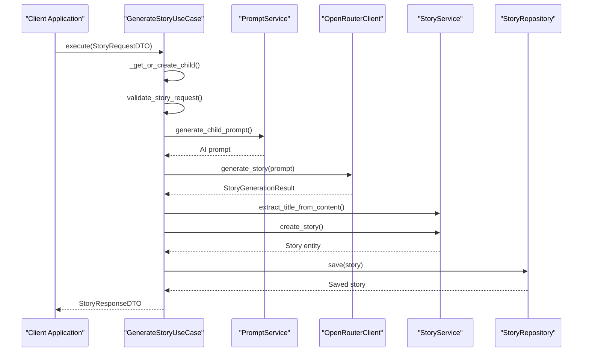
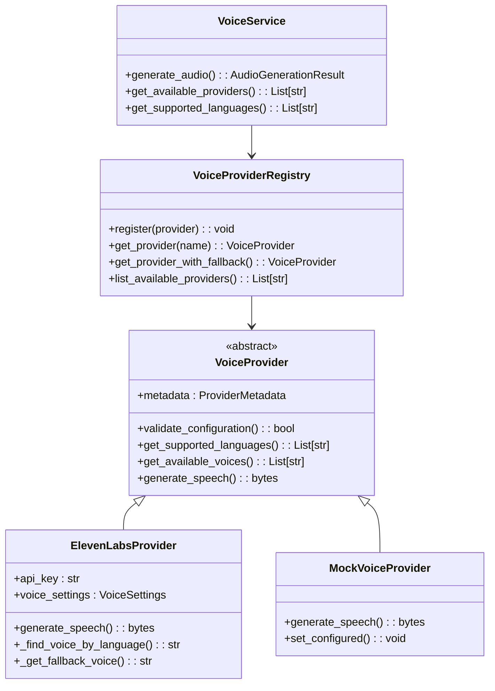
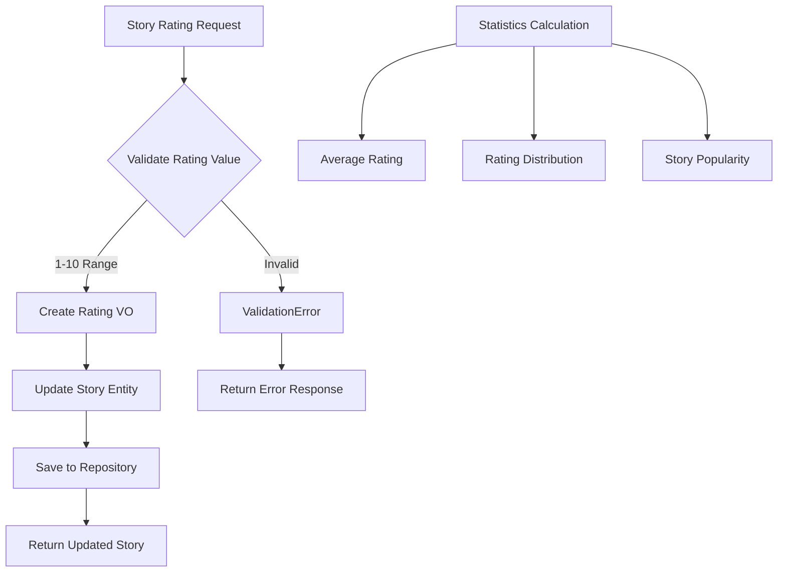
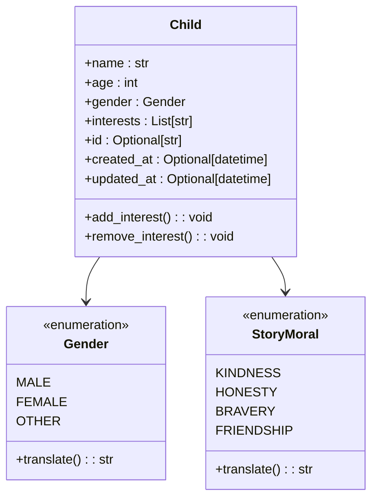
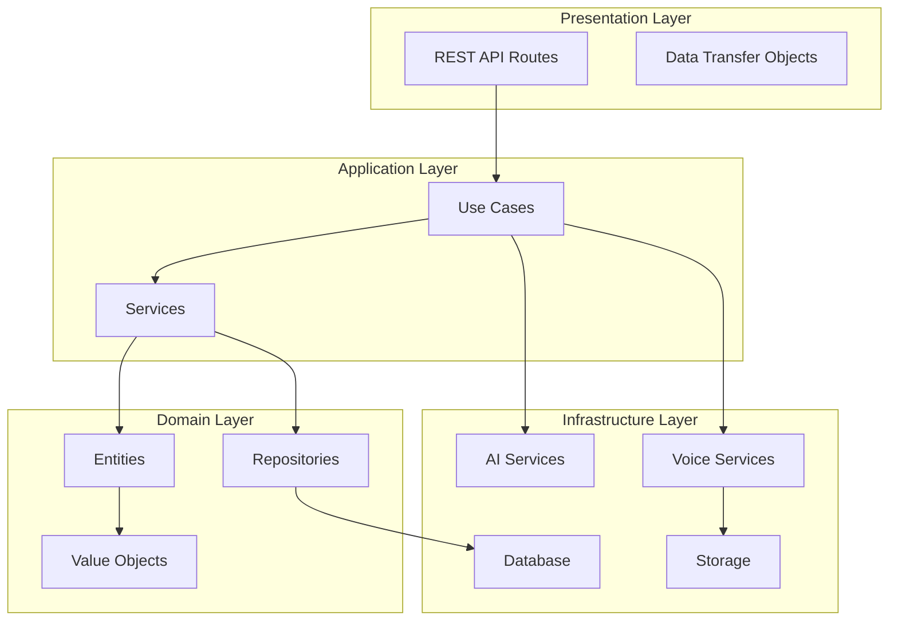

# Core Features

<cite>
**Referenced Files in This Document**
- [generate_story.py](file://src/application/use_cases/generate_story.py)
- [prompts.py](file://src/prompts.py)
- [openrouter_client.py](file://src/openrouter_client.py)
- [voice_service.py](file://src/voice_providers/voice_service.py)
- [story_service.py](file://src/domain/services/story_service.py)
- [entities.py](file://src/domain/entities.py)
- [dto.py](file://src/application/dto.py)
- [value_objects.py](file://src/domain/value_objects.py)
- [base_provider.py](file://src/voice_providers/base_provider.py)
- [elevenlabs_provider.py](file://src/voice_providers/elevenlabs_provider.py)
- [mock_provider.py](file://src/voice_providers/mock_provider.py)
- [provider_registry.py](file://src/voice_providers/provider_registry.py)
- [manage_stories.py](file://src/application/use_cases/manage_stories.py)
- [test_rating.py](file://test_rating.py)
</cite>

## Table of Contents
1. [Introduction](#introduction)
2. [Story Generation System](#story-generation-system)
3. [Audio Narration System](#audio-narration-system)
4. [Story Rating System](#story-rating-system)
5. [Child Profile Personalization](#child-profile-personalization)
6. [Configuration Options](#configuration-options)
7. [Error Handling and Troubleshooting](#error-handling-and-troubleshooting)
8. [Architecture Overview](#architecture-overview)
9. [Best Practices](#best-practices)

## Introduction

The Tale Generator is a sophisticated AI-powered storytelling platform that combines natural language generation with audio narration to create personalized bedtime stories for children. The system features four core components: AI story generation, audio narration, story rating, and child profile personalization. Each component is designed with robust error handling, fallback mechanisms, and extensible architecture to ensure reliable operation across various environments.

## Story Generation System

### AI Story Generation Pipeline

The story generation system orchestrates the complete workflow from child profile analysis to AI-generated content creation. The primary orchestration occurs in the [`GenerateStoryUseCase`](file://src/application/use_cases/generate_story.py#L21-L208) class, which coordinates multiple specialized services.

**Diagram sources**
- [generate_story.py](file://src/application/use_cases/generate_story.py#L53-L120)
- [prompts.py](file://src/prompts.py#L316-L356)
- [openrouter_client.py](file://src/openrouter_client.py#L99-L161)

### Prompt Engineering System

The [`PromptService`](file://src/domain/services/prompt_service.py) creates highly personalized prompts using child interests, moral values, and language preferences. The system employs a sophisticated template-based approach that adapts to different languages and cultural contexts.

#### Language-Specific Prompt Templates

The prompt system supports multiple languages through dedicated template classes:

- **EnglishStoryInfo**: Creates prompts in English with clear narrative instructions
- **RussianStoryInfo**: Generates Russian-language prompts with cultural adaptations
- **Template Structure**: Each template includes moral instructions, length specifications, character instructions, and language requirements

#### Child Profile Integration

The system extracts key information from child profiles to create personalized story elements:

- **Name and Age**: Integrated directly into the narrative structure
- **Interests**: Translated to story themes and plot elements
- **Gender**: Influences character descriptions and role modeling
- **Moral Values**: Embedded as central themes with educational emphasis

**Section sources**
- [prompts.py](file://src/prompts.py#L295-L467)
- [generate_story.py](file://src/application/use_cases/generate_story.py#L76-L82)

### AI Model Integration

The system integrates with OpenRouter API through the [`OpenRouterClient`](file://src/openrouter_client.py#L44-L161) class, which provides robust AI story generation capabilities with comprehensive retry logic.

#### Available Models

The system supports multiple AI models through the [`OpenRouterModel`](file://src/openrouter_client.py#L19-L31) enumeration:

- **GPT-4o Series**: Advanced multimodal capabilities
- **Claude Models**: Anthropic's conversational intelligence
- **Llama Models**: Meta's open-source alternatives
- **Gemini Models**: Google's multimodal AI
- **Free Tier Options**: Cost-effective alternatives

#### Retry Logic Implementation

The [`generate_story`](file://src/openrouter_client.py#L99-L161) method implements exponential backoff retry logic:

1. **Initial Attempt**: Direct API call with standard parameters
2. **Retry Mechanism**: Up to 3 attempts with exponential delay doubling
3. **Error Handling**: Comprehensive logging and graceful degradation
4. **Fallback Options**: Alternative model selection if primary fails

**Section sources**
- [openrouter_client.py](file://src/openrouter_client.py#L99-L161)

## Audio Narration System

### Voice Provider Architecture

The audio system implements a flexible provider architecture that supports multiple voice services with automatic failover capabilities.

**Diagram sources**
- [base_provider.py](file://src/voice_providers/base_provider.py#L28-L97)
- [elevenlabs_provider.py](file://src/voice_providers/elevenlabs_provider.py#L18-L220)
- [mock_provider.py](file://src/voice_providers/mock_provider.py#L13-L98)
- [provider_registry.py](file://src/voice_providers/provider_registry.py#L12-L212)

### ElevenLabs Integration

The [`ElevenLabsProvider`](file://src/voice_providers/elevenlabs_provider.py#L18-L220) offers premium voice synthesis with advanced features:

#### Voice Selection Algorithm

1. **Language Matching**: Automatic voice selection based on target language
2. **Fallback Strategy**: Graceful degradation when specific voices unavailable
3. **Quality Settings**: Optimized voice settings for children's stories
4. **Multilingual Support**: Native support for 12+ languages

#### Configuration Requirements

- **API Key**: Required for authentication
- **Voice Settings**: Stability, similarity boost, and style controls
- **Model Selection**: Multilingual or specialized models
- **Text Length Limits**: 5000 characters maximum per request

**Section sources**
- [elevenlabs_provider.py](file://src/voice_providers/elevenlabs_provider.py#L165-L220)

### Mock Provider for Development

The [`MockVoiceProvider`](file://src/voice_providers/mock_provider.py#L13-L98) enables development and testing without external API dependencies:

#### Features
- **Deterministic Output**: Consistent audio generation for testing
- **Configurable**: Runtime configuration validation
- **Format Support**: MP3 format simulation
- **Size Simulation**: Realistic audio size estimation

**Section sources**
- [mock_provider.py](file://src/voice_providers/mock_provider.py#L47-L98)

### Provider Registry Management

The [`VoiceProviderRegistry`](file://src/voice_providers/provider_registry.py#L12-L212) manages provider lifecycle and selection:

#### Provider Selection Strategy

1. **Primary Provider**: Configured default provider
2. **Fallback Chain**: Sequential fallback providers
3. **Validation**: Automatic configuration verification
4. **Discovery**: Dynamic provider availability detection

#### Environment Configuration

- **DEFAULT_VOICE_PROVIDER**: Primary provider selection
- **VOICE_PROVIDER_FALLBACK**: Comma-separated fallback list
- **Provider Validation**: Automatic health checks

**Section sources**
- [provider_registry.py](file://src/voice_providers/provider_registry.py#L21-L140)

## Story Rating System

### Rating Architecture

The rating system provides structured feedback collection with validation and statistical capabilities.

**Diagram sources**
- [manage_stories.py](file://src/application/use_cases/manage_stories.py#L272-L315)
- [value_objects.py](file://src/domain/value_objects.py#L136-L156)

### Rating Value Objects

The [`Rating`](file://src/domain/value_objects.py#L136-L156) value object ensures data integrity:

#### Validation Rules
- **Range Constraint**: 1-10 scale
- **Type Safety**: Immutable integer value
- **String Representation**: Formatted as "X/10"
- **Serialization**: JSON-compatible format

#### Usage Patterns
- **Entity Association**: Linked to Story entities
- **Repository Updates**: Atomic rating modifications
- **API Responses**: Structured rating data

**Section sources**
- [value_objects.py](file://src/domain/value_objects.py#L136-L156)
- [manage_stories.py](file://src/application/use_cases/manage_stories.py#L272-L315)

### Story Statistics

The system tracks rating metrics for story analysis:

#### Statistical Features
- **Average Ratings**: Numerical score aggregation
- **Distribution Analysis**: Rating frequency patterns
- **Popularity Metrics**: Story engagement indicators
- **Trend Tracking**: Rating changes over time

**Section sources**
- [entities.py](file://src/domain/entities.py#L148-L156)

## Child Profile Personalization

### Child Entity Model

The [`Child`](file://src/domain/entities.py#L10-L58) entity represents individual child profiles with comprehensive personalization capabilities.

**Diagram sources**
- [entities.py](file://src/domain/entities.py#L10-L58)
- [value_objects.py](file://src/domain/value_objects.py#L46-L131)

### Profile Management Features

#### Personalization Elements
- **Name Integration**: Direct incorporation into story narratives
- **Age Appropriateness**: Content level adjustment based on age
- **Gender Representation**: Balanced character diversity
- **Interest Themes**: Plot elements aligned with child preferences

#### Profile Persistence
- **Unique Identification**: UUID-based child IDs
- **Timestamp Tracking**: Creation and modification dates
- **Change History**: Audit trail for profile modifications
- **Duplicate Detection**: Exact match prevention

**Section sources**
- [entities.py](file://src/domain/entities.py#L10-L58)
- [generate_story.py](file://src/application/use_cases/generate_story.py#L122-L154)

### Language Translation System

The system supports bilingual content through comprehensive translation capabilities:

#### Translation Features
- **Gender Translations**: Cultural gender term adaptation
- **Moral Translations**: Educational value preservation
- **Interest Translations**: Hobby and activity localization
- **Context-Aware**: Meaning-preserving translations

**Section sources**
- [value_objects.py](file://src/domain/value_objects.py#L52-L131)

## Configuration Options

### Model Selection Configuration

The system provides extensive configuration options for customization:

#### AI Model Configuration
- **Model Selection**: Choice from multiple AI providers
- **Temperature Control**: Creativity vs. consistency balance
- **Token Limits**: Content length management
- **Retry Parameters**: Failure tolerance settings

#### Voice Provider Configuration
- **Provider Selection**: Primary and fallback provider setup
- **Voice Options**: Specific voice and model selection
- **Language Support**: Supported language configuration
- **Quality Settings**: Audio quality preferences

#### Environment Variables

| Variable | Purpose | Default | Required |
|----------|---------|---------|----------|
| `OPENROUTER_API_KEY` | AI model access | None | Yes |
| `ELEVENLABS_API_KEY` | Voice provider access | None | No |
| `DEFAULT_VOICE_PROVIDER` | Primary provider | `elevenlabs` | No |
| `VOICE_PROVIDER_FALLBACK` | Fallback providers | `mock` | No |

**Section sources**
- [openrouter_client.py](file://src/openrouter_client.py#L47-L64)
- [provider_registry.py](file://src/voice_providers/provider_registry.py#L26-L32)

### Prompt Template Customization

The system allows customization of story templates:

#### Template Variables
- **Character Attributes**: Name, age, gender, appearance
- **Plot Elements**: Moral themes, story length, language
- **Narrative Structure**: Opening, development, conclusion
- **Educational Goals**: Learning outcomes and values

#### Customization Options
- **Language Adaptation**: Cultural context adjustments
- **Content Filtering**: Age-appropriate content guidelines
- **Style Preferences**: Narrative tone and complexity
- **Integration Points**: API endpoint customization

**Section sources**
- [prompts.py](file://src/prompts.py#L295-L467)

## Error Handling and Troubleshooting

### Common Issues and Solutions

#### API Timeout Issues

**Symptoms**: Stories fail to generate within expected timeframes
**Causes**: Network latency, API overload, model training
**Solutions**:
- Implement exponential backoff retry logic
- Monitor API response times
- Configure appropriate timeout values
- Use fallback models during peak loads

#### Voice Generation Failures

**Symptoms**: Audio generation returns empty results
**Causes**: Provider outages, configuration errors, quota limits
**Solutions**:
- Enable automatic provider fallback
- Validate provider configurations
- Monitor provider health status
- Implement circuit breaker patterns

#### Prompt Engineering Challenges

**Symptoms**: Inconsistent or low-quality story content
**Causes**: Ambiguous prompts, model limitations, cultural mismatches
**Solutions**:
- Refine prompt templates with specific examples
- Test prompts across multiple models
- Incorporate cultural sensitivity guidelines
- Implement prompt validation and testing

### Monitoring and Logging

The system implements comprehensive logging for troubleshooting:

#### Log Categories
- **Debug Information**: Detailed execution traces
- **Warning Messages**: Non-critical issues and fallbacks
- **Error Reports**: Exception details and stack traces
- **Performance Metrics**: Timing and resource usage

#### Monitoring Strategies
- **Health Checks**: Regular provider status verification
- **Error Rate Tracking**: Failure frequency monitoring
- **Performance Analytics**: Response time analysis
- **Usage Patterns**: Feature adoption trends

**Section sources**
- [openrouter_client.py](file://src/openrouter_client.py#L119-L161)
- [voice_service.py](file://src/voice_providers/voice_service.py#L75-L134)

### Recovery Mechanisms

#### Automatic Failover
- **Provider Switching**: Seamless fallback to alternative providers
- **Model Rotation**: Distribute load across multiple AI models
- **Circuit Breakers**: Prevent cascade failures
- **Graceful Degradation**: Reduced functionality during outages

#### Manual Intervention
- **Configuration Updates**: Runtime provider switching
- **Emergency Overrides**: Temporary service bypass
- **Maintenance Mode**: Controlled service suspension
- **Rollback Procedures**: Version rollback capabilities

## Architecture Overview

### System Architecture

The Tale Generator follows a layered architecture with clear separation of concerns:

**Diagram sources**
- [generate_story.py](file://src/application/use_cases/generate_story.py#L21-L51)
- [story_service.py](file://src/domain/services/story_service.py#L13-L146)
- [voice_service.py](file://src/voice_providers/voice_service.py#L25-L236)

### Design Patterns

#### Repository Pattern
- **Abstraction**: Data access abstraction
- **Testability**: Mockable repositories
- **Flexibility**: Multiple storage backends
- **Consistency**: Uniform data access patterns

#### Service Layer Pattern
- **Business Logic**: Centralized business rules
- **Coordination**: Cross-service orchestration
- **Validation**: Input and output validation
- **Transaction Management**: Atomic operations

#### Factory Pattern
- **Object Creation**: Provider instantiation
- **Configuration Management**: Environment-based creation
- **Extensibility**: New provider addition
- **Dependency Injection**: Loose coupling

**Section sources**
- [generate_story.py](file://src/application/use_cases/generate_story.py#L21-L51)
- [story_service.py](file://src/domain/services/story_service.py#L13-L146)

## Best Practices

### Development Guidelines

#### Code Organization
- **Single Responsibility**: Each class has one primary purpose
- **Interface Segregation**: Minimal interface dependencies
- **Dependency Inversion**: Depend on abstractions, not concretions
- **Clean Architecture**: Layered separation of concerns

#### Testing Strategies
- **Unit Testing**: Individual component testing
- **Integration Testing**: Cross-component validation
- **Mock Testing**: External service simulation
- **Performance Testing**: Load and stress testing

#### Security Considerations
- **Input Validation**: Comprehensive request validation
- **API Key Management**: Secure credential handling
- **Rate Limiting**: Request throttling implementation
- **Audit Logging**: Comprehensive change tracking

### Operational Excellence

#### Monitoring and Alerting
- **Health Checks**: Regular system health verification
- **Performance Metrics**: Response time and throughput monitoring
- **Error Tracking**: Comprehensive error reporting
- **Capacity Planning**: Resource utilization analysis

#### Maintenance Procedures
- **Regular Updates**: Dependency and security updates
- **Backup Strategies**: Data protection and recovery
- **Documentation**: Comprehensive technical documentation
- **Training**: Team knowledge sharing and skill development

**Section sources**
- [generate_story.py](file://src/application/use_cases/generate_story.py#L53-L120)
- [voice_service.py](file://src/voice_providers/voice_service.py#L25-L236)