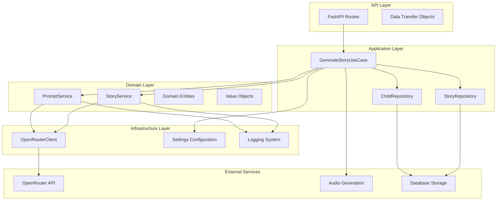
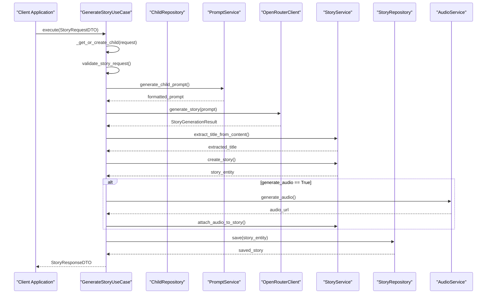
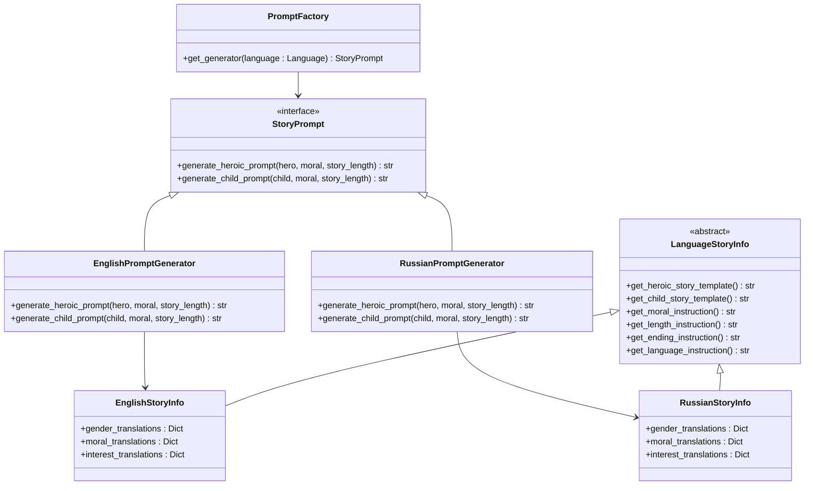
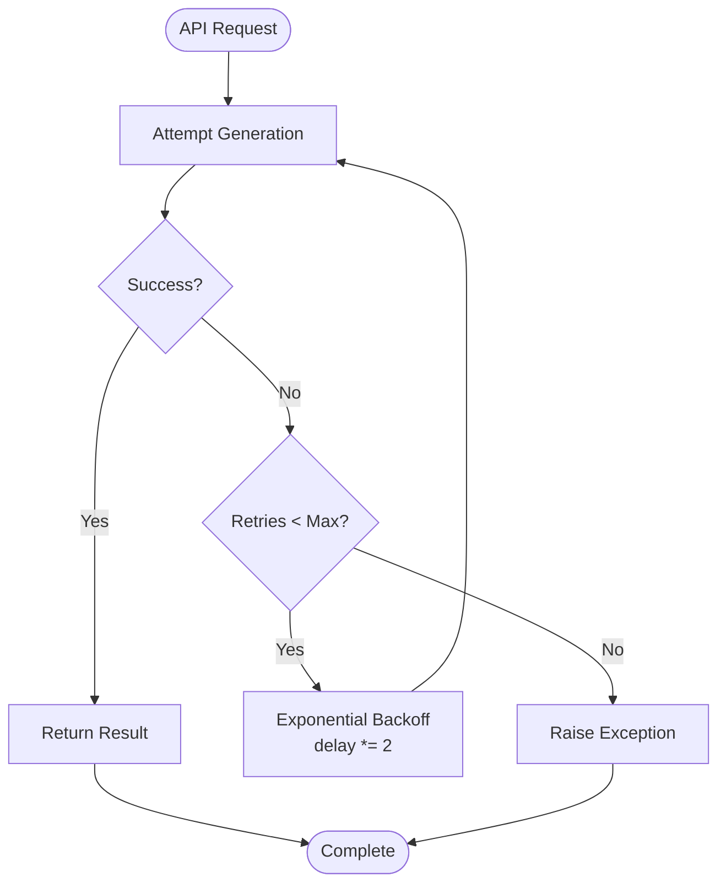
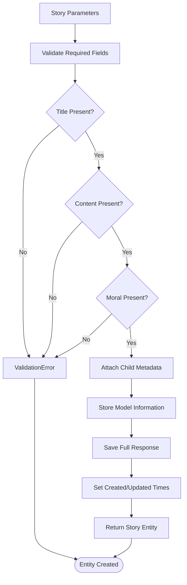

# Story Generation

<cite>
**Referenced Files in This Document**
- [generate_story.py](file://src/application/use_cases/generate_story.py)
- [prompts.py](file://src/prompts.py)
- [prompt_service.py](file://src/domain/services/prompt_service.py)
- [story_service.py](file://src/domain/services/story_service.py)
- [openrouter_client.py](file://src/openrouter_client.py)
- [dto.py](file://src/application/dto.py)
- [entities.py](file://src/domain/entities.py)
- [value_objects.py](file://src/domain/value_objects.py)
- [settings.py](file://src/infrastructure/config/settings.py)
- [routes.py](file://src/api/routes.py)
</cite>

## Table of Contents
1. [Introduction](#introduction)
2. [System Architecture](#system-architecture)
3. [Core Components](#core-components)
4. [Workflow Orchestration](#workflow-orchestration)
5. [Prompt Engineering](#prompt-engineering)
6. [AI Integration](#ai-integration)
7. [Story Creation Process](#story-creation-process)
8. [Configuration Management](#configuration-management)
9. [Error Handling and Resilience](#error-handling-and-resilience)
10. [Common Issues and Solutions](#common-issues-and-solutions)
11. [Performance Considerations](#performance-considerations)
12. [Testing Strategy](#testing-strategy)

## Introduction

The Tale Generator's AI-powered story generation feature represents a sophisticated orchestration system that combines child profile management, dynamic prompt engineering, AI content creation, and story persistence. This system transforms user input into personalized bedtime stories through a 10-step workflow that ensures quality, consistency, and multilingual support.

The story generation process leverages advanced AI models via OpenRouter, incorporates child psychology principles, and maintains strict validation standards to deliver educational and entertaining content suitable for children aged 1-18.

## System Architecture

The story generation system follows a clean architecture pattern with clear separation of concerns across multiple layers:



**Diagram sources**
- [generate_story.py](file://src/application/use_cases/generate_story.py#L21-L51)
- [prompt_service.py](file://src/domain/services/prompt_service.py#L11-L13)
- [story_service.py](file://src/domain/services/story_service.py#L13-L15)
- [openrouter_client.py](file://src/openrouter_client.py#L44-L64)

## Core Components

### GenerateStoryUseCase

The `GenerateStoryUseCase` serves as the primary orchestrator for the story generation workflow. It coordinates all components through dependency injection and manages the complete 10-step process.

**Key Responsibilities:**
- Child profile management and persistence
- Prompt generation coordination
- AI content creation orchestration
- Story persistence and retrieval
- Audio generation integration
- Response formatting and validation

**Section sources**
- [generate_story.py](file://src/application/use_cases/generate_story.py#L21-L208)

### PromptService

The `PromptService` handles language-specific prompt generation, translating child and hero profiles into structured prompts for AI consumption. It supports both English and Russian languages with automatic translation capabilities.

**Core Features:**
- Dynamic prompt template generation
- Language-specific content adaptation
- Interest and moral value translation
- Word count estimation based on reading speed
- Template-based prompt construction

**Section sources**
- [prompt_service.py](file://src/domain/services/prompt_service.py#L11-L207)

### StoryService

The `StoryService` manages story lifecycle operations, including title extraction, entity creation, and content validation. It ensures data integrity and provides utility functions for story manipulation.

**Primary Functions:**
- Story entity creation and validation
- Title extraction from content
- Audio attachment management
- Story rating and feedback handling
- Content validation and sanitization

**Section sources**
- [story_service.py](file://src/domain/services/story_service.py#L13-L146)

### OpenRouterClient

The `OpenRouterClient` provides robust integration with OpenRouter's AI models, featuring built-in retry logic, model selection, and comprehensive error handling.

**Advanced Features:**
- Multiple model support (GPT-4o, Claude, Llama, Gemini)
- Automatic retry mechanism with exponential backoff
- Generation info tracking and metadata extraction
- Temperature and token configuration
- Rate limiting and timeout management

**Section sources**
- [openrouter_client.py](file://src/openrouter_client.py#L44-L161)

## Workflow Orchestration

The story generation process follows a meticulously orchestrated 10-step workflow that ensures quality and consistency:



**Diagram sources**
- [generate_story.py](file://src/application/use_cases/generate_story.py#L53-L120)

### Step-by-Step Execution Flow

**Step 1: Child Profile Management**
The system first determines if the child profile exists or needs creation. It performs an exact match search against existing profiles and creates new records when necessary.

**Step 2: Moral Value Determination**
The system resolves the moral value from either a predefined moral option or a custom moral string, defaulting to "kindness" if neither is provided.

**Step 3: Request Validation**
Comprehensive validation ensures child profiles meet requirements, moral values are present, and story length parameters are valid.

**Step 4: Prompt Generation**
The PromptService generates language-appropriate prompts incorporating child interests, moral values, and story length requirements.

**Step 5: AI Content Creation**
The OpenRouterClient sends the generated prompt to selected AI models with retry logic and comprehensive error handling.

**Step 6: Title Extraction**
The system extracts the story title from the AI-generated content, using the first line as the default title.

**Step 7: Story Entity Creation**
A complete story entity is created with all metadata, including child information, model used, and generation details.

**Step 8: Audio Generation (Optional)**
If requested, the system generates audio narration using voice providers and attaches the audio file to the story.

**Step 9: Story Persistence**
The completed story is saved to the repository with full metadata retention.

**Step 10: Response Formation**
The system returns a structured response containing the story title, content, moral value, language, and optional audio URL.

**Section sources**
- [generate_story.py](file://src/application/use_cases/generate_story.py#L53-L120)

## Prompt Engineering

The prompt engineering system demonstrates sophisticated language-aware content generation that adapts to multiple languages while maintaining educational value.

### Dynamic Prompt Construction

The system employs a factory pattern with language-specific generators:



**Diagram sources**
- [prompts.py](file://src/prompts.py#L295-L434)
- [prompts.py](file://src/prompts.py#L60-L293)

### Language-Specific Adaptations

**English Templates:**
- Character-focused prompts with explicit name inclusion
- Clear moral instruction and length specifications
- Standardized narrative structure with ending requirements
- Cultural appropriateness for English-speaking audiences

**Russian Templates:**
- Gender-neutral and culturally appropriate translations
- Interest-specific vocabulary matching native preferences
- Moral value translation maintaining educational integrity
- Length estimation adapted to Russian reading habits

**Section sources**
- [prompts.py](file://src/prompts.py#L136-L604)

### Prompt Template Structure

Each prompt template follows a consistent structure:

1. **Character Description**: Detailed child or hero characteristics
2. **Moral Instruction**: Clear moral value specification
3. **Length Specification**: Word count estimation based on reading speed
4. **Content Guidelines**: Narrative structure and style requirements
5. **Ending Requirements**: Moral lesson conclusion
6. **Language Specification**: Target language identification

## AI Integration

The OpenRouter integration provides robust AI content generation with multiple model options and comprehensive error handling.

### Model Selection and Configuration

The system supports various AI models with different capabilities:

| Model | Provider | Capabilities | Use Cases |
|-------|----------|--------------|-----------|
| GPT-4o | OpenAI | Advanced reasoning, creativity | Complex story arcs |
| GPT-4o-mini | OpenAI | Balanced performance/cost | Standard storytelling |
| Claude-3.5-Sonnet | Anthropic | Safety-first, nuanced understanding | Educational content |
| Claude-3-Haiku | Anthropic | Fast inference, reliable | Quick generation |
| Llama-3.1-405B | Meta | Large context, specialized domains | Detailed narratives |
| Gemini-2.0-Flash | Google | Multimodal, creative writing | Rich storytelling |

**Section sources**
- [openrouter_client.py](file://src/openrouter_client.py#L19-L31)

### Retry Logic Implementation

The OpenRouterClient implements sophisticated retry logic with exponential backoff:



**Diagram sources**
- [openrouter_client.py](file://src/openrouter_client.py#L119-L161)

### Generation Information Tracking

The system captures comprehensive metadata about each generation:

- **Generation ID**: Unique identifier for tracking
- **Model Information**: Used model and version details
- **Token Usage**: Input/output token statistics
- **Processing Time**: Generation duration metrics
- **Cost Information**: Token-based pricing data
- **Quality Metrics**: Automated and manual evaluation scores

**Section sources**
- [openrouter_client.py](file://src/openrouter_client.py#L34-L42)

## Story Creation Process

The story creation process involves multiple stages of validation, transformation, and persistence to ensure quality and consistency.

### Entity Creation and Validation

The `StoryService.create_story()` method constructs story entities with comprehensive validation:



**Diagram sources**
- [story_service.py](file://src/domain/services/story_service.py#L16-L66)

### Title Extraction Algorithm

The title extraction process uses intelligent parsing to handle various content formats:

1. **Content Splitting**: Lines are split by newline characters
2. **First Line Selection**: The initial line is prioritized as the title
3. **Formatting Removal**: Markdown-style headers (#) are stripped
4. **Empty Handling**: Default title "A Bedtime Story" is used for empty content
5. **Sanitization**: Whitespace and special characters are normalized

**Section sources**
- [story_service.py](file://src/domain/services/story_service.py#L68-L81)

### Audio Integration

When audio generation is requested, the system performs a multi-stage process:

1. **Audio Generation**: Text-to-speech conversion using selected provider
2. **File Upload**: Audio file stored in cloud storage with unique naming
3. **Metadata Attachment**: Provider information and generation metadata stored
4. **URL Association**: Audio URL linked to story entity
5. **Quality Verification**: Audio playback verification and error handling

**Section sources**
- [generate_story.py](file://src/application/use_cases/generate_story.py#L156-L208)

## Configuration Management

The system uses Pydantic-based configuration management for flexible and type-safe settings.

### Environment-Based Configuration

Key configuration areas include:

**AI Service Configuration:**
- `OPENROUTER_API_KEY`: OpenRouter API authentication
- `DEFAULT_MODEL`: Primary AI model selection
- `MAX_TOKENS`: Generation limits
- `TEMPERATURE`: Creativity vs. consistency balance
- `MAX_RETRIES`: Retry attempt limits
- `RETRY_DELAY`: Initial delay between retries

**Database Configuration:**
- `SUPABASE_URL`: Database endpoint
- `SUPABASE_KEY`: Authentication credentials
- `SCHEMA_NAME`: Database schema
- `TIMEOUT`: Connection timeout settings

**Voice Service Configuration:**
- `ELEVENLABS_API_KEY`: Audio generation API key
- `ENABLED`: Feature flag for audio generation

**Section sources**
- [settings.py](file://src/infrastructure/config/settings.py#L32-L76)

### Configuration Validation

The settings system provides comprehensive validation:

- **Type Safety**: Automatic type conversion and validation
- **Environment Loading**: `.env` file integration with encoding support
- **Nested Configuration**: Hierarchical settings organization
- **Default Values**: Reasonable defaults for all settings
- **Runtime Updates**: Dynamic configuration changes

## Error Handling and Resilience

The system implements comprehensive error handling across all layers with graceful degradation capabilities.

### Multi-Level Error Handling

**Application Layer:**
- Input validation and sanitization
- Business logic error handling
- Resource availability checks
- Transaction rollback mechanisms

**Domain Layer:**
- Entity validation and constraints
- Service-level error propagation
- Cross-cutting concern handling
- Audit trail maintenance

**Infrastructure Layer:**
- External service failures
- Network connectivity issues
- Rate limiting and throttling
- Timeout management

### Common Error Scenarios

**API Timeouts:**
- Connection timeout configuration
- Request timeout limits
- Graceful fallback mechanisms
- User notification systems

**Prompt Engineering Challenges:**
- Ambiguous child profiles
- Inappropriate moral values
- Language translation errors
- Template formatting issues

**Content Validation:**
- AI-generated content filtering
- Child safety compliance
- Content quality assessment
- Accessibility considerations

## Common Issues and Solutions

### API Timeout Resolution

**Problem:** OpenRouter API requests timing out during generation
**Solution:** Implement configurable timeout settings with exponential backoff retry logic

**Configuration Example:**
```python
# In settings.py
class AIServiceSettings(BaseSettings):
    timeout: int = Field(default=30, description="API timeout in seconds")
    max_retries: int = Field(default=3, description="Maximum retry attempts")
```

### Prompt Engineering Challenges

**Issue:** Inconsistent AI responses due to ambiguous prompts
**Resolution:** Implement structured prompt templates with clear parameter boundaries

**Best Practices:**
- Use specific character traits and interests
- Provide clear moral value definitions
- Specify narrative structure requirements
- Include cultural and age-appropriate guidelines

### Content Validation Issues

**Problem:** AI-generated content violating safety guidelines
**Solution:** Implement multi-layered content filtering and validation

**Implementation Strategy:**
1. **Pre-generation Filtering**: Prompt validation and sanitization
2. **Post-generation Review**: Content quality assessment
3. **Safety Monitoring**: Automated content safety checks
4. **Human Oversight**: Manual review for sensitive content

### Memory and Performance Optimization

**Challenge:** Large story generation consuming excessive memory
**Optimization Techniques:**
- Streaming generation for long stories
- Prompt compression and summarization
- Efficient data structures for child profiles
- Caching of frequently used templates

## Performance Considerations

### Generation Speed Optimization

**Model Selection Strategy:**
- Use smaller models (GPT-4o-mini) for quick generation
- Reserve larger models (GPT-4o) for complex narratives
- Implement model-specific optimization techniques

**Caching Mechanisms:**
- Prompt template caching
- Child profile caching
- Frequently used moral values
- Generated story previews

### Scalability Architecture

**Horizontal Scaling:**
- Container-based deployment
- Load balancing across instances
- Database connection pooling
- Message queue for async processing

**Vertical Scaling:**
- Memory optimization for large prompts
- CPU allocation for AI processing
- Storage optimization for audio files
- Network bandwidth management

## Testing Strategy

### Unit Testing Approach

**Mock Dependencies:**
- AI service mocking for deterministic testing
- Repository layer mocking for isolated testing
- External service mocking for reliability
- Configuration mocking for environment independence

**Test Coverage Areas:**
- Prompt generation accuracy
- Story creation validation
- Error handling scenarios
- Integration point testing

### Integration Testing

**End-to-End Workflows:**
- Complete story generation pipeline
- Audio generation integration
- Database persistence verification
- API endpoint testing

**Performance Testing:**
- Generation speed benchmarks
- Concurrent request handling
- Memory usage monitoring
- API rate limiting validation

### Configuration Testing

**Environment Variations:**
- Development environment testing
- Production-like staging validation
- Multi-language configuration testing
- Feature flag impact assessment