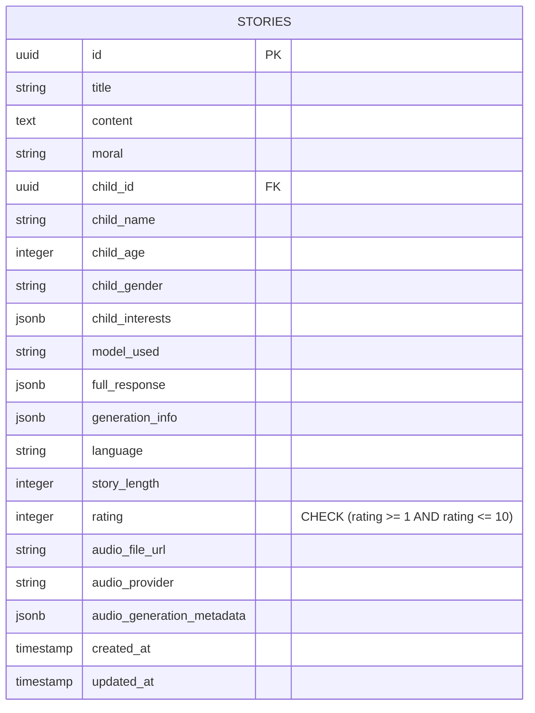
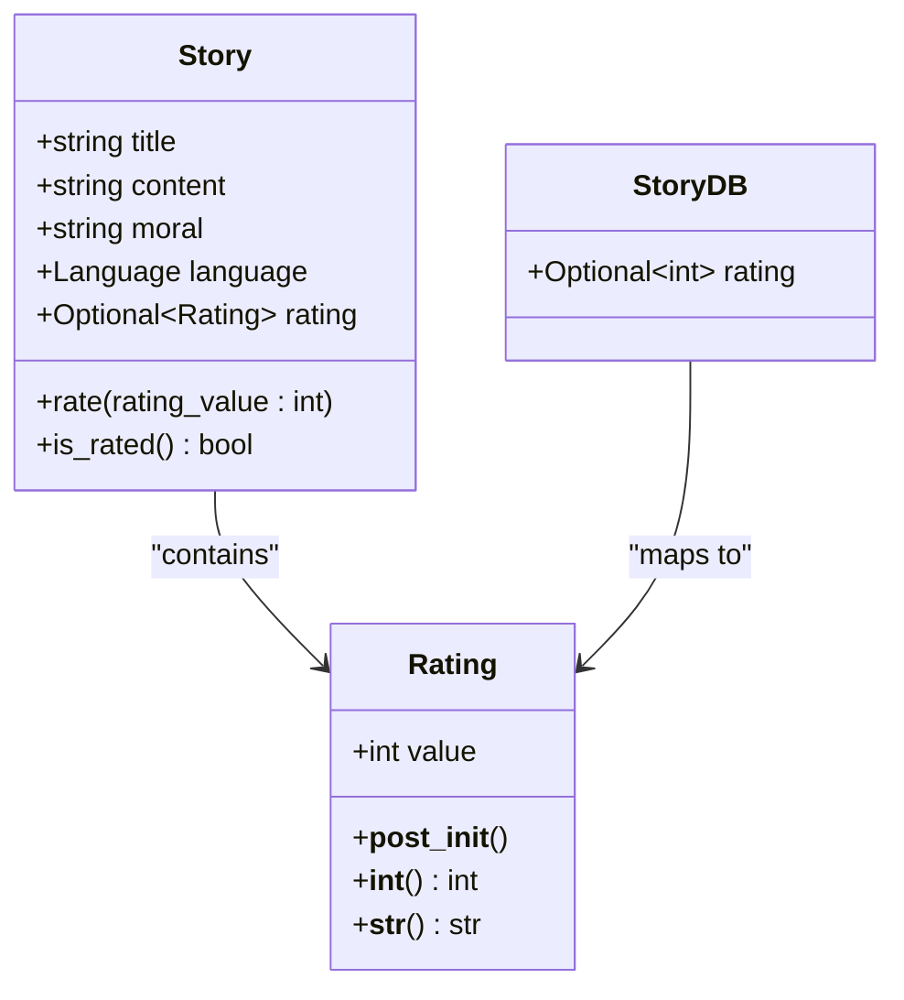
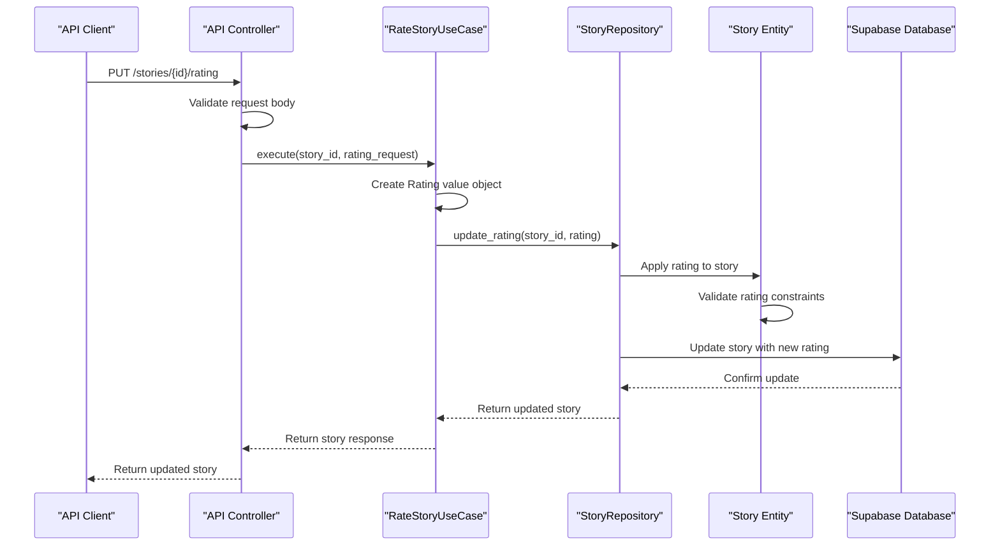
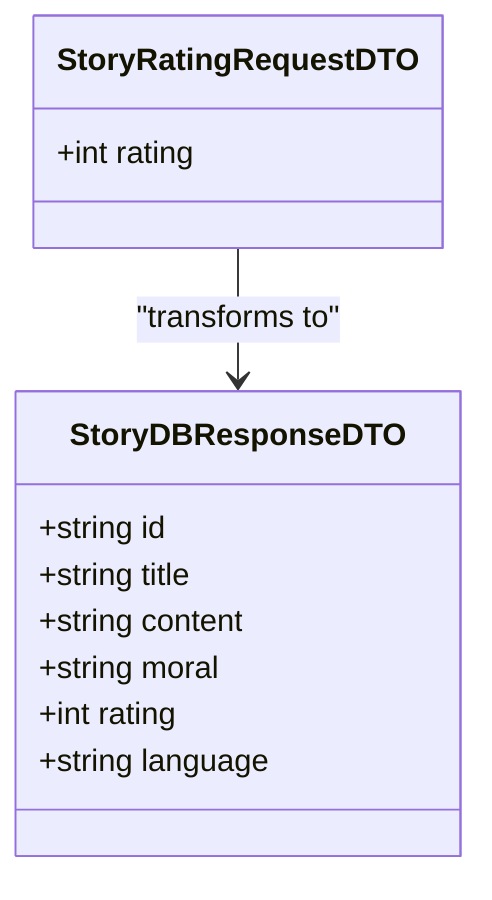
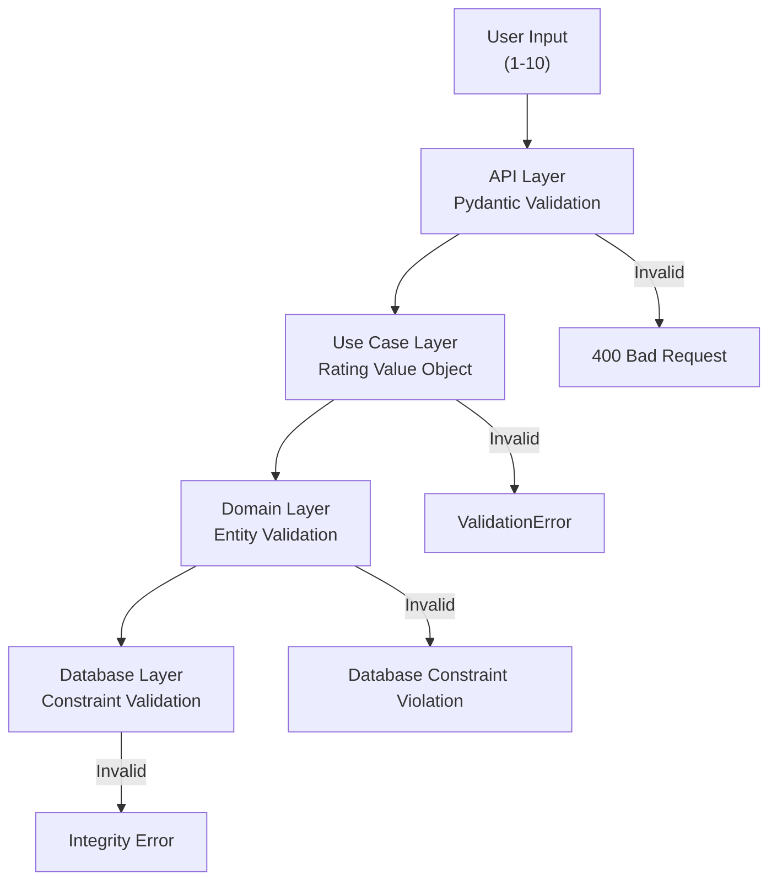
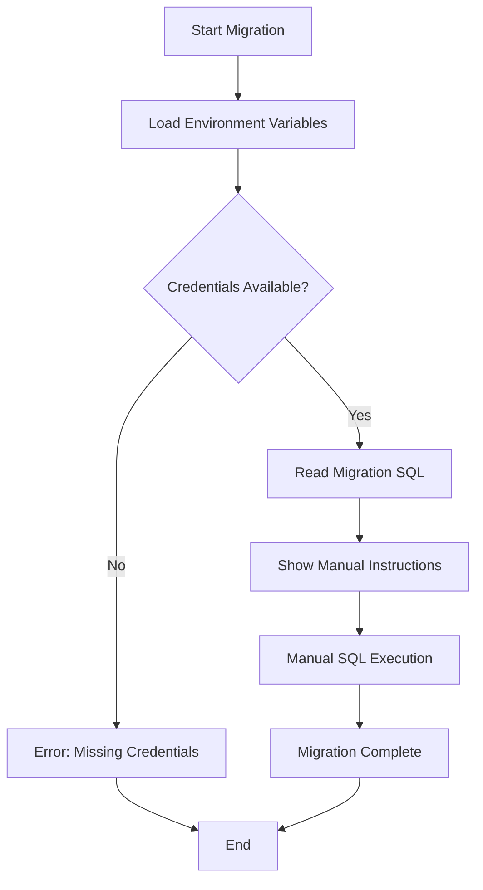
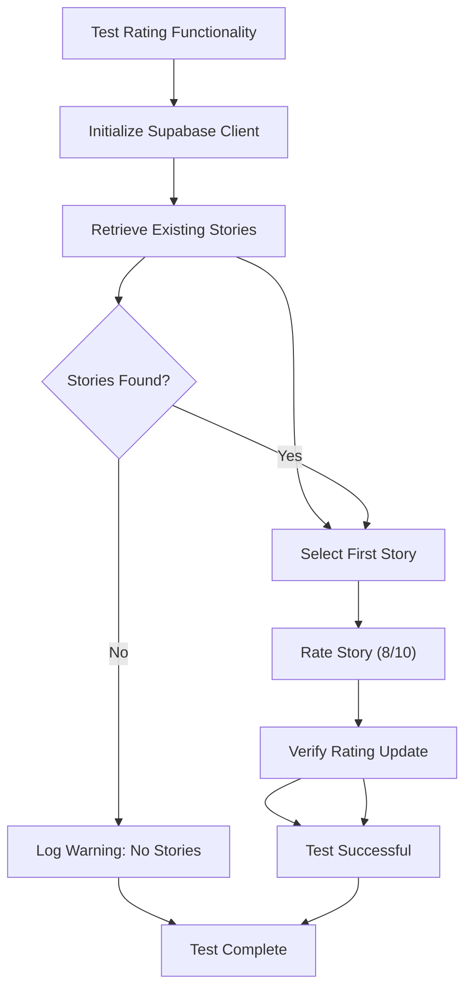

# Story Rating System

<cite>
**Referenced Files in This Document**
- [006_add_rating_to_stories.sql](file://supabase/migrations/006_add_rating_to_stories.sql)
- [apply_rating_migration.py](file://apply_rating_migration.py)
- [manage_stories.py](file://manage_stories.py)
- [src/application/use_cases/manage_stories.py](file://src/application/use_cases/manage_stories.py)
- [src/domain/entities.py](file://src/domain/entities.py)
- [src/domain/value_objects.py](file://src/domain/value_objects.py)
- [src/domain/repositories/story_repository.py](file://src/domain/repositories/story_repository.py)
- [src/application/dto.py](file://src/application/dto.py)
- [src/models.py](file://src/models.py)
- [src/supabase_client.py](file://src/supabase_client.py)
- [src/api/routes.py](file://src/api/routes.py)
- [src/core/constants.py](file://src/core/constants.py)
- [test_rating.py](file://test_rating.py)
</cite>

## Table of Contents
1. [Introduction](#introduction)
2. [Database Schema Changes](#database-schema-changes)
3. [Domain Model Implementation](#domain-model-implementation)
4. [Use Case Architecture](#use-case-architecture)
5. [API Integration](#api-integration)
6. [Validation and Error Handling](#validation-and-error-handling)
7. [Migration Management](#migration-management)
8. [Configuration Options](#configuration-options)
9. [Common Issues and Solutions](#common-issues-and-solutions)
10. [Testing and Quality Assurance](#testing-and-quality-assurance)

## Introduction

The story rating system enables users to evaluate generated bedtime stories on a scale of 1-10. This comprehensive system integrates database schema modifications, domain-driven architecture, API endpoints, and robust validation mechanisms to provide a seamless rating experience while maintaining data consistency and reliability.

The rating functionality serves multiple purposes: collecting user feedback, enabling story improvement, and supporting future analytics capabilities. The system is built with a layered architecture that separates concerns between data persistence, business logic, and presentation layers.

## Database Schema Changes

### Migration Implementation

The rating system was introduced through a carefully designed database migration that adds the rating column to the stories table while maintaining backward compatibility and data integrity.

**Diagram sources**
- [006_add_rating_to_stories.sql](file://supabase/migrations/006_add_rating_to_stories.sql#L1-L11)

The migration script performs several critical operations:

1. **Column Addition**: Adds the `rating` column with integer type and constraint validation
2. **Index Creation**: Establishes an index on the rating column for efficient querying
3. **Data Initialization**: Sets existing rows to NULL for backward compatibility

**Section sources**
- [006_add_rating_to_stories.sql](file://supabase/migrations/006_add_rating_to_stories.sql#L1-L11)

### Database Constraints

The rating column implements strict constraints to ensure data quality:

- **Range Validation**: Ratings must be between 1 and 10 (inclusive)
- **Nullability**: Allows NULL values for un-rated stories
- **Indexing**: Provides efficient sorting and filtering capabilities
- **Type Safety**: Uses INTEGER type for optimal storage and performance

## Domain Model Implementation

### Value Object Design

The rating system utilizes a dedicated value object that encapsulates rating behavior and validation logic within the domain model.

**Diagram sources**
- [src/domain/value_objects.py](file://src/domain/value_objects.py#L136-L157)
- [src/domain/entities.py](file://src/domain/entities.py#L114-L210)

### Entity Behavior

The Story entity provides comprehensive rating functionality through specialized methods:

- **Rating Assignment**: The `rate()` method creates a new Rating value object
- **Status Checking**: The `is_rated()` method determines if a story has been rated
- **Property Access**: The `rating` property provides controlled access to the rating value

**Section sources**
- [src/domain/entities.py](file://src/domain/entities.py#L148-L188)
- [src/domain/value_objects.py](file://src/domain/value_objects.py#L136-L157)

### Constants and Configuration

The system defines rating boundaries through centralized constants:

| Constant | Value | Purpose |
|----------|-------|---------|
| `MIN_RATING` | 1 | Minimum acceptable rating |
| `MAX_RATING` | 10 | Maximum acceptable rating |

These constants ensure consistency across the application and facilitate easy configuration changes.

**Section sources**
- [src/core/constants.py](file://src/core/constants.py#L13-L15)

## Use Case Architecture

### RateStoryUseCase Implementation

The RateStoryUseCase orchestrates the rating process through a clean, testable interface that follows domain-driven design principles.

**Diagram sources**
- [src/application/use_cases/manage_stories.py](file://src/application/use_cases/manage_stories.py#L272-L314)
- [src/api/routes.py](file://src/api/routes.py#L279-L305)

### Repository Pattern

The StoryRepository interface defines the contract for rating operations while allowing flexible implementations:

- **update_rating()**: Updates a story's rating with validation
- **find_by_id()**: Retrieves stories for rating operations
- **Persistence Abstraction**: Enables different storage backends

**Section sources**
- [src/domain/repositories/story_repository.py](file://src/domain/repositories/story_repository.py#L49-L60)

### Data Transfer Objects

The system employs DTOs to ensure proper data flow between layers:

**Diagram sources**
- [src/application/dto.py](file://src/application/dto.py#L47-L50)
- [src/application/dto.py](file://src/application/dto.py#L96-L115)

**Section sources**
- [src/application/dto.py](file://src/application/dto.py#L47-L123)

## API Integration

### REST Endpoint Design

The rating functionality exposes a RESTful API endpoint that follows REST conventions and provides comprehensive error handling.

| Method | Endpoint | Purpose | Request Body | Response |
|--------|----------|---------|--------------|----------|
| PUT | `/stories/{story_id}/rating` | Rate a story | `{rating: int}` | Updated story with rating |

### Request Validation

The API validates rating requests at multiple levels:

1. **Schema Validation**: Pydantic validates JSON structure and data types
2. **Range Validation**: Ensures ratings are between 1 and 10
3. **Story Existence**: Verifies the story exists before rating

**Section sources**
- [src/api/routes.py](file://src/api/routes.py#L279-L305)

### Error Handling

The API provides structured error responses for various failure scenarios:

- **404 Not Found**: Story not found for rating
- **400 Bad Request**: Invalid rating value
- **500 Internal Server Error**: Database or system errors

## Validation and Error Handling

### Multi-Level Validation

The rating system implements comprehensive validation across multiple layers:

**Diagram sources**
- [src/api/routes.py](file://src/api/routes.py#L289-L297)
- [src/domain/value_objects.py](file://src/domain/value_objects.py#L141-L148)

### Exception Handling Patterns

The system handles various error conditions gracefully:

- **Value Validation**: Throws ValidationError for invalid rating values
- **Database Constraints**: Handles constraint violations from the database
- **Network Errors**: Manages connectivity issues with Supabase
- **Resource Not Found**: Provides clear messaging for missing stories

**Section sources**
- [src/domain/value_objects.py](file://src/domain/value_objects.py#L141-L148)

## Migration Management

### Migration Script Architecture

The migration system provides automated database schema updates while maintaining operational safety.

**Diagram sources**
- [apply_rating_migration.py](file://apply_rating_migration.py#L11-L51)

### Migration Best Practices

The migration script demonstrates several best practices:

- **Environment Validation**: Checks for required environment variables
- **Error Handling**: Provides clear error messages for missing configurations
- **Documentation**: Includes step-by-step instructions for manual execution
- **Flexibility**: Supports custom migration file paths

**Section sources**
- [apply_rating_migration.py](file://apply_rating_migration.py#L11-L51)

### Data Consistency Strategies

The migration ensures data consistency through:

- **Conditional Column Addition**: Uses `IF NOT EXISTS` to prevent conflicts
- **Default Value Handling**: Initializes existing records appropriately
- **Constraint Enforcement**: Applies database-level constraints immediately

## Configuration Options

### Rating Range Configuration

The system supports configurable rating ranges through centralized constants:

- **Minimum Rating**: Configurable via `MIN_RATING` constant
- **Maximum Rating**: Configurable via `MAX_RATING` constant
- **Display Format**: Consistent formatting across all interfaces

### Display Settings

Rating information appears consistently across different interfaces:

- **API Responses**: Included in story objects with proper type casting
- **CLI Tools**: Formatted as "X/10" for human readability
- **Database Storage**: Stored as integers for optimal performance

**Section sources**
- [src/core/constants.py](file://src/core/constants.py#L13-L15)

## Common Issues and Solutions

### Migration Requirements

**Issue**: Missing rating column in database schema
**Solution**: Run the migration script and manually execute SQL in Supabase dashboard

**Section sources**
- [apply_rating_migration.py](file://apply_rating_migration.py#L50-L51)

### Data Consistency Problems

**Issue**: Inconsistent rating values in database
**Solution**: Implement database constraints and application-level validation

**Section sources**
- [006_add_rating_to_stories.sql](file://supabase/migrations/006_add_rating_to_stories.sql#L2-L3)

### API Integration Challenges

**Issue**: Rating requests failing silently
**Solution**: Implement comprehensive error handling and logging

**Section sources**
- [src/api/routes.py](file://src/api/routes.py#L289-L297)

### Performance Considerations

**Issue**: Slow rating updates with large datasets
**Solution**: Utilize database indexing and optimize query patterns

**Section sources**
- [006_add_rating_to_stories.sql](file://supabase/migrations/006_add_rating_to_stories.sql#L5-L6)

## Testing and Quality Assurance

### Test Coverage

The rating system includes comprehensive testing through dedicated test scripts:

**Diagram sources**
- [test_rating.py](file://test_rating.py#L15-L56)

### Quality Assurance Measures

The testing framework validates:

- **Basic Functionality**: Successful rating assignment and retrieval
- **Error Conditions**: Proper handling of missing stories
- **Migration Dependencies**: Clear messaging about migration requirements
- **Integration Testing**: End-to-end rating workflow validation

**Section sources**
- [test_rating.py](file://test_rating.py#L15-L56)

### Continuous Integration

The system supports automated testing through:

- **Test Scripts**: Dedicated scripts for rating functionality testing
- **Environment Setup**: Clear instructions for test environment configuration
- **Migration Verification**: Automated checks for migration completion

## Conclusion

The story rating system represents a well-architected solution that balances functionality, maintainability, and user experience. Through careful implementation of domain-driven design principles, comprehensive validation, and robust error handling, the system provides reliable rating capabilities while maintaining data integrity and performance.

The modular architecture enables future enhancements such as rating analytics, weighted averages, and advanced filtering capabilities. The clear separation of concerns ensures that the system remains maintainable as requirements evolve.

Key strengths of the implementation include:

- **Comprehensive Validation**: Multi-layer validation prevents data corruption
- **Flexible Architecture**: Clean separation enables easy testing and maintenance
- **Robust Error Handling**: Graceful degradation and clear error messaging
- **Migration Safety**: Careful schema evolution with backward compatibility

The system successfully fulfills its primary objectives of enabling user feedback collection, supporting story improvement efforts, and providing a foundation for future analytical capabilities.