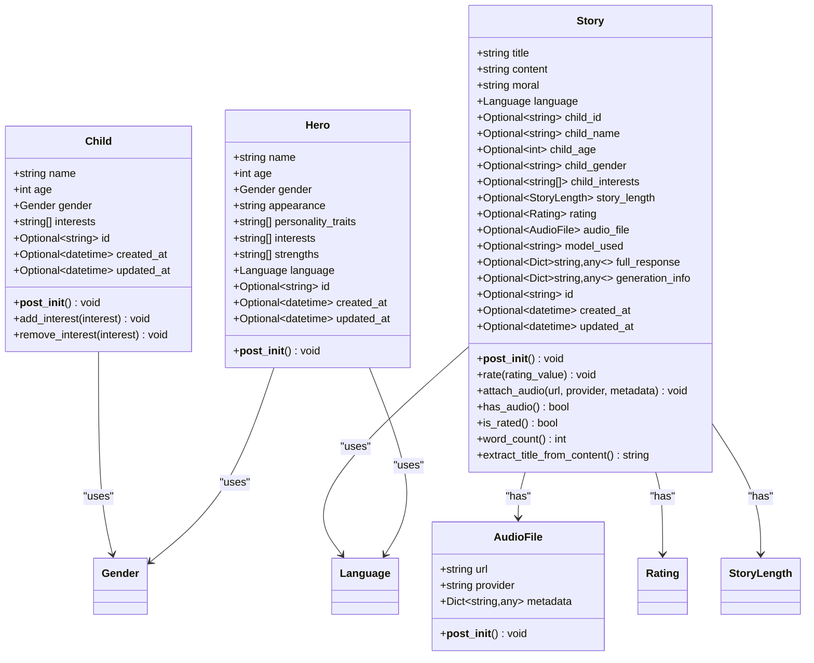
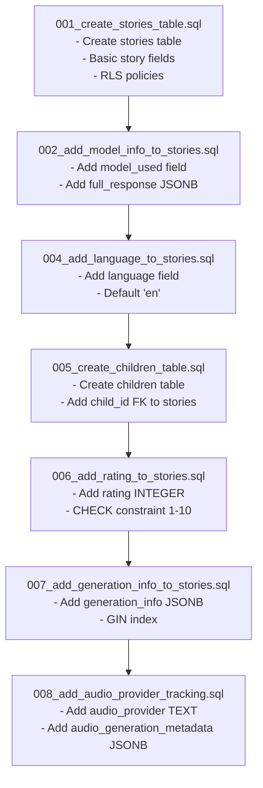
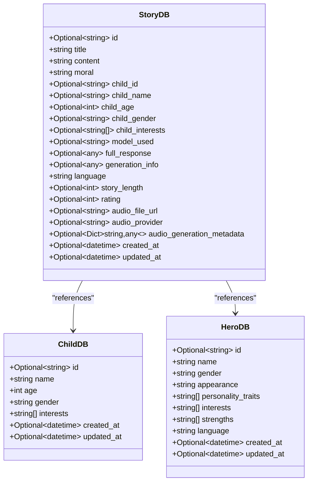
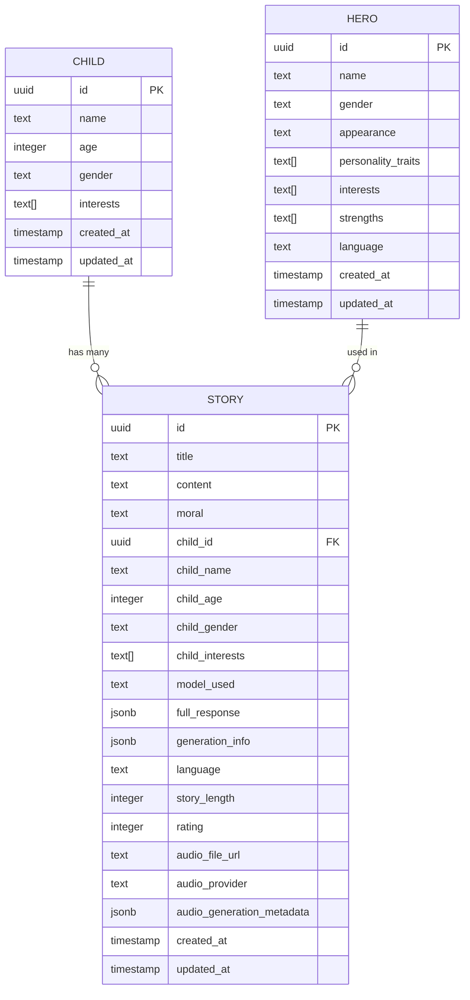
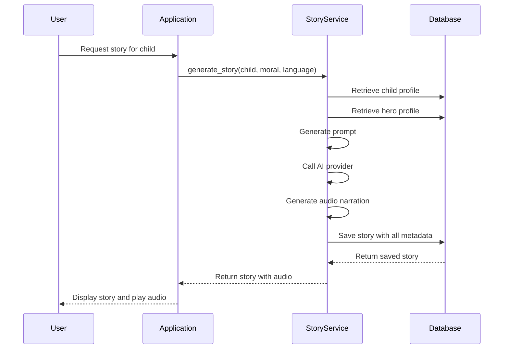

# Data Models & Database Schema

<cite>
**Referenced Files in This Document**   
- [src/domain/entities.py](file://src/domain/entities.py)
- [src/infrastructure/persistence/models.py](file://src/infrastructure/persistence/models.py)
- [supabase/migrations/001_create_stories_table.sql](file://supabase/migrations/001_create_stories_table.sql)
- [supabase/migrations/002_add_model_info_to_stories.sql](file://supabase/migrations/002_add_model_info_to_stories.sql)
- [supabase/migrations/004_add_language_to_stories.sql](file://supabase/migrations/004_add_language_to_stories.sql)
- [supabase/migrations/005_create_children_table.sql](file://supabase/migrations/005_create_children_table.sql)
- [supabase/migrations/006_add_rating_to_stories.sql](file://supabase/migrations/006_add_rating_to_stories.sql)
- [supabase/migrations/007_add_generation_info_to_stories.sql](file://supabase/migrations/007_add_generation_info_to_stories.sql)
- [supabase/migrations/008_add_audio_provider_tracking.sql](file://supabase/migrations/008_add_audio_provider_tracking.sql)
- [src/domain/value_objects.py](file://src/domain/value_objects.py)
- [src/migrations/001_create_heroes_table.sql](file://src/migrations/001_create_heroes_table.sql)
- [src/migrations/002_populate_heroes_table.sql](file://src/migrations/002_populate_heroes_table.sql)
- [test_children.py](file://test_children.py)
- [test_populate_children.py](file://test_populate_children.py)
</cite>

## Table of Contents
1. [Introduction](#introduction)
2. [Core Domain Entities](#core-domain-entities)
3. [Database Schema Evolution](#database-schema-evolution)
4. [Entity-Database Mapping](#entity-database-mapping)
5. [Data Model Relationships](#data-model-relationships)
6. [Field Specifications](#field-specifications)
7. [Sample Data and Usage Patterns](#sample-data-and-usage-patterns)
8. [Conclusion](#conclusion)

## Introduction
This document provides comprehensive documentation for the Tale Generator system's data models and database schema. It details the core domain entities—Story, Child, AudioFile, and Hero—and their corresponding database representations. The documentation covers the schema evolution through migrations, field specifications, constraints, and relationships between entities. It also explains how domain entities map to database models and provides sample usage patterns.

## Core Domain Entities

The Tale Generator system is built around four core domain entities: Story, Child, AudioFile, and Hero. These entities are defined in the domain layer and encapsulate both data and behavior.



**Diagram sources**
- [src/domain/entities.py](file://src/domain/entities.py#L10-L210)
- [src/domain/value_objects.py](file://src/domain/value_objects.py#L1-L189)

**Section sources**
- [src/domain/entities.py](file://src/domain/entities.py#L10-L210)
- [src/domain/value_objects.py](file://src/domain/value_objects.py#L1-L189)

## Database Schema Evolution

The database schema has evolved through a series of migrations that incrementally added features and improved data modeling. The schema is organized within the `tales` schema in Supabase.



**Diagram sources**
- [supabase/migrations/001_create_stories_table.sql](file://supabase/migrations/001_create_stories_table.sql)
- [supabase/migrations/002_add_model_info_to_stories.sql](file://supabase/migrations/002_add_model_info_to_stories.sql)
- [supabase/migrations/004_add_language_to_stories.sql](file://supabase/migrations/004_add_language_to_stories.sql)
- [supabase/migrations/005_create_children_table.sql](file://supabase/migrations/005_create_children_table.sql)
- [supabase/migrations/006_add_rating_to_stories.sql](file://supabase/migrations/006_add_rating_to_stories.sql)
- [supabase/migrations/007_add_generation_info_to_stories.sql](file://supabase/migrations/007_add_generation_info_to_stories.sql)
- [supabase/migrations/008_add_audio_provider_tracking.sql](file://supabase/migrations/008_add_audio_provider_tracking.sql)

**Section sources**
- [supabase/migrations/001_create_stories_table.sql](file://supabase/migrations/001_create_stories_table.sql)
- [supabase/migrations/002_add_model_info_to_stories.sql](file://supabase/migrations/002_add_model_info_to_stories.sql)
- [supabase/migrations/004_add_language_to_stories.sql](file://supabase/migrations/004_add_language_to_stories.sql)
- [supabase/migrations/005_create_children_table.sql](file://supabase/migrations/005_create_children_table.sql)
- [supabase/migrations/006_add_rating_to_stories.sql](file://supabase/migrations/006_add_rating_to_stories.sql)
- [supabase/migrations/007_add_generation_info_to_stories.sql](file://supabase/migrations/007_add_generation_info_to_stories.sql)
- [supabase/migrations/008_add_audio_provider_tracking.sql](file://supabase/migrations/008_add_audio_provider_tracking.sql)

## Entity-Database Mapping

The system uses an Object-Relational Mapping (ORM) pattern to bridge domain entities with database representations. The `StoryDB`, `ChildDB`, and `HeroDB` classes in the persistence layer map to their corresponding domain entities.



**Diagram sources**
- [src/infrastructure/persistence/models.py](file://src/infrastructure/persistence/models.py#L1-L55)
- [src/domain/entities.py](file://src/domain/entities.py#L10-L210)

**Section sources**
- [src/infrastructure/persistence/models.py](file://src/infrastructure/persistence/models.py#L1-L55)

## Data Model Relationships

The data models are interconnected through foreign key relationships and logical associations. The primary relationship is between Story and Child, where stories are generated for specific children.



**Diagram sources**
- [supabase/migrations/001_create_stories_table.sql](file://supabase/migrations/001_create_stories_table.sql)
- [supabase/migrations/005_create_children_table.sql](file://supabase/migrations/005_create_children_table.sql)
- [src/migrations/001_create_heroes_table.sql](file://src/migrations/001_create_heroes_table.sql)

## Field Specifications

### Story Entity & Table
The `stories` table contains comprehensive information about generated tales, with fields evolving through migrations.

| Field | Type | Nullability | Default | Constraints | Description |
|-------|------|-------------|---------|-------------|-------------|
| id | UUID | NOT NULL | gen_random_uuid() | PRIMARY KEY | Unique identifier for the story |
| title | TEXT | NOT NULL | - | - | Title of the story |
| content | TEXT | NOT NULL | - | - | Full text content of the story |
| moral | TEXT | NOT NULL | - | - | Moral value of the story |
| child_id | UUID | NULL | - | REFERENCES tales.children(id) | Foreign key to the child who received the story |
| child_name | TEXT | NOT NULL | - | - | Name of the child (denormalized for performance) |
| child_age | INTEGER | NOT NULL | - | - | Age of the child (denormalized) |
| child_gender | TEXT | NOT NULL | - | - | Gender of the child (denormalized) |
| child_interests | TEXT[] | NOT NULL | - | - | Interests of the child (denormalized array) |
| model_used | TEXT | NULL | - | - | AI model used for story generation |
| full_response | JSONB | NULL | - | - | Complete response from the AI provider |
| generation_info | JSONB | NULL | - | - | Metadata about the generation process |
| language | TEXT | NOT NULL | 'en' | - | Language code (en, ru) |
| story_length | INTEGER | NULL | - | - | Length of story in minutes |
| rating | INTEGER | NULL | - | CHECK (rating >= 1 AND rating <= 10) | User rating (1-10 scale) |
| audio_file_url | TEXT | NULL | - | - | URL to the audio narration |
| audio_provider | TEXT | NULL | - | - | Voice provider used for audio generation |
| audio_generation_metadata | JSONB | NULL | - | - | Provider-specific metadata for audio generation |
| created_at | TIMESTAMP WITH TIME ZONE | NOT NULL | NOW() | - | Creation timestamp |
| updated_at | TIMESTAMP WITH TIME ZONE | NOT NULL | NOW() | - | Last update timestamp |

**Section sources**
- [src/domain/entities.py](file://src/domain/entities.py#L114-L210)
- [supabase/migrations/001_create_stories_table.sql](file://supabase/migrations/001_create_stories_table.sql)
- [supabase/migrations/002_add_model_info_to_stories.sql](file://supabase/migrations/002_add_model_info_to_stories.sql)
- [supabase/migrations/004_add_language_to_stories.sql](file://supabase/migrations/004_add_language_to_stories.sql)
- [supabase/migrations/005_create_children_table.sql](file://supabase/migrations/005_create_children_table.sql)
- [supabase/migrations/006_add_rating_to_stories.sql](file://supabase/migrations/006_add_rating_to_stories.sql)
- [supabase/migrations/007_add_generation_info_to_stories.sql](file://supabase/migrations/007_add_generation_info_to_stories.sql)
- [supabase/migrations/008_add_audio_provider_tracking.sql](file://supabase/migrations/008_add_audio_provider_tracking.sql)

### Child Entity & Table
The `children` table stores profiles of children for whom stories are generated.

| Field | Type | Nullability | Default | Constraints | Description |
|-------|------|-------------|---------|-------------|-------------|
| id | UUID | NOT NULL | gen_random_uuid() | PRIMARY KEY | Unique identifier for the child |
| name | TEXT | NOT NULL | - | - | Name of the child |
| age | INTEGER | NOT NULL | - | - | Age of the child (1-18) |
| gender | TEXT | NOT NULL | - | - | Gender of the child |
| interests | TEXT[] | NOT NULL | - | - | Array of the child's interests |
| created_at | TIMESTAMP WITH TIME ZONE | NOT NULL | NOW() | - | Creation timestamp |
| updated_at | TIMESTAMP WITH TIME ZONE | NOT NULL | NOW() | - | Last update timestamp |

**Section sources**
- [src/domain/entities.py](file://src/domain/entities.py#L10-L21)
- [supabase/migrations/005_create_children_table.sql](file://supabase/migrations/005_create_children_table.sql)

### Hero Entity & Table
The `heroes` table contains predefined hero profiles used in story generation.

| Field | Type | Nullability | Default | Constraints | Description |
|-------|------|-------------|---------|-------------|-------------|
| id | UUID | NOT NULL | gen_random_uuid() | PRIMARY KEY | Unique identifier for the hero |
| name | TEXT | NOT NULL | - | - | Name of the hero |
| gender | TEXT | NOT NULL | - | - | Gender of the hero |
| appearance | TEXT | NOT NULL | - | - | Physical description of the hero |
| personality_traits | TEXT[] | NOT NULL | - | - | Array of personality traits |
| interests | TEXT[] | NOT NULL | - | - | Array of interests/hobbies |
| strengths | TEXT[] | NOT NULL | - | - | Array of strengths/powers |
| language | TEXT | NOT NULL | 'en' | - | Language code for the hero |
| created_at | TIMESTAMP WITH TIME ZONE | NOT NULL | NOW() | - | Creation timestamp |
| updated_at | TIMESTAMP WITH TIME ZONE | NOT NULL | NOW() | - | Last update timestamp |

**Section sources**
- [src/domain/entities.py](file://src/domain/entities.py#L60-L75)
- [src/migrations/001_create_heroes_table.sql](file://src/migrations/001_create_heroes_table.sql)

## Sample Data and Usage Patterns

### Sample Child Profile
```json
{
  "name": "Emma",
  "age": 6,
  "gender": "female",
  "interests": ["unicorns", "fairies", "princesses"]
}
```

### Sample Story Generation Flow


**Diagram sources**
- [src/domain/entities.py](file://src/domain/entities.py)
- [src/domain/services/story_service.py](file://src/domain/services/story_service.py)
- [src/infrastructure/persistence/models.py](file://src/infrastructure/persistence/models.py)

### Usage Examples
Based on test files, common usage patterns include:

1. **Creating and saving a child profile:**
```python
child = ChildDB(
    name="Test Child",
    age=7,
    gender="male",
    interests=["testing", "programming", "games"]
)
saved_child = client.save_child(child)
```

2. **Generating a story with specific parameters:**
```python
prompt = get_child_story_prompt(child_obj, moral, language, story_length=3)
```

3. **Rating a story:**
```python
story.rate(8)  # Rate story with 8/10
```

4. **Attaching audio to a story:**
```python
story.attach_audio(
    url="https://audio.example.com/story.mp3",
    provider="elevenlabs",
    metadata={"voice_id": "v123", "speed": 1.0}
)
```

**Section sources**
- [test_children.py](file://test_children.py#L1-L50)
- [test_populate_children.py](file://test_populate_children.py#L1-L84)
- [populate_stories.py](file://populate_stories.py#L115-L146)

## Conclusion
The Tale Generator system features a well-structured data model with clear separation between domain entities and database representations. The schema has evolved incrementally through migrations to support new features like story rating, multi-language support, and audio narration tracking. The core entities—Story, Child, AudioFile, and Hero—are rich domain objects that encapsulate both data and behavior, while the database schema efficiently stores all necessary information for story generation, retrieval, and analytics. The use of JSONB fields for flexible metadata storage and proper indexing for query performance demonstrates thoughtful database design. The system supports comprehensive story tracking with generation metadata, user ratings, and audio provider information, enabling rich user experiences and valuable analytics.