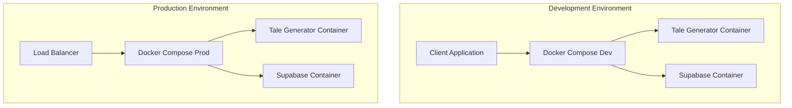
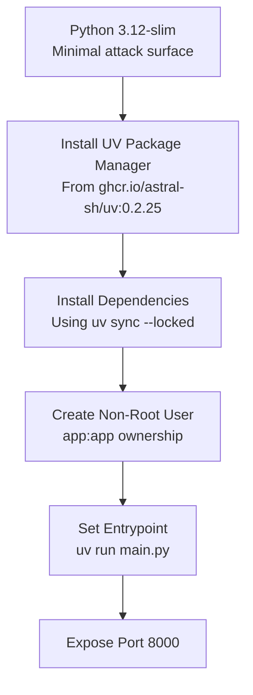
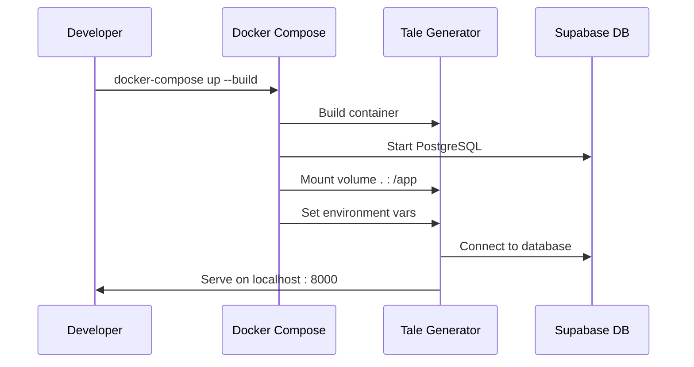
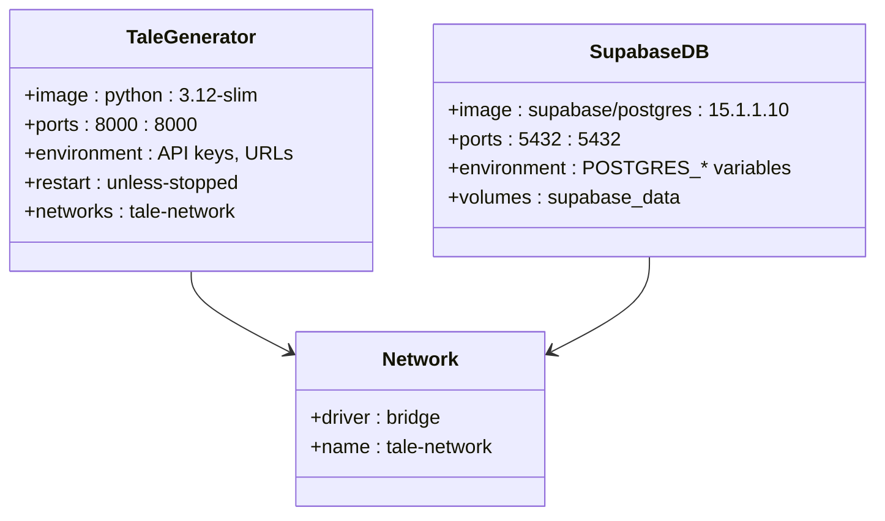
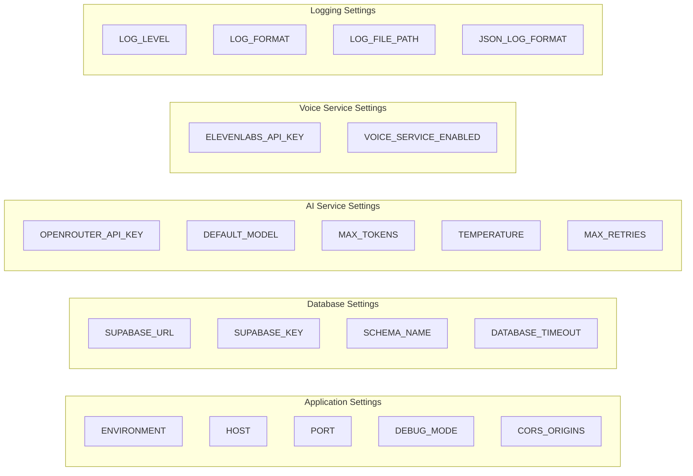
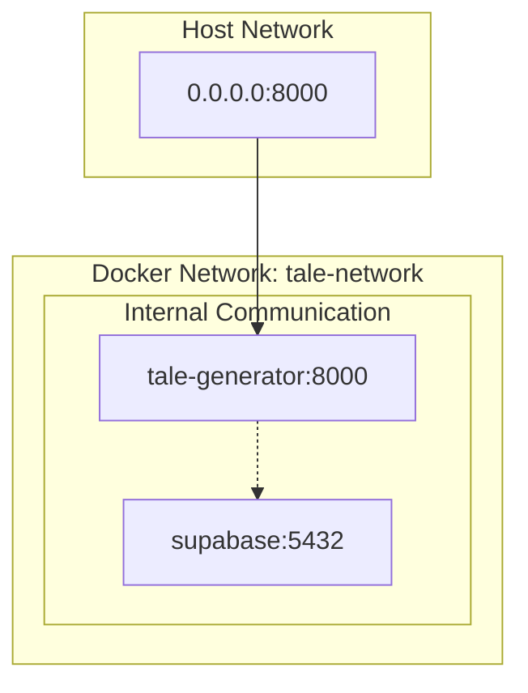
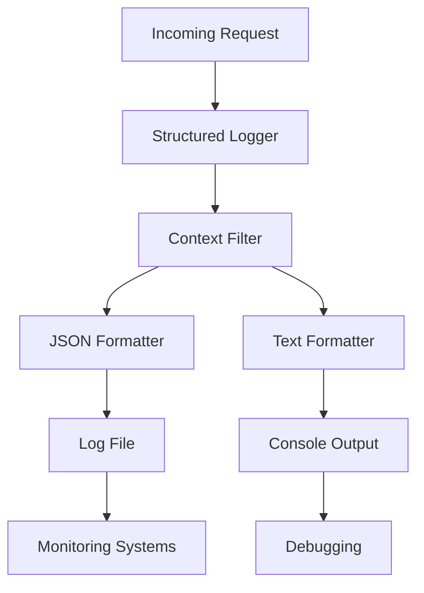

# Deployment Guide

<cite>
**Referenced Files in This Document**
- [Dockerfile](file://Dockerfile)
- [docker-compose.yml](file://docker-compose.yml)
- [docker-compose.prod.yml](file://docker-compose.prod.yml)
- [main.py](file://main.py)
- [pyproject.toml](file://pyproject.toml)
- [src/infrastructure/config/settings.py](file://src/infrastructure/config/settings.py)
- [src/core/logging.py](file://src/core/logging.py)
- [README.md](file://README.md)
- [QUICK_START.md](file://QUICK_START.md)
</cite>

## Table of Contents
1. [Introduction](#introduction)
2. [Container Architecture Overview](#container-architecture-overview)
3. [Dockerfile Analysis](#dockerfile-analysis)
4. [Development Environment Setup](#development-environment-setup)
5. [Production Configuration](#production-configuration)
6. [Environment Variables](#environment-variables)
7. [Network Configuration](#network-configuration)
8. [Deployment Commands](#deployment-commands)
9. [Monitoring and Logging](#monitoring-and-logging)
10. [Production Best Practices](#production-best-practices)
11. [Cloud Platform Deployment](#cloud-platform-deployment)
12. [Troubleshooting](#troubleshooting)

## Introduction

The Tale Generator API is a FastAPI-based service for generating personalized children's bedtime stories using AI. This deployment guide covers containerized deployment using Docker with optimized configurations for both development and production environments.

The application consists of:
- **FastAPI Web Service**: Handles API requests and story generation
- **Supabase Database**: PostgreSQL database for storing stories and user data
- **AI Integration**: OpenRouter API for story generation
- **Voice Services**: ElevenLabs integration for audio generation (optional)

## Container Architecture Overview

The Tale Generator API follows a microservice architecture with containerized deployment:



**Diagram sources**
- [docker-compose.yml](file://docker-compose.yml#L3-L41)
- [docker-compose.prod.yml](file://docker-compose.prod.yml#L3-L21)

## Dockerfile Analysis

The Dockerfile implements security-first containerization with Python 3.12-slim base image and UV for efficient dependency management.

### Base Image and Security



**Diagram sources**
- [Dockerfile](file://Dockerfile#L1-L28)

### Key Security Features

| Security Feature | Implementation | Purpose |
|------------------|----------------|---------|
| **Non-root User** | `useradd --create-home --shell /bin/bash app` | Minimizes privilege exposure |
| **Minimal Base** | `python:3.12-slim` | Reduces attack surface |
| **Locked Dependencies** | `uv sync --locked` | Ensures reproducible builds |
| **Secure Ownership** | `chown -R app:app /app` | Proper file permissions |

**Section sources**
- [Dockerfile](file://Dockerfile#L1-L28)

## Development Environment Setup

The development environment uses Docker Compose to orchestrate the application and database services.

### Development Configuration

The development setup includes:
- **Volume Mounting**: Local code changes reflected immediately
- **Port Mapping**: `8000:8000` for local development
- **Environment Variables**: Loaded from `.env` file
- **Database Service**: Embedded PostgreSQL via Supabase image

### Docker Compose Structure



**Diagram sources**
- [docker-compose.yml](file://docker-compose.yml#L3-L41)

### Starting Development Environment

```bash
# Clone and navigate to project
git clone <repository-url>
cd tale-generator

# Copy environment template
cp .env.example .env

# Configure environment variables in .env
# OPENROUTER_API_KEY=your_openrouter_key
# SUPABASE_URL=your_supabase_url
# SUPABASE_KEY=your_supabase_key

# Start development services
docker-compose up --build

# Access the API at http://localhost:8000
# Access admin interface at http://localhost:8000/admin
```

**Section sources**
- [docker-compose.yml](file://docker-compose.yml#L1-L41)
- [README.md](file://README.md#L174-L182)

## Production Configuration

The production configuration optimizes for reliability, security, and scalability.

### Production Features

| Feature | Configuration | Benefit |
|---------|---------------|---------|
| **Restart Policy** | `restart: unless-stopped` | Automatic recovery from failures |
| **Resource Management** | Optimized container limits | Better resource utilization |
| **Network Isolation** | Dedicated tale-network | Improved security |
| **Health Monitoring** | Built-in health check | Proactive issue detection |

### Production Docker Compose



**Diagram sources**
- [docker-compose.prod.yml](file://docker-compose.prod.yml#L3-L21)

### Production Deployment Commands

```bash
# Build and start production services
docker-compose -f docker-compose.prod.yml up --build -d

# View container logs
docker-compose -f docker-compose.prod.yml logs -f tale-generator

# Scale the application
docker-compose -f docker-compose.prod.yml up --scale tale-generator=3 -d

# Stop and remove containers
docker-compose -f docker-compose.prod.yml down
```

**Section sources**
- [docker-compose.prod.yml](file://docker-compose.prod.yml#L1-L21)

## Environment Variables

The application uses a hierarchical configuration system with environment variables for all external dependencies.

### Configuration Categories



**Diagram sources**
- [src/infrastructure/config/settings.py](file://src/infrastructure/config/settings.py#L16-L131)

### Required Environment Variables

| Variable | Description | Example |
|----------|-------------|---------|
| `OPENROUTER_API_KEY` | OpenRouter API authentication | `sk-or-v1-...` |
| `SUPABASE_URL` | Supabase project URL | `https://*.supabase.co` |
| `SUPABASE_KEY` | Supabase service role key | `eyJhbGciOiJIUzI1NiIs...` |

### Optional Environment Variables

| Variable | Default | Description |
|----------|---------|-------------|
| `LOG_LEVEL` | `INFO` | Logging verbosity level |
| `LOG_FORMAT` | `%(...)s` | Log message format |
| `LOG_FILE` | `None` | Log file path |
| `ELEVENLABS_API_KEY` | `None` | ElevenLabs voice generation API key |

### Environment Variable Configuration

```bash
# Create .env file
cat > .env << EOF
# Application Settings
ENVIRONMENT=production
HOST=0.0.0.0
PORT=8000
DEBUG=false
CORS_ORIGINS=http://localhost:3000,https://your-domain.com

# Database Configuration
SUPABASE_URL=https://your-supabase-project.supabase.co
SUPABASE_KEY=your-supabase-service-key

# AI Service Configuration
OPENROUTER_API_KEY=sk-or-v1-your-openrouter-key
DEFAULT_MODEL=openai/gpt-4o-mini
MAX_TOKENS=1000
TEMPERATURE=0.7
MAX_RETRIES=3

# Voice Service Configuration
ELEVENLABS_API_KEY=your-elevenlabs-key
VOICE_SERVICE_ENABLED=true

# Logging Configuration
LOG_LEVEL=INFO
LOG_FORMAT=%(asctime)s - %(name)s - %(levelname)s - [%(request_id)s] - %(message)s
LOG_FILE=/var/log/tale-generator/app.log
JSON_LOG_FORMAT=false
EOF
```

**Section sources**
- [src/infrastructure/config/settings.py](file://src/infrastructure/config/settings.py#L16-L131)

## Network Configuration

The application uses Docker networking for secure service communication.

### Network Architecture



**Diagram sources**
- [docker-compose.yml](file://docker-compose.yml#L36-L41)
- [docker-compose.prod.yml](file://docker-compose.prod.yml#L19-L21)

### Network Benefits

- **Isolation**: Services communicate only through designated ports
- **Security**: No unnecessary port exposure
- **Scalability**: Easy to add more services to the network
- **Maintenance**: Simplified service discovery

**Section sources**
- [docker-compose.yml](file://docker-compose.yml#L36-L41)
- [docker-compose.prod.yml](file://docker-compose.prod.yml#L19-L21)

## Deployment Commands

### Basic Deployment Operations

```bash
# Development environment
docker-compose up --build
docker-compose logs -f tale-generator
docker-compose down

# Production environment
docker-compose -f docker-compose.prod.yml up --build -d
docker-compose -f docker-compose.prod.yml logs -f
docker-compose -f docker-compose.prod.yml down

# Scaling production
docker-compose -f docker-compose.prod.yml up --scale tale-generator=3 -d
```

### Container Management

```bash
# View running containers
docker ps

# Inspect container details
docker inspect tale-generator

# View container logs with timestamps
docker-compose logs -f --tail=100 tale-generator

# Execute commands in container
docker-compose exec tale-generator python manage_stories.py list-all

# Restart container
docker-compose restart tale-generator

# Update containers after code changes
docker-compose up --build -d
```

### Health Monitoring

```bash
# Check application health
curl http://localhost:8000/health

# Monitor container health status
docker inspect --format='{{.State.Health.Status}}' tale-generator

# View container metrics
docker stats tale-generator
```

## Monitoring and Logging

The application implements comprehensive logging with structured output and context tracking.

### Logging Architecture



**Diagram sources**
- [src/core/logging.py](file://src/core/logging.py#L1-L180)

### Logging Configuration Options

| Format | Use Case | Example |
|--------|----------|---------|
| **Text Format** | Development, Debugging | `%(asctime)s - %(name)s - %(levelname)s - [%(request_id)s] - %(message)s` |
| **JSON Format** | Production, Monitoring | `{"timestamp": "...", "level": "...", "message": "..."}` |

### Log Management Commands

```bash
# View recent logs
docker-compose logs --tail=100 tale-generator

# Follow logs in real-time
docker-compose logs -f tale-generator

# Export logs to file
docker-compose logs tale-generator > app.log

# Compress logs for backup
docker-compose logs tale-generator | gzip > app.log.gz

# Monitor log size
docker logs --size tale-generator
```

### Health Check Endpoint

The application includes a built-in health check endpoint:

```bash
# Test health endpoint
curl -f http://localhost:8000/health || echo "Health check failed"

# Automated health monitoring
while true; do
    curl -f http://localhost:8000/health > /dev/null
    if [ $? -ne 0 ]; then
        echo "Application unhealthy"
        # Trigger alert or restart
    fi
    sleep 30
done
```

**Section sources**
- [src/core/logging.py](file://src/core/logging.py#L1-L180)
- [main.py](file://main.py#L45-L49)

## Production Best Practices

### Security Hardening

| Practice | Implementation | Benefit |
|----------|----------------|---------|
| **Non-root Execution** | `USER app` in Dockerfile | Reduced privilege escalation risk |
| **Secret Management** | Environment variables only | No hardcoded secrets |
| **Network Isolation** | Dedicated Docker network | Limited attack surface |
| **Resource Limits** | Container resource constraints | Prevent resource exhaustion |

### Performance Optimization

```bash
# Production deployment with resource limits
docker run \
  --name tale-generator-prod \
  --memory=512m \
  --cpus=1.0 \
  --restart=unless-stopped \
  -p 8000:8000 \
  -e ENVIRONMENT=production \
  -e SUPABASE_URL=$SUPABASE_URL \
  -e OPENROUTER_API_KEY=$OPENROUTER_API_KEY \
  tale-generator:latest
```

### Backup and Recovery

```bash
# Database backup
docker-compose exec supabase pg_dump -U postgres postgres > backup.sql

# Container state backup
docker commit tale-generator tale-generator-backup:$(date +%Y%m%d-%H%M%S)

# Volume backup
docker run --rm -v supabase_data:/data -v $(pwd):/backup alpine tar czf /backup/db_backup.tar.gz /data
```

### Monitoring Integration

```bash
# Prometheus metrics endpoint (if implemented)
docker run \
  --name tale-generator-monitoring \
  -p 9090:9090 \
  -v /path/to/prometheus.yml:/etc/prometheus/prometheus.yml \
  prom/prometheus
```

## Cloud Platform Deployment

### AWS Elastic Beanstalk

```yaml
# .ebextensions/tale-generator.config
option_settings:
  aws:elasticbeanstalk:container:docker:
    Command: uv run main.py
    Memory: 512
  aws:autoscaling:policy:
    EstimatedInstanceWarmup: 120
    LowerThreshold: 50
    UpperThreshold: 80
```

### Google Cloud Run

```yaml
# cloudbuild.yaml
steps:
- name: 'gcr.io/cloud-builders/docker'
  args: ['build', '-t', 'gcr.io/$PROJECT_ID/tale-generator:$COMMIT_SHA', '.']
- name: 'gcr.io/cloud-builders/docker'
  args: ['push', 'gcr.io/$PROJECT_ID/tale-generator:$COMMIT_SHA']
- name: 'gcr.io/cloud-builders/gcloud'
  args: ['run', 'deploy', 'tale-generator', 
         '--image', 'gcr.io/$PROJECT_ID/tale-generator:$COMMIT_SHA',
         '--platform', 'managed',
         '--region', 'us-central1',
         '--memory', '512Mi',
         '--cpu', '1',
         '--set-env-vars', 'ENVIRONMENT=production']
```

### Kubernetes Deployment

```yaml
# k8s/deployment.yaml
apiVersion: apps/v1
kind: Deployment
metadata:
  name: tale-generator
spec:
  replicas: 3
  selector:
    matchLabels:
      app: tale-generator
  template:
    metadata:
      labels:
        app: tale-generator
    spec:
      containers:
      - name: tale-generator
        image: tale-generator:latest
        ports:
        - containerPort: 8000
        env:
        - name: ENVIRONMENT
          value: "production"
        resources:
          requests:
            memory: "256Mi"
            cpu: "250m"
          limits:
            memory: "512Mi"
            cpu: "500m"
        livenessProbe:
          httpGet:
            path: /health
            port: 8000
          initialDelaySeconds: 30
          periodSeconds: 10
        readinessProbe:
          httpGet:
            path: /health
            port: 8000
          initialDelaySeconds: 5
          periodSeconds: 5
```

## Troubleshooting

### Common Issues and Solutions

#### Container Startup Issues

```bash
# Check container logs
docker-compose logs tale-generator

# Verify environment variables
docker-compose exec tale-generator env | grep -E "(SUPABASE_|OPENROUTER_|LOG_)"

# Test database connectivity
docker-compose exec tale-generator python -c "
import os
from supabase import create_client
client = create_client(os.getenv('SUPABASE_URL'), os.getenv('SUPABASE_KEY'))
print(client.auth.sign_in_anonymously().session)
"
```

#### Database Connection Problems

```bash
# Check database container status
docker-compose ps supabase

# Test database connectivity
docker-compose exec supabase psql -U postgres -d postgres -c "SELECT 1;"

# Verify migration completion
docker-compose exec tale-generator python -c "
from supabase import create_client
import os
client = create_client(os.getenv('SUPABASE_URL'), os.getenv('SUPABASE_KEY'))
result = client.table('stories').select('*').limit(1).execute()
print('Database connection successful')
"
```

#### Performance Issues

```bash
# Monitor resource usage
docker stats tale-generator

# Check for memory leaks
docker stats --no-stream tale-generator | awk '{print $7}' | tail -n 10

# Profile application performance
docker-compose exec tale-generator python -m cProfile -o profile.stats main.py
```

### Debug Mode Configuration

```bash
# Enable debug mode for development
export DEBUG=true
export LOG_LEVEL=DEBUG

# Run with debugger
docker-compose exec tale-generator python -m pdb main.py

# Test API endpoints with verbose logging
curl -v http://localhost:8000/health
```

### Health Check Validation

```bash
#!/bin/bash
# health-check.sh
set -e

echo "Testing Tale Generator API health..."

# Test basic health endpoint
response=$(curl -s -o /dev/null -w "%{http_code}" http://localhost:8000/health)
if [ "$response" != "200" ]; then
    echo "❌ Health check failed with status: $response"
    exit 1
fi
echo "✅ Health check passed"

# Test API functionality
response=$(curl -s -f -X POST "http://localhost:8000/generate-story" \
  -H "Content-Type: application/json" \
  -d '{"child":{"name":"Test","age":5,"gender":"male"},"moral":"kindness","language":"en"}')

if [ $? -eq 0 ]; then
    echo "✅ Story generation test passed"
else
    echo "❌ Story generation test failed"
    exit 1
fi

echo "🎉 All health checks passed!"
```

**Section sources**
- [main.py](file://main.py#L45-L49)
- [test_api.py](file://test_api.py#L16-L18)