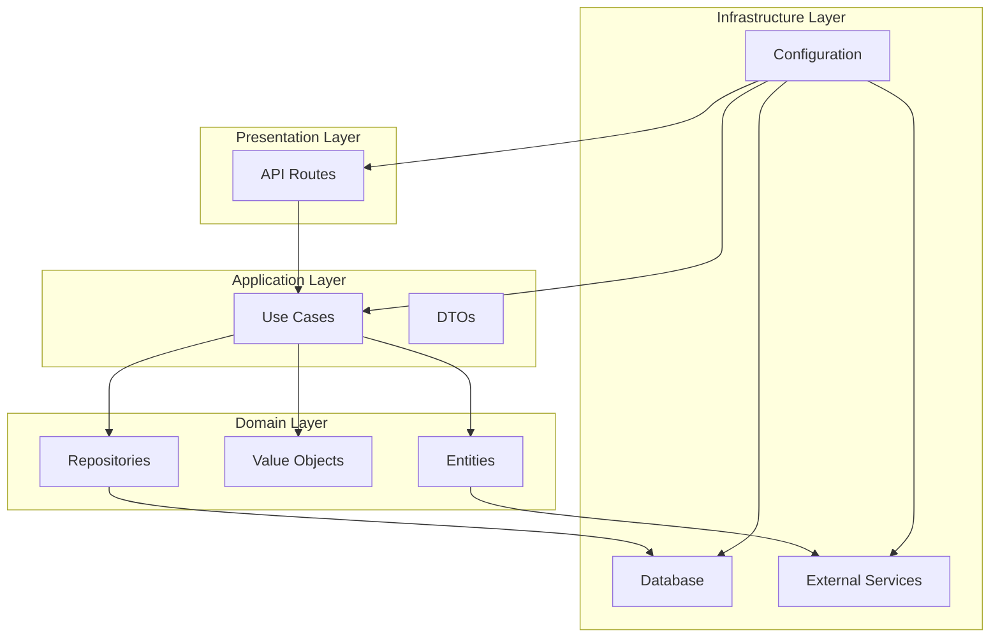

# Developer Guide

<cite>
**Referenced Files in This Document**   
- [README.md](file://README.md)
- [IMPLEMENTATION_SUMMARY.md](file://IMPLEMENTATION_SUMMARY.md)
- [REFACTORING_PROGRESS.md](file://REFACTORING_PROGRESS.md)
- [QUICK_START.md](file://QUICK_START.md)
- [pyproject.toml](file://pyproject.toml)
- [src/core/logging.py](file://src/core/logging.py)
- [src/core/exceptions.py](file://src/core/exceptions.py)
- [src/domain/entities.py](file://src/domain/entities.py)
- [src/domain/value_objects.py](file://src/domain/value_objects.py)
- [src/domain/repositories/base.py](file://src/domain/repositories/base.py)
- [src/voice_providers/base_provider.py](file://src/voice_providers/base_provider.py)
- [src/voice_providers/provider_registry.py](file://src/voice_providers/provider_registry.py)
- [src/voice_providers/voice_service.py](file://src/voice_providers/voice_service.py)
- [src/infrastructure/config/settings.py](file://src/infrastructure/config/settings.py)
</cite>

## Table of Contents
1. [Introduction](#introduction)
2. [Contribution Guidelines](#contribution-guidelines)
3. [Code Structure and Architecture](#code-structure-and-architecture)
4. [Extension Points](#extension-points)
5. [Debugging and Logging](#debugging-and-logging)
6. [Performance Optimization](#performance-optimization)
7. [Onboarding for New Developers](#onboarding-for-new-developers)

## Introduction
The Tale Generator is a FastAPI service designed to generate personalized children's bedtime stories using AI. The application supports multi-language story generation, voice-over capabilities, and persistent storage via Supabase. This developer guide provides comprehensive information for contributing to and extending the codebase, focusing on the 4-layer architecture, contribution workflows, and extension mechanisms.

The project follows Domain-Driven Design principles with clean architecture patterns, separating concerns into distinct layers: Core, Domain, Application, and Infrastructure. This structure enables maintainable, testable, and extensible code that can evolve with new requirements while preserving backward compatibility.

**Section sources**
- [README.md](file://README.md#L1-L186)
- [QUICK_START.md](file://QUICK_START.md#L1-L246)

## Contribution Guidelines

### Code Style and Standards
The Tale Generator codebase adheres to PEP8 coding standards with comprehensive type hints throughout. All Python files should include proper type annotations for function parameters, return values, and variable declarations. The project uses Pydantic for data validation and settings management, ensuring type safety and configuration validation at runtime.

Code should follow these specific guidelines:
- Use 4 spaces for indentation (no tabs)
- Limit lines to 88 characters (following Black formatter conventions)
- Include docstrings for all functions, classes, and modules using Google-style formatting
- Add type hints for all function parameters and return values
- Use descriptive variable and function names
- Keep functions focused on single responsibilities
- Include comprehensive error handling with meaningful messages

The project dependencies are managed through UV (a modern Python package manager) as specified in pyproject.toml. All new dependencies should be added to this file following the existing structure.

**Section sources**
- [pyproject.toml](file://pyproject.toml#L1-L26)
- [README.md](file://README.md#L165-L170)

### Branching Strategy
The repository follows a Git branching model optimized for collaborative development:

- **main**: Production-ready code with all tests passing
- **develop**: Integration branch for features being prepared for release
- **feature/\***: Feature branches created from develop for new functionality
- **hotfix/\***: Emergency fixes created from main and merged to both main and develop
- **release/\***: Release preparation branches for final testing and versioning

Feature branches should be created for all new development work. When a feature is complete, it should be merged into develop through a pull request. Release branches are created from develop when preparing for deployment and include final testing and version updates.

### Pull Request Workflow
The pull request process ensures code quality and knowledge sharing across the team:

1. Create a feature branch from the latest develop branch
2. Implement the feature with comprehensive tests
3. Ensure all existing tests pass and code coverage is maintained
4. Push the feature branch to the remote repository
5. Create a pull request to merge into develop
6. Request review from at least one team member
7. Address any feedback and update the PR
8. Once approved, merge the PR into develop

Pull requests should include:
- Clear description of changes and motivation
- Reference to related issues or feature requests
- Test results and coverage information
- Any necessary migration steps
- Updated documentation if applicable

All pull requests trigger automated testing through the CI/CD pipeline, which runs the complete test suite and code quality checks.

**Section sources**
- [README.md](file://README.md#L168-L170)

## Code Structure and Architecture

### 4-Layer Architecture Overview
The Tale Generator follows a clean 4-layer architecture that separates concerns and promotes maintainability:



**Diagram sources**
- [REFACTORING_PROGRESS.md](file://REFACTORING_PROGRESS.md#L229-L276)
- [QUICK_START.md](file://QUICK_START.md#L13-L37)

#### Core Layer
The Core layer contains shared utilities and foundational components used throughout the application. This includes:
- **Exceptions**: A comprehensive hierarchy of custom exceptions with error codes and contextual details
- **Constants**: Centralized application constants for configuration defaults and business rules
- **Logging**: Structured logging system with request context tracking

The exception hierarchy provides consistent error handling across the application, with specific exception types for validation errors, not found errors, conflicts, external service failures, database errors, authorization issues, and configuration problems.

**Section sources**
- [src/core/exceptions.py](file://src/core/exceptions.py#L1-L237)
- [src/core/logging.py](file://src/core/logging.py#L1-L180)

#### Domain Layer
The Domain layer contains the business logic and domain models that represent the core concepts of the application. This layer is independent of frameworks and infrastructure concerns.

**Entities** represent rich domain objects with behavior and validation:
- **Child**: Represents a child profile with name, age, gender, and interests
- **Hero**: Represents a story hero with detailed characteristics
- **Story**: Represents a generated story with content, moral, language, and metadata
- **AudioFile**: Represents audio narration with provider information

**Value Objects** represent immutable domain concepts:
- **Language**: Supported languages (English, Russian) with display names
- **Gender**: Gender options with translation capabilities
- **StoryMoral**: Predefined moral values with descriptions
- **Rating**: Story rating (1-10) with validation
- **StoryLength**: Story duration with word count calculation

**Repository Interfaces** define the contract for data persistence:
- **Repository[T]**: Generic base interface with CRUD operations
- **StoryRepository**: Extends base repository with story-specific queries
- **ChildRepository**: Extends base repository with child-specific queries
- **HeroRepository**: Extends base repository with hero-specific queries

**Section sources**
- [src/domain/entities.py](file://src/domain/entities.py#L1-L210)
- [src/domain/value_objects.py](file://src/domain/value_objects.py#L1-L189)
- [src/domain/repositories/base.py](file://src/domain/repositories/base.py#L1-L56)

#### Application Layer
The Application layer contains use cases that orchestrate domain logic and define the application's behavior. This layer acts as a mediator between the presentation and domain layers.

**Data Transfer Objects (DTOs)** define the contracts for data exchange between layers, ensuring type safety and validation. Use cases implement specific business workflows such as story generation, child management, and story management.

The use case pattern ensures that business logic is encapsulated in testable, reusable components that can be easily modified without affecting other parts of the system.

**Section sources**
- [REFACTORING_PROGRESS.md](file://REFACTORING_PROGRESS.md#L172-L177)

#### Infrastructure Layer
The Infrastructure layer contains implementations of external integrations and technical concerns. This includes:
- **Configuration**: Pydantic-based settings with environment variable loading
- **Persistence**: Database models and repository implementations
- **External Services**: Clients for OpenRouter, ElevenLabs, and Supabase
- **API Routes**: FastAPI route definitions and request handling

The configuration system uses Pydantic Settings with nested configurations for database, AI service, voice service, application, and logging settings. This provides type-safe access to configuration values with validation at startup.

**Section sources**
- [src/infrastructure/config/settings.py](file://src/infrastructure/config/settings.py#L1-L169)

## Extension Points

### Adding New Voice Providers
The Tale Generator supports multiple text-to-speech providers through a flexible provider architecture. To add a new voice provider:

1. **Implement the VoiceProvider Interface**: Create a new provider class that inherits from `VoiceProvider` and implements all abstract methods:
   - `metadata`: Return provider metadata including name, display name, and capabilities
   - `validate_configuration()`: Verify that required API keys and settings are available
   - `get_supported_languages()`: Return a list of supported language codes
   - `get_available_voices()`: Return available voice identifiers
   - `generate_speech()`: Convert text to audio and return bytes

2. **Register the Provider**: Add the provider to the application startup in `src/api/routes.py` by registering it with the global registry:
   ```python
   from src.voice_providers.provider_registry import get_registry
   registry = get_registry()
   registry.register(MyNewProvider())
   ```

3. **Add Environment Variables**: Define any required configuration in the `.env.example` file and document them in the README.

4. **Write Tests**: Create comprehensive tests in a new test file (e.g., `test_myprovider.py`) that verify:
   - Provider registration and discovery
   - Configuration validation
   - Audio generation functionality
   - Error handling

5. **Update Documentation**: Add the provider to the voice providers documentation with usage examples and configuration instructions.

The provider registry supports automatic fallback between providers, configurable through environment variables:
```bash
DEFAULT_VOICE_PROVIDER=elevenlabs
VOICE_PROVIDER_FALLBACK=mock
```

**Section sources**
- [IMPLEMENTATION_SUMMARY.md](file://IMPLEMENTATION_SUMMARY.md#L42-L62)
- [src/voice_providers/base_provider.py](file://src/voice_providers/base_provider.py#L1-L97)
- [src/voice_providers/provider_registry.py](file://src/voice_providers/provider_registry.py#L1-L212)
- [src/voice_providers/voice_service.py](file://src/voice_providers/voice_service.py#L1-L236)

### Supporting Additional Languages
The application currently supports English and Russian, with a framework for adding additional languages. To support a new language:

1. **Extend the Language Enum**: Add the new language code to the `Language` enum in `src/domain/value_objects.py`:
   ```python
   class Language(StrEnum):
       ENGLISH = "en"
       RUSSIAN = "ru"
       SPANISH = "es"  # New language
   ```

2. **Add Display Name**: Update the `display_name` property to include the new language.

3. **Update Translations**: Extend the translation dictionaries in `Gender.translate()` and `StoryMoral.translate()` methods to include translations for the new language.

4. **Verify Voice Provider Support**: Ensure that at least one voice provider supports the new language by checking the `get_supported_languages()` method.

5. **Update Database Schema**: If necessary, modify the database schema to support the new language (e.g., adding translation fields).

6. **Add Test Coverage**: Create tests to verify that stories can be generated in the new language and that all text elements are properly translated.

The system uses ISO 639-1 language codes and supports language-specific content generation, including gender and moral translations.

**Section sources**
- [src/domain/value_objects.py](file://src/domain/value_objects.py#L10-L44)
- [src/domain/entities.py](file://src/domain/entities.py#L121-L126)

### Creating New Use Cases
New application workflows should be implemented as use cases in the Application layer. To create a new use case:

1. **Define the Use Case**: Identify the business requirement and define the workflow steps.

2. **Create Data Transfer Objects**: Define input and output DTOs in `src/application/dto.py` with proper validation.

3. **Implement the Use Case**: Create a new module in `src/application/use_cases/` that implements the workflow:
   - Accept DTOs as input
   - Orchestrate domain entities and services
   - Return result DTOs
   - Handle errors appropriately

4. **Write Unit Tests**: Create comprehensive tests that cover normal operation and edge cases.

5. **Integrate with API**: Connect the use case to API routes through dependency injection.

Use cases should be focused on single responsibilities and avoid direct dependencies on infrastructure components.

**Section sources**
- [REFACTORING_PROGRESS.md](file://REFACTORING_PROGRESS.md#L172-L177)

### Implementing Repository Interfaces for Different Databases
The repository pattern allows for multiple database implementations. To support a new database:

1. **Create Repository Implementation**: Implement the repository interfaces (`StoryRepository`, `ChildRepository`, etc.) for the new database technology.

2. **Follow Interface Contracts**: Ensure all methods in the base `Repository[T]` interface are implemented with the same signatures and behavior.

3. **Handle Database-Specific Features**: Map domain concepts to database-specific features while maintaining the same logical behavior.

4. **Implement Error Translation**: Convert database-specific exceptions to the application's exception hierarchy.

5. **Add Connection Management**: Implement connection pooling, transaction management, and other database-specific concerns.

6. **Write Integration Tests**: Create tests that verify the repository implementation works correctly with the actual database.

The dependency injection system will allow switching between different repository implementations based on configuration.

**Section sources**
- [src/domain/repositories/base.py](file://src/domain/repositories/base.py#L1-L56)
- [REFACTORING_PROGRESS.md](file://REFACTORING_PROGRESS.md#L179-L181)

## Debugging and Logging

### Logging Practices
The Tale Generator uses a structured logging system with context support. Key features include:

- **Request ID Tracking**: Each request is assigned a unique ID that appears in all related log entries, enabling easy tracing of request flows.
- **JSON Formatting**: Logs can be output in JSON format for easier parsing by monitoring systems.
- **Contextual Information**: Additional context can be added to log entries using the `log_with_context()` function.
- **Hierarchical Loggers**: Loggers are organized hierarchically (e.g., `tale_generator.voice_provider`) for targeted log level control.

To use the logging system:
```python
from src.core.logging import get_logger, set_request_id, log_with_context

logger = get_logger(__name__)

# Set request context
request_id = set_request_id()

# Log with context
log_with_context(
    logger,
    logging.INFO,
    "Processing story generation",
    child_name="Emma",
    story_moral="kindness"
)
```

Log levels should be used appropriately:
- **DEBUG**: Detailed information for debugging
- **INFO**: General operational information
- **WARNING**: Indication of potential issues
- **ERROR**: Errors that prevent specific operations
- **CRITICAL**: Critical errors that may affect the entire application

**Section sources**
- [src/core/logging.py](file://src/core/logging.py#L1-L180)

### Debugging Tips
When debugging issues in the Tale Generator, follow these best practices:

1. **Use Request IDs**: Look for the request ID in logs to trace the entire flow of a specific request.

2. **Enable Debug Logging**: Set the log level to DEBUG in the `.env` file to get more detailed information:
   ```bash
   LOG_LEVEL=DEBUG
   ```

3. **Check Configuration**: Verify that all environment variables are correctly set, especially API keys and service URLs.

4. **Test Components in Isolation**: Use the mock provider for voice generation to isolate issues between different components.

5. **Use the Admin Interface**: Access the admin interface at `/admin` to view generated stories and their metadata.

6. **Run Tests**: Execute relevant test files to verify component behavior:
   ```bash
   uv run pytest test_voice_providers.py
   ```

7. **Check Database Migrations**: Ensure all database migrations have been applied, especially when adding new fields.

8. **Monitor External Services**: Verify that external services (OpenRouter, ElevenLabs) are accessible and properly configured.

For voice provider issues, check the provider registry status and fallback configuration. The system logs detailed information about provider selection and fallback attempts.

**Section sources**
- [test_logging.py](file://test_logging.py#L1-L32)
- [src/core/logging.py](file://src/core/logging.py#L1-L180)

## Performance Optimization

### Caching Strategies
The application can be optimized through strategic caching:

- **Voice Provider Caching**: Cache available voices and their characteristics to avoid repeated API calls.
- **Frequently Accessed Data**: Cache hero profiles and other static data that doesn't change frequently.
- **Generated Stories**: Implement response caching for frequently requested stories.

### Database Optimization
- **Indexing**: Ensure appropriate indexes are created for commonly queried fields (child_id, language, etc.).
- **Connection Pooling**: Use connection pooling to reduce database connection overhead.
- **Batch Operations**: Use batch operations when processing multiple records.

### Voice Generation Optimization
- **Lazy Initialization**: Initialize voice provider clients only when needed.
- **Connection Reuse**: Reuse HTTP connections to voice provider APIs.
- **Parallel Processing**: Process multiple voice generation requests in parallel when possible.

### General Performance Considerations
- **Minimize External Calls**: Cache results from external services when appropriate.
- **Efficient Data Transfer**: Use streaming for large audio files.
- **Memory Management**: Process large stories in chunks rather than loading everything into memory.
- **Asynchronous Processing**: Use async/await for I/O-bound operations to improve throughput.

The architecture is designed for performance with lazy loading, caching, and minimal overhead in the core components.

**Section sources**
- [IMPLEMENTATION_SUMMARY.md](file://IMPLEMENTATION_SUMMARY.md#L241-L243)
- [src/voice_providers/elevenlabs_provider.py](file://src/voice_providers/elevenlabs_provider.py#L48-L49)

## Onboarding for New Developers

### Getting Started
1. **Clone the Repository**:
   ```bash
   git clone <repository-url>
   cd tale-generator
   ```

2. **Install Dependencies**:
   ```bash
   uv sync
   ```

3. **Configure Environment**:
   ```bash
   cp .env.example .env
   # Edit .env with your API keys and database credentials
   ```

4. **Apply Database Migrations**:
   Copy SQL from `supabase/migrations/` and run in your Supabase SQL Editor.

5. **Run the Application**:
   ```bash
   uv run main.py
   ```

### Understanding the Codebase
Start with these key files to understand the architecture:
- `REFACTORING_PROGRESS.md`: Overview of the 4-layer architecture
- `QUICK_START.md`: Quick examples of using the new architecture
- `IMPLEMENTATION_SUMMARY.md`: Details on the voice provider implementation
- `src/core/exceptions.py`: Exception hierarchy
- `src/domain/value_objects.py`: Domain value objects
- `src/voice_providers/base_provider.py`: Voice provider interface

### Development Workflow
1. Create a feature branch from develop
2. Implement your changes with tests
3. Run the test suite: `uv run pytest`
4. Create a pull request to merge into develop
5. Address review feedback
6. Merge after approval

### Key Resources
- **Architecture Overview**: `REFACTORING_PROGRESS.md`
- **Module Details**: `IMPLEMENTATION_STATUS.md`
- **Design Rationale**: `.qoder/quests/refactor-project-into-modules.md`
- **Voice Provider Guide**: `docs/VOICE_PROVIDERS.md`

The refactoring has created a production-ready, maintainable codebase that follows modern Python practices and clean architecture principles.

**Section sources**
- [QUICK_START.md](file://QUICK_START.md#L223-L240)
- [README.md](file://README.md#L22-L76)
- [REFACTORING_PROGRESS.md](file://REFACTORING_PROGRESS.md#L1-L276)