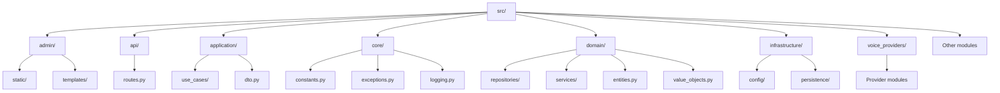
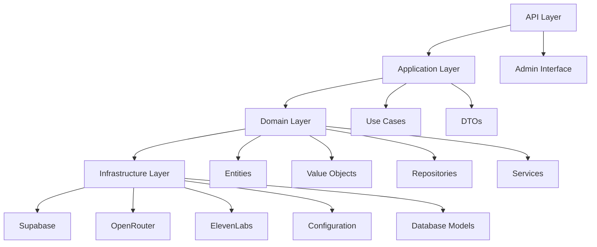
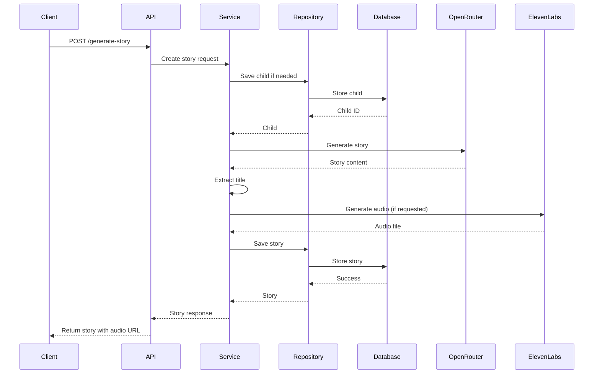
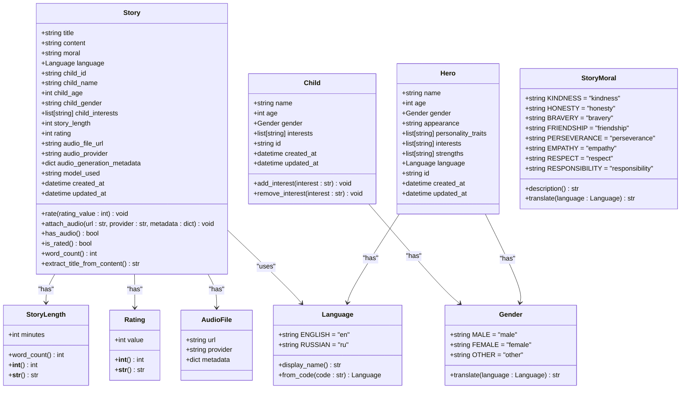
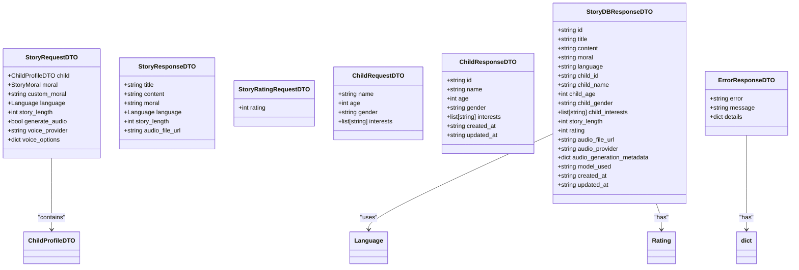
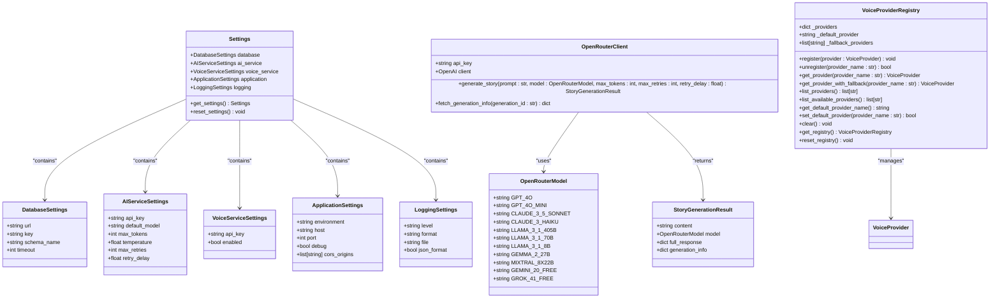
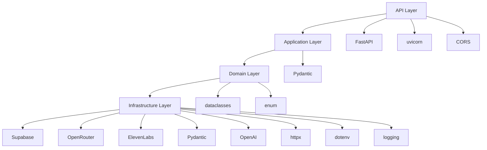

# Project Overview

<cite>
**Referenced Files in This Document**   
- [README.md](file://README.md)
- [main.py](file://main.py)
- [src/api/routes.py](file://src/api/routes.py)
- [src/application/dto.py](file://src/application/dto.py)
- [src/domain/entities.py](file://src/domain/entities.py)
- [src/domain/value_objects.py](file://src/domain/value_objects.py)
- [src/core/constants.py](file://src/core/constants.py)
- [src/infrastructure/config/settings.py](file://src/infrastructure/config/settings.py)
- [src/models.py](file://src/models.py)
- [manage_stories.py](file://manage_stories.py)
- [src/domain/services/story_service.py](file://src/domain/services/story_service.py)
- [src/domain/repositories/base.py](file://src/domain/repositories/base.py)
- [src/domain/repositories/story_repository.py](file://src/domain/repositories/story_repository.py)
- [src/voice_providers/provider_registry.py](file://src/voice_providers/provider_registry.py)
- [src/openrouter_client.py](file://src/openrouter_client.py)
</cite>

## Table of Contents
1. [Introduction](#introduction)
2. [Project Structure](#project-structure)
3. [Core Components](#core-components)
4. [Architecture Overview](#architecture-overview)
5. [Detailed Component Analysis](#detailed-component-analysis)
6. [Dependency Analysis](#dependency-analysis)
7. [Performance Considerations](#performance-considerations)
8. [Troubleshooting Guide](#troubleshooting-guide)
9. [Conclusion](#conclusion)

## Introduction

The Tale Generator API is a FastAPI-based backend service designed to generate personalized AI bedtime stories for children. This system combines artificial intelligence, multi-language support, and audio narration capabilities to create an engaging storytelling experience. The service supports story generation in both English and Russian, allows users to rate stories on a 1-10 scale, and provides audio narration through voice providers like ElevenLabs.

The API is built with a clean, layered architecture following domain-driven design principles, organized into Core, Domain, Application, and Infrastructure layers. It integrates with Supabase for persistent storage of stories and child profiles, uses OpenRouter for AI-powered story generation, and provides an admin interface for story management. The system is designed for developers, API consumers, and system administrators who want to create personalized children's content programmatically.

**Section sources**
- [README.md](file://README.md#L1-L186)

## Project Structure

The Tale Generator API follows a well-organized directory structure that reflects its layered architecture. The source code is organized under the `src/` directory with distinct folders for each architectural layer: admin interface assets, API routes, application use cases, core utilities, domain entities, infrastructure components, and voice providers. The project also includes migration scripts for database setup, configuration files, and utility scripts for story management.

**Diagram sources **
- [README.md](file://README.md#L1-L186)

**Section sources**
- [README.md](file://README.md#L1-L186)

## Core Components

The Tale Generator API consists of several core components that work together to provide a comprehensive storytelling platform. The system is built around a FastAPI application that exposes endpoints for story generation, retrieval, and management. At its core, the service integrates with OpenRouter to generate AI-powered stories based on child profiles, moral themes, and language preferences. Stories are persisted in a Supabase database, allowing for retrieval, rating, and analysis.

The API supports multi-language output (English and Russian) and includes functionality for audio narration through voice providers like ElevenLabs. The system also features an admin interface for viewing and managing generated stories, with filtering and sorting capabilities. CLI tools are provided for administrative tasks such as listing stories, rating stories, and managing child profiles.

**Section sources**
- [README.md](file://README.md#L1-L186)
- [main.py](file://main.py#L1-L77)
- [src/api/routes.py](file://src/api/routes.py#L1-L570)

## Architecture Overview

The Tale Generator API follows a clean, layered architecture based on domain-driven design principles. The system is organized into four main layers: Core, Domain, Application, and Infrastructure. This architectural approach separates concerns and promotes maintainability, testability, and scalability.

The Domain layer contains the business logic and entities such as Story, Child, and Hero, along with value objects like Language, Gender, and Rating. The Application layer defines use cases and data transfer objects (DTOs) that mediate between the API and domain layers. The Infrastructure layer handles external integrations with Supabase for persistence and OpenRouter for AI generation. The Core layer provides shared utilities like logging, configuration, and exceptions.

**Diagram sources **
- [src/domain/entities.py](file://src/domain/entities.py#L1-L210)
- [src/application/dto.py](file://src/application/dto.py#L1-L123)
- [src/infrastructure/config/settings.py](file://src/infrastructure/config/settings.py#L1-L169)
- [src/domain/services/story_service.py](file://src/domain/services/story_service.py#L1-L146)

**Section sources**
- [src/domain/entities.py](file://src/domain/entities.py#L1-L210)
- [src/application/dto.py](file://src/application/dto.py#L1-L123)
- [src/infrastructure/config/settings.py](file://src/infrastructure/config/settings.py#L1-L169)
- [src/domain/services/story_service.py](file://src/domain/services/story_service.py#L1-L146)

## Detailed Component Analysis

### API Layer Analysis

The API layer serves as the entry point for all external interactions with the Tale Generator system. Built on FastAPI, it exposes a comprehensive set of endpoints for story generation, retrieval, and management, as well as child profile operations. The API follows RESTful principles with clearly defined routes and request/response models.

**Diagram sources **
- [main.py](file://main.py#L1-L77)
- [src/api/routes.py](file://src/api/routes.py#L1-L570)

**Section sources**
- [main.py](file://main.py#L1-L77)
- [src/api/routes.py](file://src/api/routes.py#L1-L570)

### Domain Layer Analysis

The domain layer contains the core business entities and logic for the Tale Generator API. This layer is organized around domain-driven design principles, with entities like Story, Child, and Hero representing the key concepts in the system. Value objects such as Language, Gender, and Rating encapsulate domain-specific data with validation rules.

**Diagram sources **
- [src/domain/entities.py](file://src/domain/entities.py#L1-L210)
- [src/domain/value_objects.py](file://src/domain/value_objects.py#L1-L189)

**Section sources**
- [src/domain/entities.py](file://src/domain/entities.py#L1-L210)
- [src/domain/value_objects.py](file://src/domain/value_objects.py#L1-L189)

### Application Layer Analysis

The application layer serves as the mediator between the API and domain layers, implementing use cases and defining data transfer objects (DTOs). This layer contains the application-specific logic that orchestrates the interactions between different domain entities and services.

**Diagram sources **
- [src/application/dto.py](file://src/application/dto.py#L1-L123)

**Section sources**
- [src/application/dto.py](file://src/application/dto.py#L1-L123)

### Infrastructure Layer Analysis

The infrastructure layer handles external integrations and technical concerns such as configuration, database access, and third-party service clients. This layer implements the technical details required to support the domain and application layers.

**Diagram sources **
- [src/infrastructure/config/settings.py](file://src/infrastructure/config/settings.py#L1-L169)
- [src/openrouter_client.py](file://src/openrouter_client.py#L1-L161)
- [src/voice_providers/provider_registry.py](file://src/voice_providers/provider_registry.py#L1-L212)

**Section sources**
- [src/infrastructure/config/settings.py](file://src/infrastructure/config/settings.py#L1-L169)
- [src/openrouter_client.py](file://src/openrouter_client.py#L1-L161)
- [src/voice_providers/provider_registry.py](file://src/voice_providers/provider_registry.py#L1-L212)

## Dependency Analysis

The Tale Generator API has a well-defined dependency structure that follows the dependency inversion principle. Higher-level modules depend on abstractions rather than concrete implementations, allowing for flexibility and testability. The system's dependencies flow from the API layer down to the infrastructure layer, with each layer depending only on the layers below it.

**Diagram sources **
- [pyproject.toml](file://pyproject.toml)
- [src/api/routes.py](file://src/api/routes.py#L1-L570)
- [src/infrastructure/config/settings.py](file://src/infrastructure/config/settings.py#L1-L169)

**Section sources**
- [pyproject.toml](file://pyproject.toml)
- [src/api/routes.py](file://src/api/routes.py#L1-L570)
- [src/infrastructure/config/settings.py](file://src/infrastructure/config/settings.py#L1-L169)

## Performance Considerations

The Tale Generator API incorporates several performance considerations to ensure reliable and efficient operation. The system implements retry functionality with exponential backoff for external API calls to OpenRouter and other services, helping to handle transient failures and rate limiting. Configuration settings allow for tuning of retry behavior, including maximum retry attempts and delay between retries.

The API is designed to handle story generation requests efficiently by validating input parameters early in the request lifecycle and providing appropriate error responses. Database operations are optimized through the use of appropriate indexes and query patterns, with bulk operations available for administrative tasks. The system also supports asynchronous operations where appropriate, allowing for non-blocking execution of long-running tasks like AI generation and audio processing.

**Section sources**
- [src/core/constants.py](file://src/core/constants.py#L1-L38)
- [src/infrastructure/config/settings.py](file://src/infrastructure/config/settings.py#L1-L169)
- [src/openrouter_client.py](file://src/openrouter_client.py#L1-L161)

## Troubleshooting Guide

When troubleshooting issues with the Tale Generator API, start by checking the configuration settings in the environment variables, particularly the API keys for OpenRouter, Supabase, and ElevenLabs. Ensure that the database migrations have been applied correctly and that the Supabase tables exist with the expected schema.

For story generation failures, check the logs for error messages related to the OpenRouter API calls, including authentication issues, rate limiting, or model availability. If audio generation is failing, verify that the ElevenLabs API key is configured correctly and that the voice provider is properly registered in the system.

The system provides health check endpoints at `/health` and a root endpoint at `/` that can be used to verify that the service is running. The admin interface at `/admin` can be used to view generated stories and their metadata, which can help diagnose issues with story persistence or retrieval.

**Section sources**
- [README.md](file://README.md#L1-L186)
- [main.py](file://main.py#L1-L77)
- [src/api/routes.py](file://src/api/routes.py#L1-L570)

## Conclusion

The Tale Generator API provides a comprehensive platform for generating personalized AI bedtime stories for children. With its clean, layered architecture based on domain-driven design principles, the system offers a maintainable and extensible foundation for storytelling applications. The integration with OpenRouter enables high-quality AI-generated content, while Supabase provides reliable persistence for stories and child profiles.

Key features like multi-language support (English and Russian), story rating (1-10 scale), and audio narration through providers like ElevenLabs enhance the user experience and make the system suitable for a wide range of applications. The admin interface and CLI tools provide convenient ways to manage content and monitor system performance.

The API's well-defined endpoints and request/response models make it easy for developers to integrate the service into their applications, while the modular architecture allows for future enhancements and additional features. Overall, the Tale Generator API represents a robust solution for creating personalized children's content at scale.