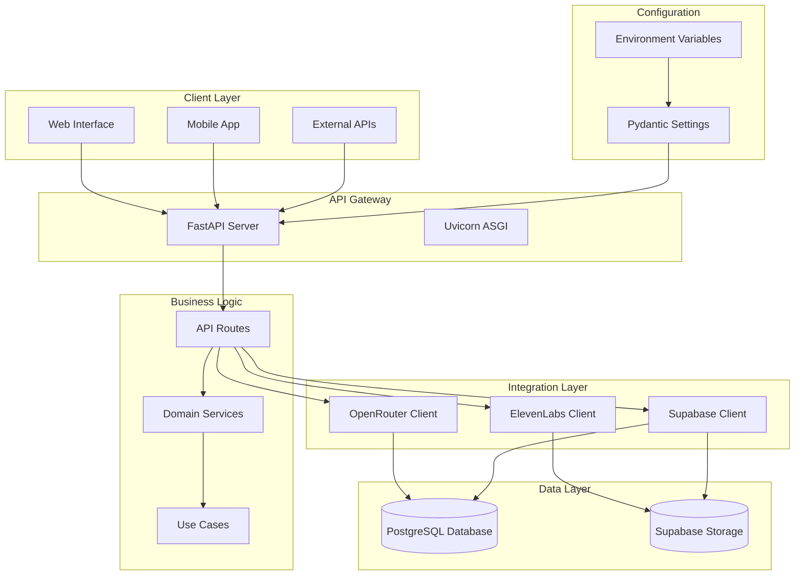
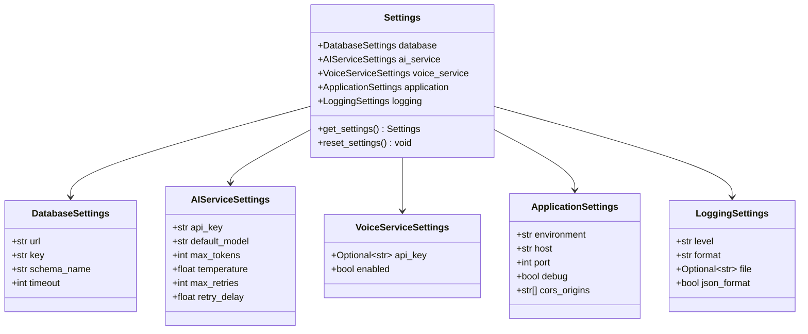

# Technology Stack & Dependencies

<cite>
**Referenced Files in This Document**
- [pyproject.toml](file://pyproject.toml)
- [Dockerfile](file://Dockerfile)
- [docker-compose.yml](file://docker-compose.yml)
- [docker-compose.prod.yml](file://docker-compose.prod.yml)
- [main.py](file://main.py)
- [src/infrastructure/config/settings.py](file://src/infrastructure/config/settings.py)
- [src/supabase_client.py](file://src/supabase_client.py)
- [src/openrouter_client.py](file://src/openrouter_client.py)
- [src/elevenlabs_client.py](file://src/elevenlabs_client.py)
- [src/api/routes.py](file://src/api/routes.py)
- [src/domain/services/audio_service.py](file://src/domain/services/audio_service.py)
- [src/voice_providers/voice_service.py](file://src/voice_providers/voice_service.py)
</cite>

## Table of Contents
1. [Introduction](#introduction)
2. [Python Version Requirements](#python-version-requirements)
3. [Core Dependencies](#core-dependencies)
4. [Containerization Strategy](#containerization-strategy)
5. [System Architecture Overview](#system-architecture-overview)
6. [Technology Role Analysis](#technology-role-analysis)
7. [Configuration Management](#configuration-management)
8. [Installation and Dependency Management](#installation-and-dependency-management)
9. [Version Constraints and Compatibility](#version-constraints-and-compatibility)
10. [Deployment Strategy](#deployment-strategy)

## Introduction

The Tale Generator project is built on a modern Python technology stack designed for scalability, reliability, and maintainability. The system leverages contemporary frameworks and libraries to create a robust API service that generates personalized bedtime stories with audio narration capabilities. This technology foundation supports both development and production environments while maintaining strict type safety and comprehensive error handling.

## Python Version Requirements

The project requires **Python 3.12+** as specified in the project configuration. This version requirement ensures access to the latest language features, improved performance characteristics, and enhanced security features available in Python 3.12 and later releases.

**Section sources**
- [pyproject.toml](file://pyproject.toml#L6)

## Core Dependencies

### Web Framework - FastAPI (>=0.115.0)

FastAPI serves as the primary web framework, providing:
- **High-performance ASGI server support** through Uvicorn integration
- **Automatic API documentation** with Swagger/OpenAPI specification
- **Type safety** through Pydantic model validation
- **Async/await support** for non-blocking operations
- **Middleware integration** for CORS and request processing

FastAPI handles all API routing, request validation, and response formatting. The framework's decorator-based approach enables clean, maintainable route definitions with automatic OpenAPI schema generation.

**Section sources**
- [pyproject.toml](file://pyproject.toml#L8)
- [main.py](file://main.py#L16-L61)
- [src/api/routes.py](file://src/api/routes.py#L1-L50)

### ASGI Server - Uvicorn (>=0.30.0)

Uvicorn provides asynchronous HTTP server capabilities:
- **Production-ready ASGI server** for FastAPI applications
- **Hot reloading** during development
- **WebSocket support** for real-time features
- **Performance optimization** with asyncio event loop
- **Graceful shutdown** handling

The server runs on port 8000 by default and supports various deployment scenarios from development to production.

**Section sources**
- [pyproject.toml](file://pyproject.toml#L9)
- [main.py](file://main.py#L68-L73)

### Data Validation - Pydantic (>=2.7.0)

Pydantic ensures type safety and data validation:
- **Model validation** with automatic type conversion
- **Serialization/deserialization** for API requests/responses
- **Field-level validation** with custom validators
- **Nested model support** for complex data structures
- **JSON Schema generation** for API documentation

The framework integrates seamlessly with FastAPI for automatic request/response validation and OpenAPI documentation generation.

**Section sources**
- [pyproject.toml](file://pyproject.toml#L10)
- [src/infrastructure/config/settings.py](file://src/infrastructure/config/settings.py#L1-L169)

### Environment Configuration - python-dotenv (>=1.0.1)

Environment variable management:
- **Dotenv file parsing** for development configuration
- **Environment variable loading** with type conversion
- **Fallback value support** for optional configurations
- **Security-conscious** handling of sensitive data

Provides seamless integration with Pydantic Settings for type-safe configuration management.

**Section sources**
- [pyproject.toml](file://pyproject.toml#L11)

### HTTP Clients

#### HTTPX (>=0.27.0)
Asynchronous HTTP client for external API communication:
- **Async/await support** for non-blocking network operations
- **Connection pooling** for improved performance
- **Timeout configuration** for reliable operations
- **Retry mechanisms** for fault tolerance

Used primarily for OpenRouter API communication and generation info retrieval.

**Section sources**
- [pyproject.toml](file://pyproject.toml#L12)
- [src/openrouter_client.py](file://src/openrouter_client.py#L66-L97)

#### OpenAI (>=1.54.0)
OpenAI SDK for AI model interactions:
- **Chat completion** API for story generation
- **Streaming support** for real-time responses
- **Cost calculation** utilities for API usage tracking
- **Model management** with multiple provider support

Integrates with OpenRouter for accessing various AI models through a unified interface.

**Section sources**
- [pyproject.toml](file://pyproject.toml#L13)
- [src/openrouter_client.py](file://src/openrouter_client.py#L44-L161)

### Database and Storage - Supabase (>=2.24.0)

Supabase provides comprehensive backend services:
- **PostgreSQL database** with JSONB support
- **Object storage** for audio file management
- **Real-time subscriptions** for data synchronization
- **Authentication** and authorization services
- **REST API** with automatic schema generation

The client handles CRUD operations for stories, children, and heroes with automatic schema management and type-safe data access.

**Section sources**
- [pyproject.toml](file://pyproject.toml#L14)
- [src/supabase_client.py](file://src/supabase_client.py#L19-L914)

### Voice Generation - ElevenLabs (>=2.24.0)

ElevenLabs API integration for text-to-speech:
- **Multilingual voice support** with language-specific voice selection
- **Custom voice settings** for optimal audio quality
- **Speaker boost** for enhanced clarity
- **Voice caching** for improved performance
- **Fallback mechanisms** for unavailable voices

Provides high-quality audio generation with automatic language detection and voice selection.

**Section sources**
- [pyproject.toml](file://pyproject.toml#L17)
- [src/elevenlabs_client.py](file://src/elevenlabs_client.py#L16-L133)

### Additional Dependencies

#### openai-cost-calculator (>=1.1.1)
Cost tracking for OpenAI API usage:
- **Token counting** for accurate cost calculation
- **Model-specific pricing** support
- **Usage analytics** for budget management
- **Rate limiting** consideration

#### Requests (>=2.32.5)
HTTP client for legacy API communications:
- **Synchronous HTTP operations** for compatibility
- **Cookie handling** for session management
- **SSL verification** for secure connections
- **Timeout configuration** for reliability

**Section sources**
- [pyproject.toml](file://pyproject.toml#L15-L16)

## Containerization Strategy

### Docker Implementation

The project uses a multi-stage containerization approach with the following characteristics:

#### Base Image Selection
- **Slim Python 3.12** image for minimal footprint
- **Alpine-based** for reduced attack surface
- **Pre-configured** with essential system packages

#### UV Package Manager Integration
The containerization strategy leverages UV for rapid dependency resolution:

```dockerfile
# Install UV package manager
COPY --from=ghcr.io/astral-sh/uv:0.2.25 /uv /bin/uv

# Install dependencies using UV
RUN uv sync --locked
```

UV provides significant advantages over traditional pip:
- **Faster installation** with parallel dependency resolution
- **Lock file support** for reproducible builds
- **Virtual environment** management
- **Caching mechanisms** for incremental builds

#### Security Considerations
- **Non-root user** creation for improved security
- **Minimal privileges** for application runtime
- **Working directory** isolation
- **Clean build process** with separate layers

**Section sources**
- [Dockerfile](file://Dockerfile#L1-L28)

### Docker Compose Configuration

#### Development Environment
The development setup includes:
- **Volume mounting** for live code reloading
- **Port exposure** on localhost:8000
- **Environment variable** injection
- **Supabase integration** for database connectivity

#### Production Environment
Production deployment features:
- **Restart policies** for reliability
- **Network isolation** with dedicated containers
- **Environment-specific** configuration
- **Resource optimization** for scaling

**Section sources**
- [docker-compose.yml](file://docker-compose.yml#L1-L41)
- [docker-compose.prod.yml](file://docker-compose.prod.yml#L1-L21)

## System Architecture Overview



**Diagram sources**
- [main.py](file://main.py#L16-L61)
- [src/api/routes.py](file://src/api/routes.py#L1-L50)
- [src/supabase_client.py](file://src/supabase_client.py#L19-L42)
- [src/openrouter_client.py](file://src/openrouter_client.py#L44-L64)
- [src/elevenlabs_client.py](file://src/elevenlabs_client.py#L16-L30)

## Technology Role Analysis

### FastAPI - API Foundation

FastAPI serves as the cornerstone of the API architecture, providing:

- **Routing and Request Handling**: Centralized endpoint management with automatic OpenAPI documentation
- **Validation Layer**: Automatic request/response validation using Pydantic models
- **Middleware Integration**: CORS, authentication, and logging middleware
- **Performance Optimization**: Built-in support for async operations and connection pooling

The framework's decorator-based approach enables clean, maintainable route definitions while automatically generating comprehensive API documentation.

### Supabase - Persistence Layer

Supabase provides a comprehensive backend solution:

- **Database Operations**: Type-safe CRUD operations with automatic schema management
- **Storage Services**: Secure file upload and retrieval for audio content
- **Real-time Features**: WebSocket connections for live data updates
- **Authentication**: Built-in user management and access control
- **Query Optimization**: SQL-based querying with JSONB support for flexible data structures

The client abstraction layer handles all database interactions while maintaining type safety and error handling consistency.

### OpenRouter - AI Integration

OpenRouter serves as the AI inference gateway:

- **Multi-model Support**: Access to various AI models through a unified interface
- **Cost Tracking**: Automatic token counting and cost calculation
- **Retry Mechanisms**: Robust error handling with exponential backoff
- **Model Abstraction**: Standardized interface regardless of underlying provider
- **Rate Limiting**: Built-in throttling for API compliance

The client implements sophisticated retry logic and generation info tracking for reliable AI interactions.

### ElevenLabs - Voice Generation

ElevenLabs provides high-quality text-to-speech capabilities:

- **Language Detection**: Automatic voice selection based on content language
- **Quality Optimization**: Custom voice settings for optimal audio quality
- **Fallback Mechanisms**: Graceful degradation when preferred voices are unavailable
- **Multilingual Support**: Native support for multiple languages and accents
- **Performance Caching**: Voice list caching for improved response times

The provider registry system enables easy integration of additional voice services while maintaining consistent interfaces.

**Section sources**
- [src/supabase_client.py](file://src/supabase_client.py#L19-L914)
- [src/openrouter_client.py](file://src/openrouter_client.py#L44-L161)
- [src/elevenlabs_client.py](file://src/elevenlabs_client.py#L16-L133)

## Configuration Management

### Pydantic Settings Architecture

The application employs a hierarchical configuration system:



**Diagram sources**
- [src/infrastructure/config/settings.py](file://src/infrastructure/config/settings.py#L117-L169)

### Environment Variable Management

Configuration follows the twelve-factor app principles:

- **Environment Separation**: Development, staging, and production configurations
- **Secret Management**: API keys and sensitive data isolated from code
- **Type Safety**: Automatic type conversion and validation
- **Default Values**: Reasonable defaults for optional settings
- **Validation**: Runtime configuration validation with descriptive errors

**Section sources**
- [src/infrastructure/config/settings.py](file://src/infrastructure/config/settings.py#L1-L169)

## Installation and Dependency Management

### UV Package Manager

The project leverages UV for efficient dependency management:

#### Installation Process
1. **Base Image Setup**: Python 3.12 slim with UV pre-installed
2. **Dependency Resolution**: Lock file-based installation for reproducibility
3. **Layer Optimization**: Separate layers for dependencies and application code
4. **Security Scanning**: Built-in vulnerability checking capabilities

#### Development Workflow
```bash
# Install dependencies
uv sync

# Add new dependencies
uv add <package-name>

# Update dependencies
uv lock --upgrade

# Run with UV
uv run main.py
```

#### Production Deployment
The Docker image includes a locked dependency set for guaranteed reproducibility across environments.

**Section sources**
- [Dockerfile](file://Dockerfile#L7-L14)
- [pyproject.toml](file://pyproject.toml#L1-L26)

### Optional Dependencies

Development dependencies include:
- **pyyaml (>=6.0.3)**: YAML file processing for configuration management

These are separated from core dependencies to minimize production image size.

**Section sources**
- [pyproject.toml](file://pyproject.toml#L20-L23)

## Version Constraints and Compatibility

### Dependency Matrix

| Package | Version Constraint | Purpose | Compatibility Notes |
|---------|-------------------|---------|-------------------|
| FastAPI | >=0.115.0 | Web framework | Requires Python 3.8+ |
| Uvicorn | >=0.30.0 | ASGI server | Async support required |
| Pydantic | >=2.7.0 | Data validation | Breaking changes in v3 |
| python-dotenv | >=1.0.1 | Environment vars | Simple configuration |
| HTTPX | >=0.27.0 | HTTP client | Async operations |
| OpenAI | >=1.54.0 | AI integration | Latest features |
| Supabase | >=2.24.0 | Database/storage | Stable API |
| ElevenLabs | >=2.24.0 | Voice generation | Recent features |
| OpenAI-Cost-Calculator | >=1.1.1 | Cost tracking | Utility library |
| Requests | >=2.32.5 | HTTP client | Legacy compatibility |

### Compatibility Considerations

#### Python Version Compatibility
- **Minimum Requirement**: Python 3.12+
- **Feature Utilization**: Modern async/await patterns
- **Library Support**: All dependencies support Python 3.12+

#### Framework Integration
- **FastAPI-Supabase**: Seamless integration with type-safe clients
- **Pydantic-OpenAI**: Automatic model validation and serialization
- **HTTPX-ElevenLabs**: Consistent async patterns across HTTP clients

#### API Stability
- **OpenRouter**: Stable API with versioned endpoints
- **Supabase**: Well-documented REST and GraphQL APIs
- **ElevenLabs**: Regular API updates with backward compatibility

**Section sources**
- [pyproject.toml](file://pyproject.toml#L7-L18)

## Deployment Strategy

### Multi-Environment Support

The deployment strategy accommodates multiple environments:

#### Development Environment
- **Local Development**: Docker Compose with volume mounting
- **Hot Reloading**: Live code updates without container restart
- **Debugging Tools**: Integrated logging and error reporting
- **Database Integration**: Local Supabase instance for testing

#### Production Environment
- **Container Orchestration**: Kubernetes or Docker Swarm deployment
- **Load Balancing**: Horizontal scaling with multiple instances
- **Health Monitoring**: Built-in health checks and metrics
- **Backup Strategies**: Automated database backups and storage snapshots

#### Environment-Specific Configurations
- **Configuration Injection**: Environment variables for secrets
- **Feature Flags**: Runtime feature toggles for gradual rollouts
- **Monitoring Integration**: Structured logging with external monitoring
- **Security Hardening**: Non-root containers and minimal privileges

**Section sources**
- [docker-compose.yml](file://docker-compose.yml#L1-L41)
- [docker-compose.prod.yml](file://docker-compose.prod.yml#L1-L21)

### Scalability Considerations

The architecture supports horizontal scaling through:

- **Stateless Design**: No session affinity required
- **Database Scaling**: Read replicas and connection pooling
- **Storage Optimization**: CDN integration for audio files
- **API Rate Limiting**: Built-in throttling mechanisms
- **Caching Layers**: Redis integration for frequently accessed data