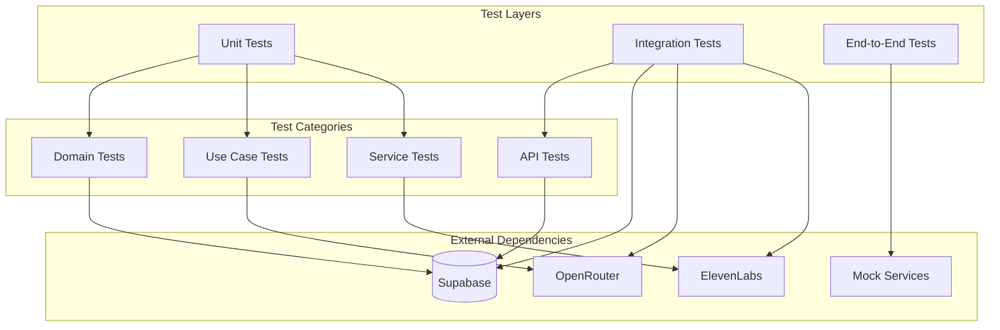
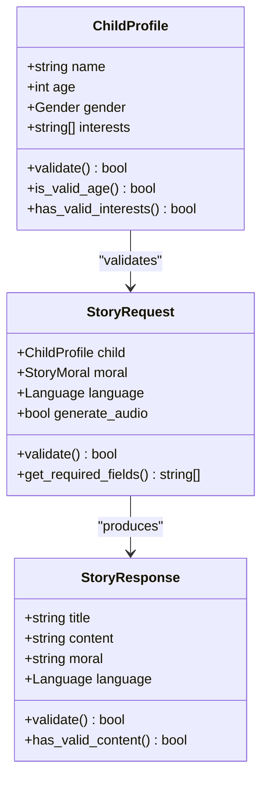
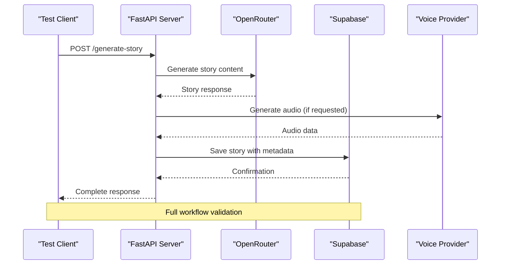
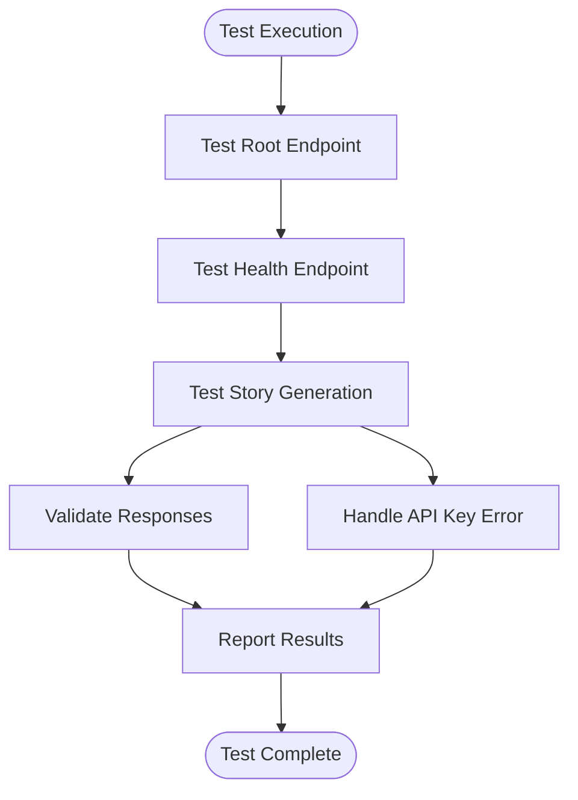
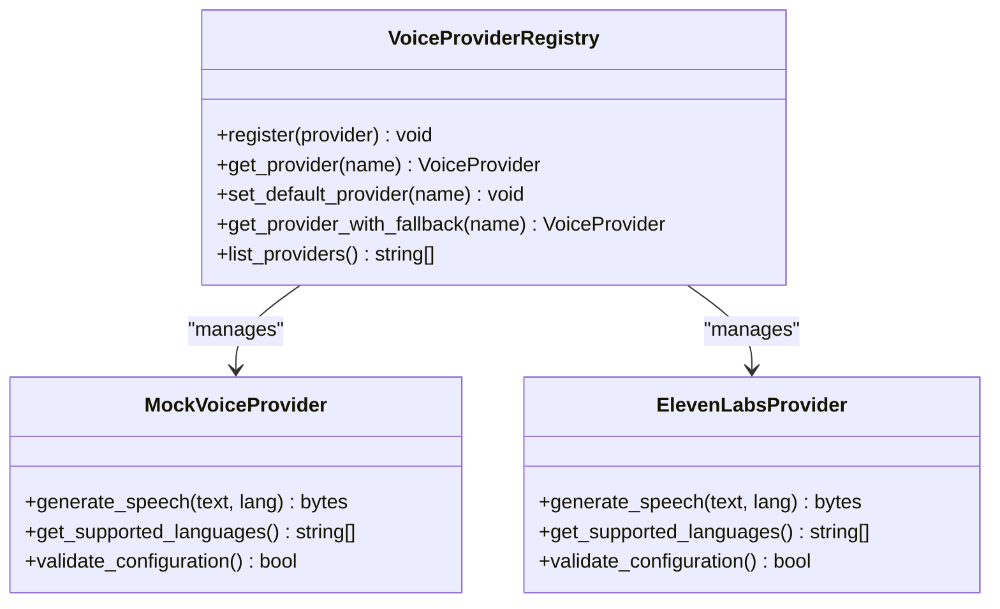
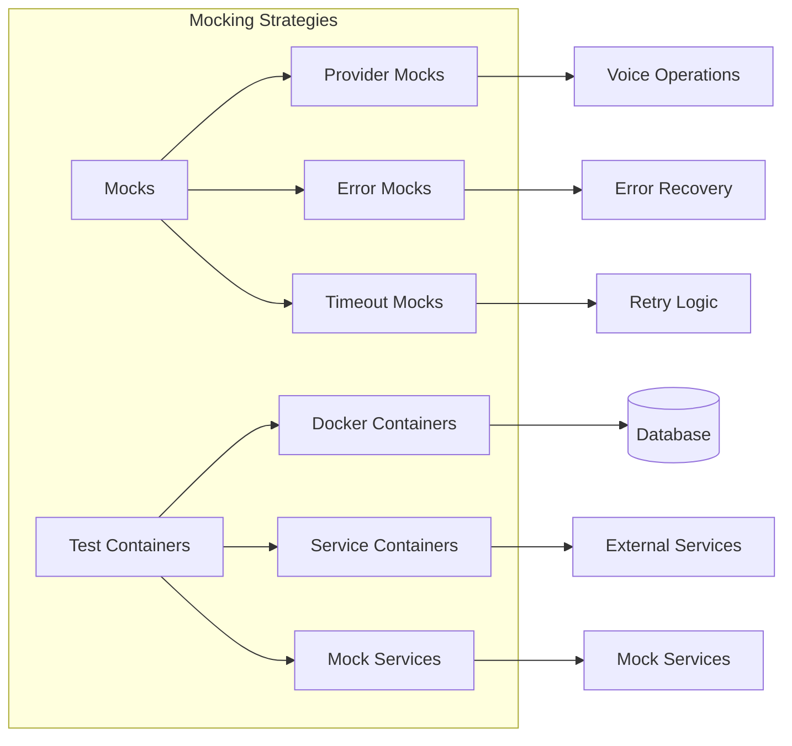
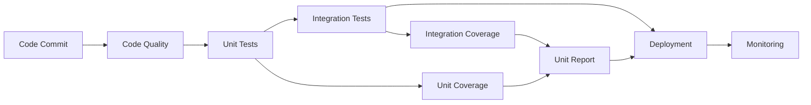
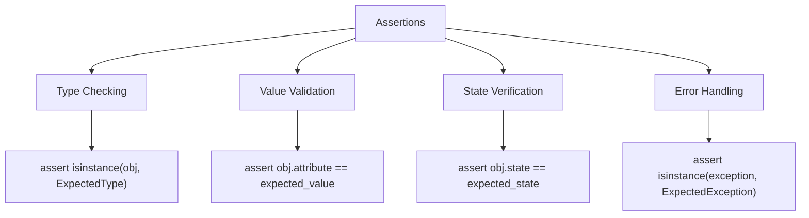
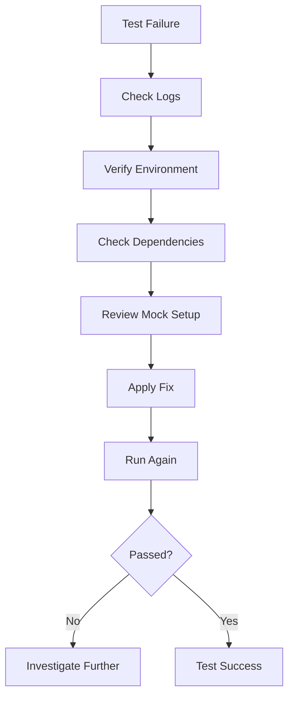

# Testing Strategy

<cite>
**Referenced Files in This Document**
- [test_api.py](file://test_api.py)
- [test_supabase_client.py](file://test_supabase_client.py)
- [test_voice_providers.py](file://test_voice_providers.py)
- [test_supabase.py](file://test_supabase.py)
- [test_integration_voice.py](file://test_integration_voice.py)
- [test_children.py](file://test_children.py)
- [test_language_api.py](file://test_language_api.py)
- [test_retry_functionality.py](file://test_retry_functionality.py)
- [pyproject.toml](file://pyproject.toml)
- [src/supabase_client.py](file://src/supabase_client.py)
- [src/voice_providers/base_provider.py](file://src/voice_providers/base_provider.py)
- [src/models.py](file://src/models.py)
- [src/api/routes.py](file://src/api/routes.py)
</cite>

## Table of Contents
1. [Introduction](#introduction)
2. [Testing Architecture Overview](#testing-architecture-overview)
3. [Unit Testing Strategy](#unit-testing-strategy)
4. [Integration Testing Approach](#integration-testing-approach)
5. [Test Environment Setup](#test-environment-setup)
6. [Specific Test File Analysis](#specific-test-file-analysis)
7. [Mocking and Test Containers](#mocking-and-test-containers)
8. [Test Coverage and CI/CD Integration](#test-coverage-and-cicd-integration)
9. [Performance Testing Considerations](#performance-testing-considerations)
10. [Best Practices and Patterns](#best-practices-and-patterns)
11. [Troubleshooting and Debugging](#troubleshooting-and-debugging)

## Introduction

The Tale Generator employs a comprehensive testing strategy designed to ensure reliability and correctness across all system components. The testing framework leverages pytest for unit and integration testing, with specialized approaches for API endpoints, database operations, and external service integrations. This strategy encompasses domain entity validation, use case testing, service layer verification, and end-to-end workflow validation.

The testing approach prioritizes modularity, maintainability, and comprehensive coverage of critical business logic while maintaining efficient execution times suitable for continuous integration environments.

## Testing Architecture Overview

The testing strategy follows a layered approach that mirrors the application architecture, ensuring thorough validation at each level:

**Diagram sources**
- [test_api.py](file://test_api.py#L1-L47)
- [test_supabase_client.py](file://test_supabase_client.py#L1-L43)
- [test_voice_providers.py](file://test_voice_providers.py#L1-L213)

The architecture emphasizes separation of concerns, with distinct test suites handling different aspects of the system. Unit tests focus on individual components, integration tests validate component interactions, and end-to-end tests ensure complete workflows function correctly.

**Section sources**
- [test_api.py](file://test_api.py#L1-L47)
- [test_supabase_client.py](file://test_supabase_client.py#L1-L43)
- [test_voice_providers.py](file://test_voice_providers.py#L1-L213)

## Unit Testing Strategy

### Domain Entity Validation Tests

Unit tests for domain entities focus on validating value object constraints, business rules, and data integrity:

**Diagram sources**
- [src/models.py](file://src/models.py#L22-L61)

### Value Object Validation

Tests ensure that value objects enforce business constraints and maintain data integrity:

- **Age Validation**: Verify age constraints for child profiles
- **Interest Validation**: Ensure interests meet minimum requirements
- **Language Validation**: Confirm supported language codes
- **Moral Validation**: Validate predefined moral values

### Use Case Implementation Tests

Unit tests validate the core business logic implemented in use cases:

- **Story Generation Logic**: Test prompt construction and response processing
- **Child Management**: Validate child creation, retrieval, and updates
- **Story Persistence**: Ensure proper database operations
- **Audio Generation**: Test voice provider integration and fallback mechanisms

### Service Layer Testing

Service layer tests focus on business logic encapsulation:

- **OpenRouter Client**: Test API communication and retry mechanisms
- **Supabase Integration**: Validate database operations and error handling
- **Voice Service**: Test provider selection and audio generation
- **Prompt Service**: Validate story template construction

**Section sources**
- [src/models.py](file://src/models.py#L1-L117)
- [test_voice_providers.py](file://test_voice_providers.py#L19-L213)

## Integration Testing Approach

### API Endpoint Testing

Integration tests validate complete API workflows from request to response:

**Diagram sources**
- [src/api/routes.py](file://src/api/routes.py#L56-L210)
- [test_api.py](file://test_api.py#L1-L47)

### Database Connectivity Tests

Supabase integration tests verify database operations and connectivity:

- **Connection Validation**: Test client initialization and authentication
- **CRUD Operations**: Validate create, read, update, delete operations
- **Data Integrity**: Ensure proper data mapping and serialization
- **Error Handling**: Test failure scenarios and recovery mechanisms

### External Service Integration

Tests validate integration with external services using controlled environments:

- **OpenRouter API**: Test story generation with various models
- **ElevenLabs API**: Validate audio generation and voice synthesis
- **Storage Services**: Test file upload and retrieval operations

**Section sources**
- [src/api/routes.py](file://src/api/routes.py#L1-L570)
- [test_supabase.py](file://test_supabase.py#L1-L46)
- [test_integration_voice.py](file://test_integration_voice.py#L1-L178)

## Test Environment Setup

### Configuration Management

The testing framework supports multiple environment configurations:

| Environment | Purpose | Configuration |
|-------------|---------|---------------|
| Development | Local development testing | Mock services, local database |
| Staging | Integration testing | Real services, test data |
| Production | End-to-end validation | Production-like environment |

### Environment Variables

Key environment variables for testing:

- `SUPABASE_URL`: Database connection URL
- `SUPABASE_KEY`: Authentication key
- `OPENROUTER_API_KEY`: AI service authentication
- `ELEVENLABS_API_KEY`: Voice service authentication

### Test Data Management

Test data is managed through:

- **Fixture Systems**: Reusable test data generators
- **Seed Data**: Pre-defined datasets for consistent testing
- **Cleanup Procedures**: Automated data removal after tests

**Section sources**
- [pyproject.toml](file://pyproject.toml#L1-L26)
- [test_supabase_client.py](file://test_supabase_client.py#L7-L42)

## Specific Test File Analysis

### test_api.py - Endpoint Validation

This test file validates API endpoint functionality through HTTP requests:

**Diagram sources**
- [test_api.py](file://test_api.py#L6-L47)

Key test scenarios include:
- Root endpoint accessibility
- Health check functionality
- Story generation with various parameters
- Error handling for missing credentials

### test_supabase_client.py - Database Operations

This file focuses on Supabase client functionality and database operations:

- **Client Instantiation**: Validates proper initialization
- **Method Availability**: Ensures all expected methods are present
- **Configuration Validation**: Tests credential checking
- **Error Handling**: Validates graceful degradation

### test_voice_providers.py - Provider Fallback Logic

Comprehensive testing of voice provider system:

**Diagram sources**
- [test_voice_providers.py](file://test_voice_providers.py#L48-L213)
- [src/voice_providers/base_provider.py](file://src/voice_providers/base_provider.py#L28-L97)

**Section sources**
- [test_api.py](file://test_api.py#L1-L47)
- [test_supabase_client.py](file://test_supabase_client.py#L1-L43)
- [test_voice_providers.py](file://test_voice_providers.py#L1-L213)

## Mocking and Test Containers

### Mock Provider Implementation

The system uses mock providers for isolated testing:

- **MockVoiceProvider**: Simulates voice generation without external dependencies
- **MockProvider Features**: Configurable responses, error simulation, latency injection
- **Test Scenarios**: Valid responses, error conditions, timeout scenarios

### External Service Mocking

Strategies for mocking external dependencies:

### Test Container Orchestration

For integration testing, test containers provide isolated environments:

- **Database Containers**: Separate test databases for each test suite
- **Service Containers**: Mock external services for consistent testing
- **Network Isolation**: Prevent interference between test environments
- **Resource Cleanup**: Automatic container cleanup after tests

**Section sources**
- [test_integration_voice.py](file://test_integration_voice.py#L1-L178)
- [src/voice_providers/base_provider.py](file://src/voice_providers/base_provider.py#L1-L97)

## Test Coverage and CI/CD Integration

### Coverage Goals

The testing strategy aims for comprehensive coverage:

| Component | Coverage Goal | Priority |
|-----------|---------------|----------|
| Core Business Logic | 95%+ | Critical |
| API Endpoints | 90%+ | High |
| Database Operations | 85%+ | High |
| External Integrations | 70%+ | Medium |
| Error Handling | 100% | Essential |

### CI/CD Pipeline Integration

Testing is integrated into the CI/CD pipeline:

### Automated Testing Triggers

- **Pull Request Validation**: Run unit and integration tests
- **Branch Testing**: Comprehensive test suite for feature branches
- **Release Testing**: Full test suite including performance tests
- **Scheduled Testing**: Regular regression testing

**Section sources**
- [pyproject.toml](file://pyproject.toml#L1-L26)

## Performance Testing Considerations

### Load Testing Strategy

Performance testing ensures system scalability:

- **API Response Times**: Monitor endpoint performance under load
- **Database Query Efficiency**: Optimize slow queries and connections
- **External Service Latency**: Account for third-party service delays
- **Memory Usage**: Monitor resource consumption during testing

### Stress Testing

System stress testing validates limits:

- **Concurrent Requests**: Test maximum concurrent API calls
- **Large Data Sets**: Validate performance with extensive data
- **Network Failures**: Test resilience to network interruptions
- **Resource Exhaustion**: Validate graceful degradation

### Performance Metrics

Key performance indicators:

- **Response Time**: Average and percentile response times
- **Throughput**: Requests processed per second
- **Error Rate**: Percentage of failed requests
- **Resource Utilization**: CPU, memory, and network usage

## Best Practices and Patterns

### Test Organization

Effective test organization principles:

- **Single Responsibility**: Each test validates one specific behavior
- **Descriptive Naming**: Clear test names indicating purpose
- **Setup and Teardown**: Proper resource management
- **Isolation**: Independent tests without shared state

### Assertion Patterns

Common assertion patterns used throughout the test suite:

### Test Data Management

Best practices for managing test data:

- **Immutable Data**: Use immutable test data to prevent side effects
- **Parameterized Tests**: Use parameterized tests for multiple scenarios
- **Data Factories**: Generate test data consistently
- **Clean State**: Ensure tests start with clean, predictable state

### Error Handling Testing

Comprehensive error handling validation:

- **Expected Exceptions**: Test that appropriate exceptions are raised
- **Error Messages**: Validate meaningful error messages
- **Recovery Mechanisms**: Test graceful degradation
- **Logging**: Ensure proper error logging for debugging

**Section sources**
- [test_children.py](file://test_children.py#L1-L50)
- [test_language_api.py](file://test_language_api.py#L1-L71)

## Troubleshooting and Debugging

### Common Test Issues

Frequent testing challenges and solutions:

| Issue | Cause | Solution |
|-------|-------|----------|
| Database Connection Failures | Missing credentials | Verify environment variables |
| API Key Errors | Expired or invalid keys | Refresh authentication tokens |
| Timeout Errors | Slow external services | Increase timeout values |
| Mock Configuration | Incorrect mock setup | Review mock provider configuration |

### Debugging Strategies

Effective debugging approaches:

- **Verbose Logging**: Enable detailed logging for test failures
- **Step-by-Step Execution**: Run tests individually to isolate issues
- **Environment Inspection**: Verify environment configuration
- **Dependency Validation**: Check external service availability

### Test Failure Analysis

Systematic approach to analyzing test failures:

### Continuous Improvement

Ongoing test improvement process:

- **Test Metrics**: Track test effectiveness and coverage
- **Feedback Loop**: Gather feedback from developers and QA
- **Refactoring**: Continuously improve test quality
- **Documentation**: Maintain up-to-date test documentation

**Section sources**
- [test_retry_functionality.py](file://test_retry_functionality.py#L1-L52)
- [test_supabase.py](file://test_supabase.py#L1-L46)