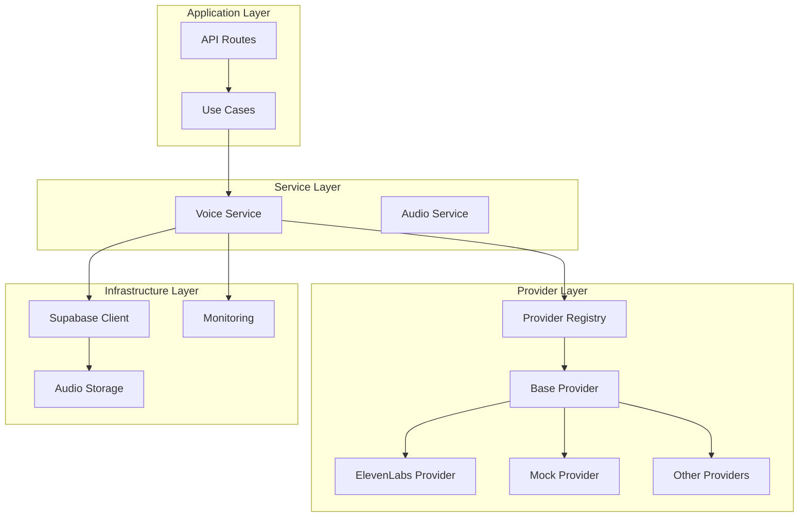
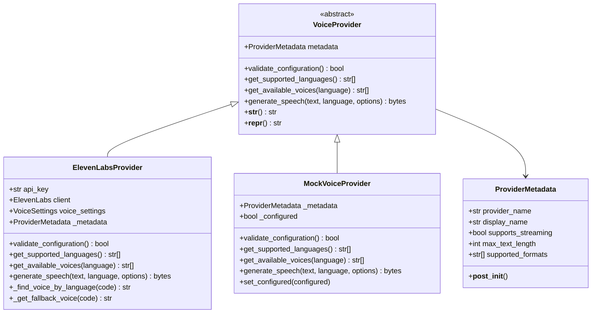
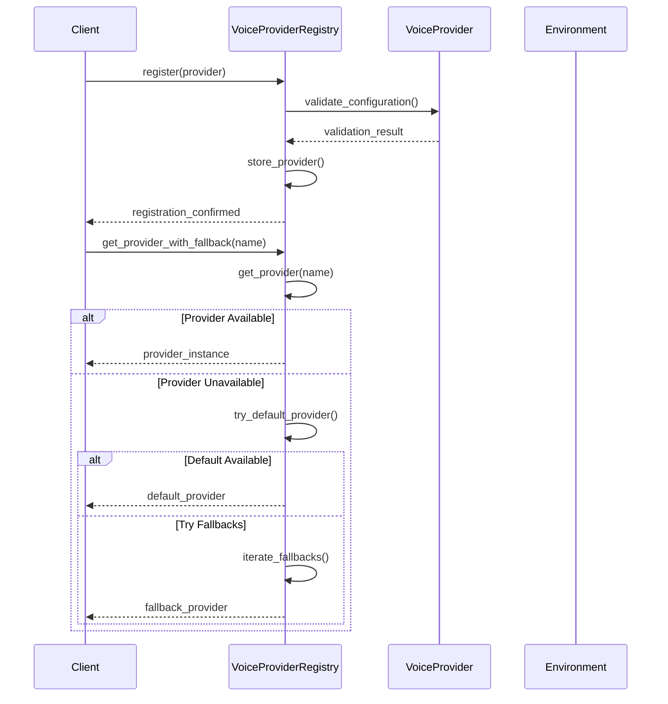
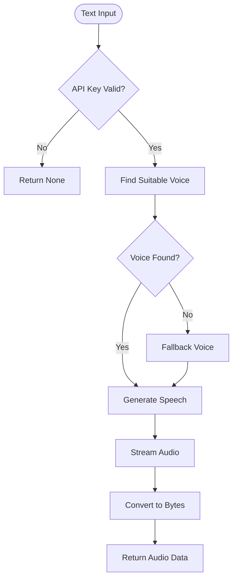
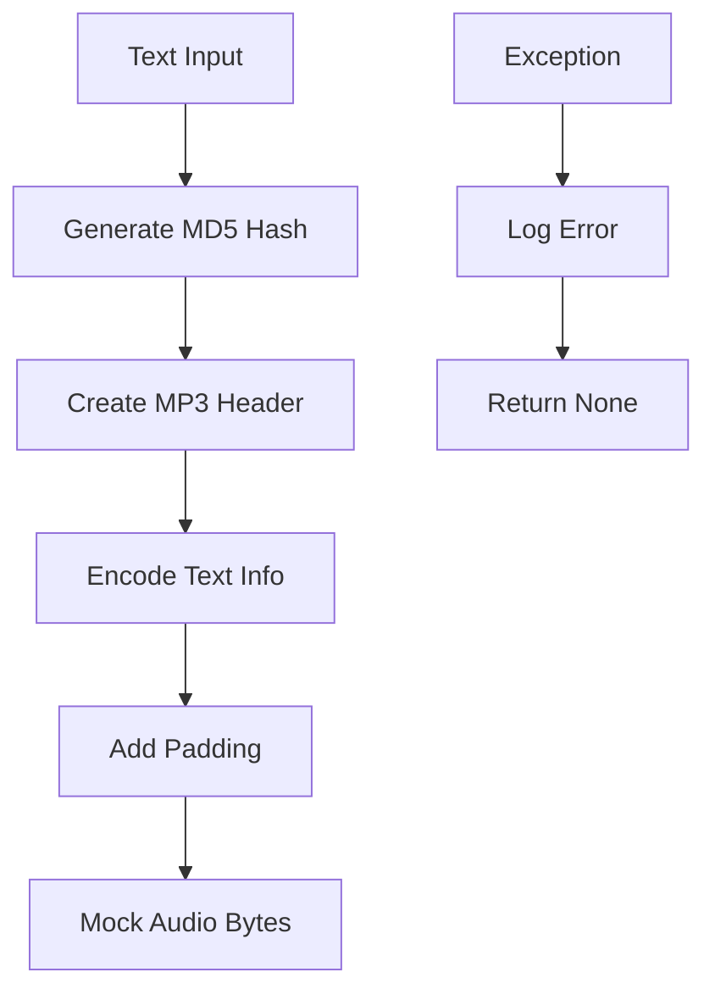
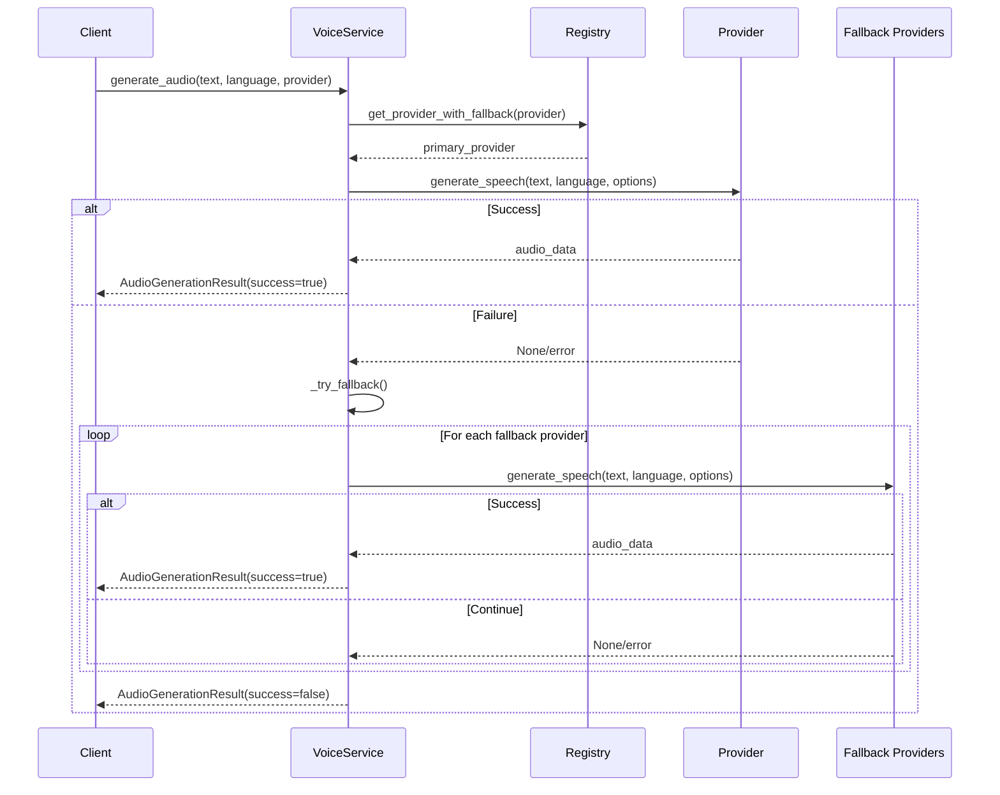
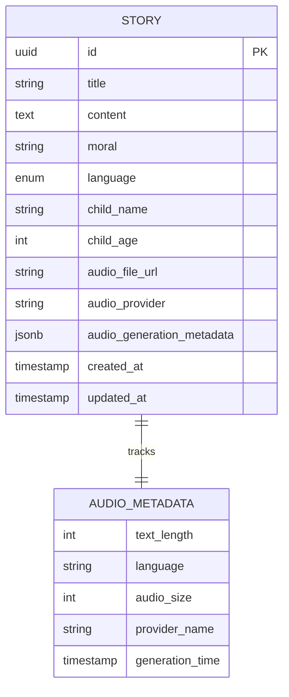
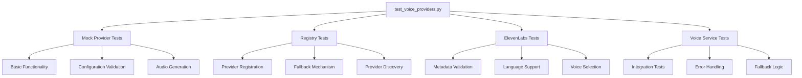
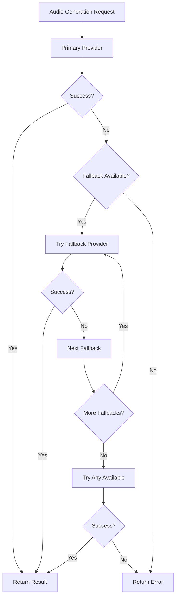
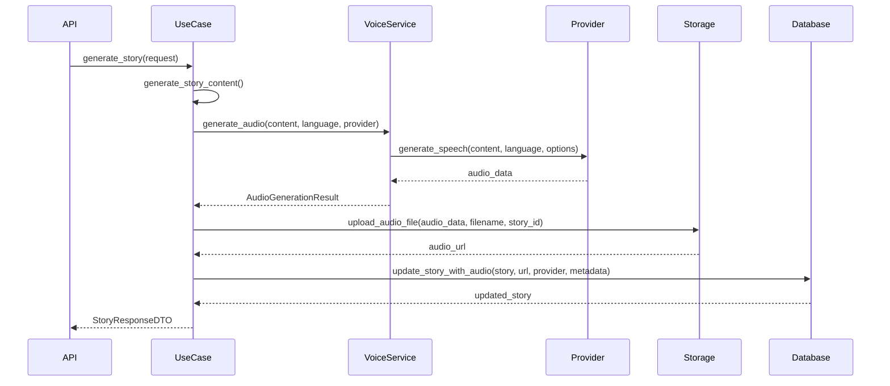

# Voice Provider System

<cite>
**Referenced Files in This Document**
- [base_provider.py](file://src/voice_providers/base_provider.py)
- [provider_registry.py](file://src/voice_providers/provider_registry.py)
- [elevenlabs_provider.py](file://src/voice_providers/elevenlabs_provider.py)
- [voice_service.py](file://src/voice_providers/voice_service.py)
- [elevenlabs_client.py](file://src/elevenlabs_client.py)
- [mock_provider.py](file://src/voice_providers/mock_provider.py)
- [supabase_client.py](file://src/supabase_client.py)
- [test_voice_providers.py](file://test_voice_providers.py)
- [test_integration_voice.py](file://test_integration_voice.py)
- [generate_story.py](file://src/application/use_cases/generate_story.py)
- [008_add_audio_provider_tracking.sql](file://supabase/migrations/008_add_audio_provider_tracking.sql)
</cite>

## Table of Contents
1. [Introduction](#introduction)
2. [System Architecture](#system-architecture)
3. [Core Components](#core-components)
4. [Provider Registry Pattern](#provider-registry-pattern)
5. [Concrete Provider Implementations](#concrete-provider-implementations)
6. [Voice Service Orchestration](#voice-service-orchestration)
7. [Configuration and Authentication](#configuration-and-authentication)
8. [Audio Storage and Metadata](#audio-storage-and-metadata)
9. [Adding New Voice Providers](#adding-new-voice-providers)
10. [Testing Strategies](#testing-strategies)
11. [Error Handling and Fallback Logic](#error-handling-and-fallback-logic)
12. [Story Generation Workflow Integration](#story-generation-workflow-integration)
13. [Production Deployment](#production-deployment)

## Introduction

The Voice Provider System is an extensible architecture designed for generating audio content from text for bedtime stories. It implements a plugin-based architecture that allows seamless switching between different voice synthesis providers while maintaining consistent interfaces and robust fallback mechanisms.

The system supports multiple voice providers including ElevenLabs, Google Cloud Text-to-Speech, Azure Speech Services, and others. It features intelligent provider selection, automatic fallback when providers fail, comprehensive error handling, and seamless integration with the story generation workflow.

## System Architecture

The voice provider system follows a layered architecture with clear separation of concerns:



**Diagram sources**
- [voice_service.py](file://src/voice_providers/voice_service.py#L25-L31)
- [provider_registry.py](file://src/voice_providers/provider_registry.py#L12-L20)
- [base_provider.py](file://src/voice_providers/base_provider.py#L28-L39)

## Core Components

### Base Provider Interface

The foundation of the system is the `VoiceProvider` abstract base class that defines the contract for all voice providers:



**Diagram sources**
- [base_provider.py](file://src/voice_providers/base_provider.py#L28-L97)
- [elevenlabs_provider.py](file://src/voice_providers/elevenlabs_provider.py#L18-L220)
- [mock_provider.py](file://src/voice_providers/mock_provider.py#L13-L98)

**Section sources**
- [base_provider.py](file://src/voice_providers/base_provider.py#L1-L97)

### Provider Metadata System

Each provider maintains comprehensive metadata about its capabilities:

| Attribute | Type | Description | Example Values |
|-----------|------|-------------|----------------|
| `provider_name` | str | Unique identifier for the provider | `"elevenlabs"`, `"google"`, `"azure"` |
| `display_name` | str | Human-readable name | `"ElevenLabs"`, `"Google Cloud TTS"` |
| `supports_streaming` | bool | Whether provider supports streaming audio | `True` (ElevenLabs), `False` (Google) |
| `max_text_length` | int | Maximum text length in characters | `5000` (ElevenLabs), `5000` (Google) |
| `supported_formats` | List[str] | Audio formats supported | `["mp3"]`, `["wav", "flac"]` |

## Provider Registry Pattern

The `VoiceProviderRegistry` implements the registry pattern for dynamic provider management:



**Diagram sources**
- [provider_registry.py](file://src/voice_providers/provider_registry.py#L36-L140)

### Registry Features

The registry provides sophisticated provider management:

- **Automatic Configuration Loading**: Reads `DEFAULT_VOICE_PROVIDER` and `VOICE_PROVIDER_FALLBACK` from environment variables
- **Provider Validation**: Ensures providers are properly configured before use
- **Fallback Mechanism**: Intelligent fallback to alternative providers when primary fails
- **Dynamic Registration**: Runtime registration and unregistration of providers
- **Provider Discovery**: List available and configured providers

**Section sources**
- [provider_registry.py](file://src/voice_providers/provider_registry.py#L1-L212)

## Concrete Provider Implementations

### ElevenLabs Provider

The ElevenLabs provider offers high-quality neural voice synthesis with multilingual support:



**Diagram sources**
- [elevenlabs_provider.py](file://src/elevenlabs_provider.py#L165-L220)

Key features of the ElevenLabs implementation:
- **Multilingual Support**: Supports 13+ languages with specialized voice detection
- **Intelligent Voice Selection**: Automatically selects appropriate voices based on language
- **Fallback Strategy**: Graceful degradation when specific voices aren't available
- **Streaming Support**: Efficient memory usage for large audio generation
- **Custom Voice Settings**: Configurable stability, similarity, and style parameters

**Section sources**
- [elevenlabs_provider.py](file://src/voice_providers/elevenlabs_provider.py#L1-L220)

### Mock Provider

The mock provider enables testing without external API calls:



**Diagram sources**
- [mock_provider.py](file://src/voice_providers/mock_provider.py#L47-L98)

**Section sources**
- [mock_provider.py](file://src/voice_providers/mock_provider.py#L1-L98)

## Voice Service Orchestration

The `VoiceService` acts as a facade that orchestrates audio generation with sophisticated fallback logic:



**Diagram sources**
- [voice_service.py](file://src/voice_providers/voice_service.py#L32-L135)

### Audio Generation Results

The service returns structured results with comprehensive metadata:

| Field | Type | Description |
|-------|------|-------------|
| `audio_data` | Optional[bytes] | Generated audio data or None |
| `provider_name` | Optional[str] | Name of provider used |
| `success` | bool | Whether generation succeeded |
| `error_message` | Optional[str] | Error description if failed |
| `metadata` | Optional[Dict] | Provider-specific metadata |

**Section sources**
- [voice_service.py](file://src/voice_providers/voice_service.py#L1-L236)

## Configuration and Authentication

### ElevenLabs Configuration

ElevenLabs requires API key configuration:

```bash
# Environment variables
ELEVENLABS_API_KEY=your-api-key-here
DEFAULT_VOICE_PROVIDER=elevenlabs
VOICE_PROVIDER_FALLBACK=mock
```

The provider validates configuration by attempting to initialize the client:

**Section sources**
- [elevenlabs_provider.py](file://src/voice_providers/elevenlabs_provider.py#L61-L71)

### Registry Configuration

The provider registry loads configuration from environment variables:

**Section sources**
- [provider_registry.py](file://src/voice_providers/provider_registry.py#L24-L34)

## Audio Storage and Metadata

### Supabase Integration

Audio files are stored in Supabase with comprehensive metadata tracking:



**Diagram sources**
- [008_add_audio_provider_tracking.sql](file://supabase/migrations/008_add_audio_provider_tracking.sql#L1-L24)

### Database Schema Changes

The system adds provider tracking columns to the stories table:

| Column | Type | Purpose |
|--------|------|---------|
| `audio_provider` | TEXT | Provider name used for generation |
| `audio_generation_metadata` | JSONB | Provider-specific generation details |

**Section sources**
- [008_add_audio_provider_tracking.sql](file://supabase/migrations/008_add_audio_provider_tracking.sql#L1-L24)

## Adding New Voice Providers

To add a new voice provider, implement the `VoiceProvider` interface:

### Implementation Steps

1. **Create Provider Class**: Extend `VoiceProvider` and implement all abstract methods
2. **Define Metadata**: Create `ProviderMetadata` with capabilities
3. **Implement Configuration**: Add validation logic
4. **Register Provider**: Add to the registry during application startup

### Example Implementation Template

```python
class CustomProvider(VoiceProvider):
    def __init__(self):
        self._metadata = ProviderMetadata(
            provider_name="custom",
            display_name="Custom Provider",
            supports_streaming=True,
            max_text_length=10000,
            supported_formats=["mp3", "wav"]
        )
        # Initialize provider-specific components
    
    @property
    def metadata(self) -> ProviderMetadata:
        return self._metadata
    
    def validate_configuration(self) -> bool:
        # Implement configuration validation
        return True
    
    def get_supported_languages(self) -> List[str]:
        # Return supported language codes
        return ["en", "es", "fr"]
    
    def get_available_voices(self, language: Optional[str] = None) -> List[str]:
        # Return available voice identifiers
        return ["voice1", "voice2"]
    
    def generate_speech(
        self, 
        text: str, 
        language: str = "en",
        voice_options: Optional[Dict[str, Any]] = None
    ) -> Optional[bytes]:
        # Implement speech generation
        return audio_bytes
```

### Registration Process

```python
from src.voice_providers import get_registry, CustomProvider

# Register the provider
registry = get_registry()
provider = CustomProvider()
registry.register(provider)

# Set as default if desired
registry.set_default_provider("custom")
```

## Testing Strategies

### Unit Testing

The system includes comprehensive unit tests for individual components:



**Diagram sources**
- [test_voice_providers.py](file://test_voice_providers.py#L1-L213)

### Integration Testing

End-to-end testing demonstrates complete workflow functionality:

**Section sources**
- [test_voice_providers.py](file://test_voice_providers.py#L1-L213)
- [test_integration_voice.py](file://test_integration_voice.py#L1-L178)

### Mock Provider Benefits

The mock provider enables:
- **Fast Testing**: No external API calls
- **Deterministic Results**: Consistent audio generation
- **Offline Development**: Testing without internet connectivity
- **Cost Control**: Eliminates API costs during development

## Error Handling and Fallback Logic

### Multi-Level Fallback Strategy

The system implements a sophisticated fallback mechanism:



**Diagram sources**
- [voice_service.py](file://src/voice_providers/voice_service.py#L136-L191)

### Error Categories

The system handles various error scenarios:

| Error Type | Cause | Recovery Strategy |
|------------|-------|-------------------|
| Network Timeout | API unresponsive | Retry with exponential backoff |
| API Rate Limit | Too many requests | Wait and retry with delay |
| Authentication Error | Invalid API key | Switch to fallback provider |
| Text Length Exceeded | Input too long | Truncate or split text |
| Unsupported Language | Language not supported | Use fallback language |
| Provider Unavailable | Provider down | Automatic fallback |

### Exception Handling Patterns

```python
try:
    # Provider-specific operation
    result = provider.generate_speech(text, language, options)
except ProviderUnavailableException:
    # Handle temporary provider issues
    return fallback_result
except AuthenticationException:
    # Handle permanent configuration issues
    return fallback_result
except Exception as e:
    # Handle unexpected errors
    logger.error(f"Unexpected error: {str(e)}")
    return fallback_result
```

**Section sources**
- [voice_service.py](file://src/voice_providers/voice_service.py#L115-L135)

## Story Generation Workflow Integration

### Seamless Integration

The voice provider system integrates seamlessly with the story generation workflow:



**Diagram sources**
- [generate_story.py](file://src/application/use_cases/generate_story.py#L156-L207)

### Backward Compatibility

The system maintains backward compatibility with existing API requests:

**Section sources**
- [generate_story.py](file://src/application/use_cases/generate_story.py#L156-L207)

### Provider Tracking

Each story includes comprehensive provider tracking:

| Field | Purpose | Example |
|-------|---------|---------|
| `audio_provider` | Provider used | `"elevenlabs"` |
| `audio_generation_metadata` | Generation details | `{text_length: 1000, voice_id: "abc123"}` |
| `audio_file_url` | Storage location | `"https://storage.example.com/stories/123/audio.mp3"` |

## Production Deployment

### Environment Configuration

Production deployment requires careful configuration:

```bash
# Essential configuration
DEFAULT_VOICE_PROVIDER=elevenlabs
VOICE_PROVIDER_FALLBACK=mock

# ElevenLabs configuration
ELEVENLABS_API_KEY=your-production-api-key

# Optional fallback providers
VOICE_PROVIDER_FALLBACK=elevenlabs,mock
```

### Monitoring and Observability

Implement monitoring for:
- **Provider Availability**: Track provider health and response times
- **Audio Quality**: Monitor generation success rates
- **Cost Tracking**: Track API usage and costs
- **Error Rates**: Monitor failure patterns and trends

### Scaling Considerations

For high-volume deployments:
- **Caching**: Cache frequently used audio segments
- **Batch Processing**: Process multiple requests efficiently
- **Load Balancing**: Distribute requests across providers
- **Rate Limiting**: Respect provider rate limits

### Security Best Practices

- **API Key Management**: Store keys securely in environment variables
- **Network Security**: Use HTTPS for all API communications
- **Access Control**: Restrict provider access based on user permissions
- **Audit Logging**: Log all audio generation activities

The Voice Provider System provides a robust, extensible foundation for audio generation in the tale generation platform, enabling seamless integration of multiple voice synthesis providers while maintaining reliability and performance standards.